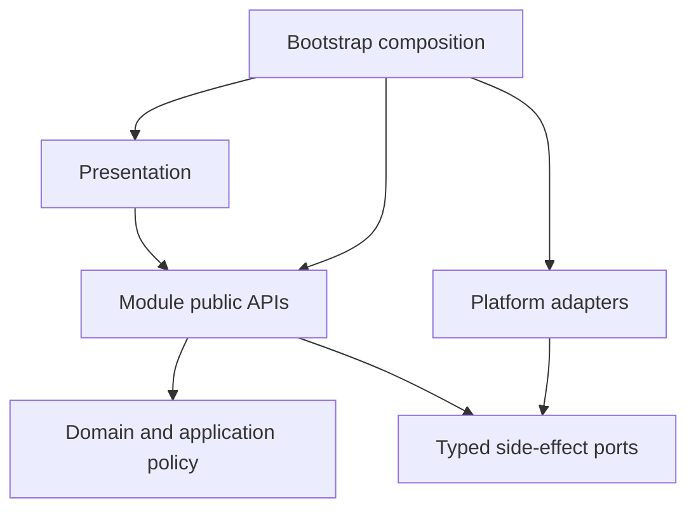

# IsleMind Architecture

**Status:** Active architectural source of truth.

**Platform:** Expo SDK, React Native, Expo Router, strict TypeScript, and Bun.

**Product runtime:** Chat is the only product and execution entry. Obsolete product-mode metadata may be decoded only inside an owner-private migration reader and cannot select navigation, permission, or reply behavior. Agent workflows and Tavern workspaces are active domain capabilities inside Chat, not alternate product modes.

## 1. Objective

The architecture keeps product behavior inside explicit ownership boundaries without imposing framework ceremony on local helpers.

> A capability should be added inside one owning module, through an existing public API or one justified boundary contract, without editing unrelated stores, screens, or provider branches.

The target system must be:

- easy to change inside clear ownership boundaries;
- strict at untrusted, persistent, permission, and side-effect boundaries;
- simple inside a boundary, without ports or schemas for local helpers;
- recoverable and diagnosable for durable work;
- responsive on representative Android devices;
- explicit about temporary compatibility code and its deletion condition.

## 2. Non-Goals

- Replacing Expo, React Native, Expo Router, TypeScript, or Zustand without demonstrated product or engineering benefits that justify migration. Existing choices may be reconsidered when requirements or evidence change.
- Applying layered architecture to every UI helper.
- Creating a general event bus, service locator, decorator container, or permanent legacy facade.
- Adding a contract file when an inferred local type or direct function call is sufficient.
- Preserving removed writers, formats, routes, or names without executable compatibility evidence.
- Weakening permission, validation, cancellation, recovery, or network trust controls to reduce file count.

## 3. Target Shape



```text
src/
  bootstrap/        composition, startup, restoration
  core/             shared pure contracts, IDs, errors, schemas
  modules/          business ownership
  platform/         reusable storage, native, network, telemetry effects
  presentation/     routes, screens, feature controllers, design system
```

Internal folders such as `domain/`, `application/`, `ports/`, and `adapters/` are created only when they contain meaningful separation. Empty-layer ceremony is forbidden.

## 4. Module Ownership

| Module | Owns | Excludes |
| --- | --- | --- |
| `conversations` | Conversation lifecycle, messages, drafts, projections | Provider protocol, tool execution, raw storage |
| `workspaces` | Chat workspace authority, revision, review, writeback | Conversation persistence, provider protocol, task execution |
| `assistant-runtime` | Run lifecycle, streaming, cancellation, journals, recovery orchestration | Screen state, provider serialization, concrete storage |
| `providers` | Catalog, credentials policy, capability, routing, normalized stream, health and fallback | Chat UI, task policy, RAG policy |
| `knowledge` | Documents, memories, indexing, retrieval, citations, context candidates | Chat rendering, provider wire formats |
| `tasks` | Durable task state, permission, confirmation, idempotency, artifacts, task journal | Provider and Android implementations |
| `integrations` | Tool manifests and MCP, built-in, web, workspace, and Android protocol adapters | Permission decisions and task lifecycle |
| `data-management` | Portable export, import, reset, cancellation admission, refresh policy | Native picker/sharing, raw repositories, secrets |
| `settings` | Preferences and configuration use cases | Credential secret implementation |
| `diagnostics` | Redacted health, timeline, recovery, and performance projections | Secret or raw provider-payload retention |

The exact allowed entry points are listed in [module public API](./module-public-api.md).

## 5. Dependency Rules

1. New business behavior belongs in `src/modules/<owner>/`.
2. Shared pure primitives belong in `src/core/`; reusable effects belong in `src/platform/`.
3. `bootstrap/` is the only composition root and the only layer that creates concrete adapters.
4. Cross-module imports use only `@/modules/<owner>`. Deep and relative cross-module imports are forbidden.
5. Domain code imports only its own domain and `core`.
6. Application code does not import React, Expo, Zustand, HTTP, SQLite, or concrete adapters.
7. Presentation consumes module public APIs. It does not become persistence or execution authority.
8. Zustand stores hold UI projections and transient interaction state, not the sole durable copy of user work.
9. `src/services/` is compatibility-only. A retained service requires a target owner and deletion condition.
10. Value and type import cycles fail CI.

## 6. Contract Budget

Contracts exist only when at least one condition is true:

- data crosses a module, process, native, network, or persistence boundary;
- an untrusted input requires runtime validation;
- a durable record requires versioning or recovery semantics;
- an adapter must be substitutable in focused tests.

Contracts do not exist merely to rename a local object, mirror an implementation, preserve a deleted symbol, or create a one-consumer interface. Local helpers use direct calls and inferred types. Cross-module aliases and compatibility re-exports are deleted after consumers move.

Each public contract has one owner. The owner exports it from `index.ts`; consumers never import owner-private folders.

## 7. Runtime Model

```text
Conversation
  -> AssistantRun
  -> ContextSnapshot
  -> ProviderGateway
  -> StreamEvent sequence
  -> optional ToolExecution / TaskExecution
  -> RunJournal / TaskJournal
  -> durable records
  -> UI projection
```

| Contract | Responsibility |
| --- | --- |
| `AssistantRun` | Identity, state, timing, cancellation, and terminal result |
| `ContextSnapshot` | Immutable attributable context |
| `ChatRequest` / `StreamEvent` | Provider-neutral request and stream |
| `ToolDefinition` / `ToolRequest` / `ToolResult` | Integration-neutral tool protocol |
| `RunEvent` | Ordered redacted run lifecycle |
| `TaskCommand` / `TaskEvent` | Durable side-effect and long-running work lifecycle |
| `Result<T, ErrorCode>` | Typed cross-boundary success or failure |

All I/O accepts `AbortSignal`. Timeouts, retry admission, cancellation, cleanup, and terminal projection are coordinated by the runtime, not reimplemented per screen.

Provider protocols enter one Providers-owned gateway. Provider-native and MCP continuation turns preserve exact cancellation, task identity, terminal receipt, usage, trace, and replay semantics.

Context assembly freezes attributable conversation, memory, knowledge, attachment, and approved tool inputs before dispatch. Retrieval and provider wire formats remain independent.

## 8. Permission And Trust

Access control has one decision owner:

- Tasks decides permission, confirmation, limit, idempotency, and durable task admission.
- Integrations describes manifest risk and output boundaries and implements protocols; it cannot grant execution.
- Bootstrap binds only admitted capabilities to concrete ports.
- Presentation requests an action and renders the decision; it does not authorize.
- Historical product-mode data is audit or migration input only and cannot affect a decision.

Untrusted manifests, persisted rows, native results, tool arguments, URLs, paths, and network responses are validated and bounded. Unknown, malformed, stale, or incomplete authority fails closed.

Static metadata with no user-state access may run without a durable task only when it is explicitly classified as pure and still observes cancellation. Reads of user data, mutations, external effects, and long-running work require task admission.

Native and web capabilities are advertised only when every required concrete port is bound. A manifest alone never proves runtime availability.

Network adapters enforce public HTTPS, bounded redirects, bytes and time, structured parsing, and cancellation. A locally admitted native crawl does not fall through to a vendor after a local trust or fetch failure. Workspace paths stay inside durable namespaces with revision and idempotency checks.

## 9. Persistence And Recovery

Each durable record has one owning module, one repository port, strict decode validation, and explicit migration policy.

SQLite transactions run on each provider's initialized, private connection through the shared per-database operation queue. The queue prevents other application adapter calls from joining an asynchronous transaction. Native and web both use `withTransactionAsync`; Expo's native exclusive helper creates a separate connection that does not inherit connection-local foreign-key settings. The authoritative database explicitly uses WAL with `synchronous=FULL`: pending effect/journal receipts must not trade away per-commit synchronization for cache-write speed. Transaction support is required, never silently replaced by non-transactional writes. A failed connection initialization is closed before retry. This queue is process-local; SQLite, not the JavaScript queue, governs external connections, and actual durability still depends on the native filesystem/VFS and device.

Knowledge's secondary-index owner installs transactional invalidation for canonical chunk replacement/deletion and cache provenance changes. Async embedding commits must still match their captured source; provider jobs additionally require the exact current attempt identity. Cancellation or late completion cannot recreate a removed job or overwrite a newer one. Cached source text is checked against canonical content/provenance before reuse or persistence. Derived indexing never grants permission to replay a provider call.

| Data | Authority |
| --- | --- |
| Conversations and messages | Conversations repository |
| Runs and run journal | Assistant Runtime repository |
| Tasks, task journal, artifacts | Tasks repository |
| Knowledge and memory | Knowledge repositories |
| Settings | Settings persistence |
| Provider metadata and credentials | Providers policy plus secure storage |
| Workspace revisions and receipts | Workspaces repository |

Secrets never enter portable payloads, ordinary logs, telemetry, or UI state. Export, import, and reset coordinate owners through Data Management and bootstrap; they do not scan storage directly.

Current durability policy is intentionally strict:

- product and new `AssistantRun` rows are Chat-only;
- conversations use current SQLite records and the current active-conversation record;
- workspaces use current native SQLite or current browser v2 storage;
- portable recovery uses the current envelope key and a large-value native blob store where required;
- unsupported historical writers and removed formats are not restored to make stale tests pass.

`AssistantRun` schema v4 persists the exact captured handoff atomically with `run.created` as strictly validated durable evidence only; it does not grant recovery authority. Rich and Plain Chat store the same final canonical `ChatRequest` snapshot with a versioned capability revision, stable request hash, and bounded context receipt. The older redacted activity-request shape is decode-only for existing SQLite rows and has no runtime or public writer. Rich text, citation, tool-call, usage, and bounded trace-lifecycle markers are journaled as `stream.event` checkpoints before terminal completion; trace content and metadata remain excluded, and the evidence remains diagnostic rather than replay authority. During an in-flight run, visible output is stored as ordered JSON-encoded delta segments behind a predecessor-checked v2 header; selection, cancellation, effect and terminal barriers materialize the ordinary v1 snapshot and clear segments atomically. Adjacent callback text is coalesced in a bounded 256-event/1 MiB buffer; overflow aborts the activity rather than dropping evidence. Nested Rich provider turns persist bounded started/completed continuation identities. On restart, an unmatched identity is attached to the interrupted failure with `resume: new-turn-only`; recovery safely terminalizes the run and never replays a provider request or tool effect. Unsupported or incomplete rows are terminal decode-only no-replay inputs. Recovery does not infer effect authority unless an awaited durable final-output/success barrier exists.

Recovery never infers that an external effect happened. Unknown cleanup or commit state is fenced for explicit retry, repair, or quarantine. Concurrent recovery callers are idempotent at the runtime boundary: a stale terminal write re-reads the durable disposition and never replays or overwrites a run that another caller already recovered.

An acknowledged `cancellationRequestedAt` remains authoritative across process death: both run and task recovery terminalize it as cancelled, not interrupted/failed. Queued tasks remain queued; interrupted confirmation expires; unknown in-flight effects fail interrupted without replay. Competing recovery writes re-read the durable terminal disposition; genuine read/write failures remain retryable failures rather than fabricated success.

Bootstrap completes run recovery, workflow checkpoint reconciliation, workspace receipt reconciliation, and task recovery before admitting Chat. A run/task recovery failure blocks admission through the existing startup retry UI. This ordering matters because the active-run/task registries are runtime-instance-local, not a cross-instance liveness oracle. `AppState` background notifications and resume recovery do not guarantee execution or a final flush when Android kills a process.

Terminal run persistence and message projection are separate commits. A succeeded run is intentionally absent from `listRecoverable`, so stale message reconstruction must also use the Assistant Runtime repository's read-only `getLatestForResponseMessage(conversationId, responseMessageId)` lookup. Bootstrap exposes it through the existing presentation runtime binding; presentation neither opens SQLite nor resumes an effect. The additive response-message index (migration v10) bounds that lookup. Recovery rechecks live/cancelled/terminal message state after awaits, projects authoritative output only onto an orphaned sending/streaming placeholder, and awaits the reconstructed message's persistence. A missing owner uses the existing orphan cancellation path; an unavailable owner read does not. Already cancelled messages are not reinterpreted as successful.

**Native evidence boundary (2026-09-07):** the isolated API-35/x86_64 Android debug campaign exercised backgrounding, actual PID death/restart, native SQLite reconstruction/rollback, cancellation and competing recovery, plus real HTTP streaming and the terminal-commit/projection crash window. This is not signed-release, ARM64/OEM, low-memory-killer, Doze, physical-flash or power-loss validation. WAL/FULL configuration and process-death persistence are distinct from hardware durability. The exercised SQLite binary and current Expo vendored source are 3.50.3; SQLite documents a rare multi-connection WAL-reset corruption race fixed in 3.51.3 (backports 3.50.7/3.44.6). The application queue serializes owned calls, but is not proof that every native checkpoint/connection satisfies that exclusion. The race was not reproduced here; dependency remediation and the remaining native release gate are open. Do not lower synchronization or claim production readiness from host or emulator passes.

## 10. Presentation And Mobile Quality

Presentation owns routing, screens, feature controllers, localization binding, and reusable visual components. Domain and application layers emit stable codes and parameters, not translated strings.

The design system owns semantic typography, color, spacing, radius, border, shadow, icon, control, feedback, loading, empty, and error primitives. Feature screens do not create parallel token systems.

Mobile behavior must cover:

- safe areas, gesture regions, keyboard avoidance, and restoration after navigation;
- 44 dp or larger touch targets and accessible labels, roles, values, and focus;
- light, dark, reduced-motion, and no-motion modes;
- loading, empty, error, offline, cancellation, success, and retry states;
- long and localized text without overlap;
- virtualized long lists and stable layout dimensions.

Animation communicates state or spatial continuity, completes quickly, respects reduced motion, and never delays a control, error, cancellation, or durable effect.

## 11. Performance

- Startup composes only essential runtime paths.
- Low-frequency settings, diagnostics, native bridges, and heavy feature panels load on demand.
- Lists use virtualization, stable keys, selector-based subscriptions, and bounded stream buffers.
- Parsing, indexing, import, and model preparation use cancellable jobs with visible queue state.
- Large artifacts are referenced by URI and metadata, never retained as base64 in view state or persistent JSON.
- Network requests are cached or coalesced only when identity, freshness, cancellation, and error semantics remain explicit.

Hybrid knowledge retrieval enumerates the selected corpus before applying its best-vector candidate limit; a recency window must not silently make older compatible vectors unreachable. Query-vector source discovery uses the same scope. Keyset pages bound transferred rows and retained candidates, yield for interaction/cancellation, and keep model work outside transactions. Fresh results and cached evidence are checked against canonical source identity. This is exact candidate search for a stable corpus, not ANN or a transaction-wide snapshot across concurrent edits; device latency and memory still require measurement.

Debug-client Metro timings and memory are diagnostic evidence only. Release or profile builds on named devices establish production budgets.

## 12. Change Method

Architectural changes proceed in bounded, independently buildable slices:

1. Identify the live authority, owner, public boundary, persistence effect, and any required compatibility reader.
2. Add or reuse the smallest target API and focused behavior test.
3. Compose concrete effects in bootstrap.
4. Move one caller path and verify cancellation, recovery, permission, and error behavior.
5. Delete the old path, alias, source assertion, and redundant prose after replacement coverage passes.
6. Keep only durable architectural rules here; implementation history belongs in Git history.

This document contains durable architecture only. The public API document contains allowed entry points only. Temporary compatibility readers stay owner-private and carry their deletion condition next to focused executable evidence.

## 13. Verification

Every slice runs the smallest relevant checks first, then the boundary it changes:

- strict TypeScript;
- focused owner behavior and compatibility tests;
- public API, dependency direction, deep-import, and cycle audits;
- persistence and migration fixtures when durable data changes;
- cancellation, permission, idempotency, redaction, and recovery fixtures when effects change;
- real-device Android evidence when native behavior or mobile presentation changes.

Source-marker tests are temporary. Remove them when a behavior, type, dependency, or device test covers the invariant more reliably.

## 14. Completion Criteria

The architecture remains healthy when:

1. the source tree and executable dependency gates agree;
2. domain and application code are free of framework and concrete-adapter imports;
3. providers, tools, Android, storage, and telemetry cross owned ports;
4. durable runs and tasks support cancellation, recovery, redacted diagnosis, and safe retry;
5. new providers, tools, retrieval strategies, and screens do not require unrelated module edits;
6. representative release-device budgets and product workflows pass;
7. migrated service facades, duplicate contracts, dead feature flags, and stale architecture assertions are deleted.

## 15. Open Decisions

| Decision | Required evidence |
| --- | --- |
| Hosted gateway, accounts, sync, billing | Product, privacy, and operating-cost requirements |
| Durable trace retention | Privacy policy and measured storage budget |
| Release performance budgets | Named release/profile builds on representative Android devices |
| EAS, OTA, and native-plugin policy | Upgrade, rollback, signing, and release-channel evidence |

No open decision blocks local module ownership, strict boundaries, or deletion of proven dead compatibility code.
