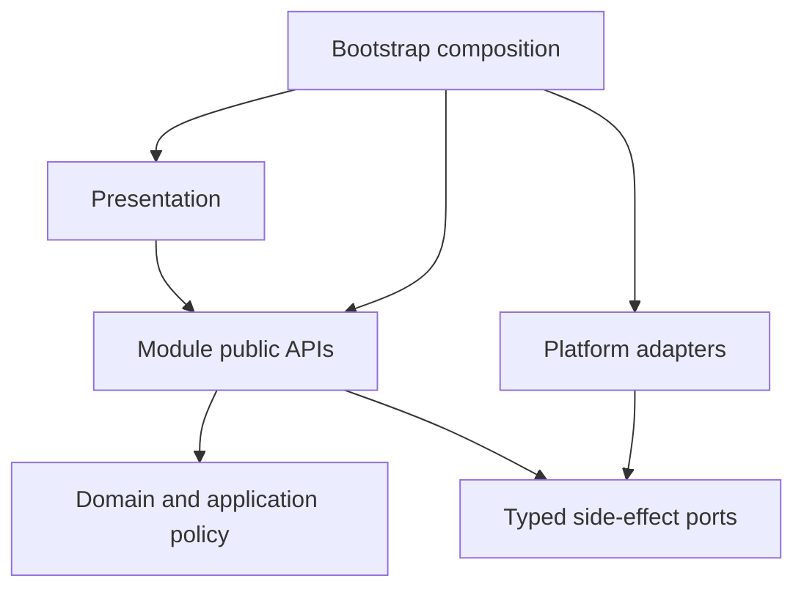

# IsleMind Architecture

**Status:** Active architectural source of truth.

**Platform:** Expo SDK, React Native, Expo Router, strict TypeScript, and Bun.

**Product runtime:** Chat is the conversational and durable assistant execution entry. Documents is a supporting user-owned editor with explicitly requested, ephemeral model proposals, not another agent/task/effect mode. Obsolete product-mode metadata may be decoded only inside an owner-private migration reader and cannot select navigation, permission, or reply behavior. Agent workflows and Tavern workspaces are active domain capabilities inside Chat, not alternate product modes.

## 1. Objective

The architecture keeps product behavior inside explicit ownership boundaries without imposing framework ceremony on local helpers.

> A capability should be added inside one owning module, through an existing public API or one justified boundary contract, without editing unrelated stores, screens, or provider branches.

The target system must be:

- easy to change inside clear ownership boundaries;
- strict at untrusted, persistent, permission, and side-effect boundaries;
- simple inside a boundary, without ports or schemas for local helpers;
- recoverable and diagnosable for durable work;
- responsive on representative Android devices;
- explicit about temporary compatibility code and its deletion condition.

## 2. Non-Goals

- Replacing Expo, React Native, Expo Router, TypeScript, or Zustand without demonstrated product or engineering benefits that justify migration. Existing choices may be reconsidered when requirements or evidence change.
- Applying layered architecture to every UI helper.
- Creating a general event bus, service locator, decorator container, or permanent legacy facade.
- Adding a contract file when an inferred local type or direct function call is sufficient.
- Preserving removed writers, formats, routes, or names without executable compatibility evidence.
- Weakening permission, validation, cancellation, recovery, or network trust controls to reduce file count.

## 3. Target Shape



```text
src/
  bootstrap/        composition, startup, restoration
  core/             shared pure contracts, IDs, errors, schemas
  modules/          business ownership
  platform/         reusable storage, native, network, telemetry effects
  presentation/     routes, screens, feature controllers, design system
```

Internal folders such as `domain/`, `application/`, `ports/`, and `adapters/` are created only when they contain meaningful separation. Empty-layer ceremony is forbidden.

## 4. Module Ownership

| Module | Owns | Excludes |
| --- | --- | --- |
| `conversations` | Conversation lifecycle, messages, drafts, projections | Provider protocol, tool execution, raw storage |
| `documents` | User-owned editable Markdown, immutable captured origin, revision/review policy and persistence | Knowledge indexing, independent source authority, provider transport, tools/durable task execution |
| `workspaces` | Chat workspace authority, revision, review, writeback | Conversation persistence, provider protocol, task execution |
| `assistant-runtime` | Run lifecycle, streaming, cancellation, journals, recovery orchestration | Screen state, provider serialization, concrete storage |
| `providers` | Catalog, credentials policy, capability, routing, normalized stream, health and fallback | Chat UI, task policy, RAG policy |
| `knowledge` | Documents, memories, indexing, retrieval, citations, context candidates | Chat rendering, provider wire formats |
| `tasks` | Durable task state, permission, confirmation, idempotency, artifacts, task journal | Provider and Android implementations |
| `integrations` | Tool manifests and MCP, built-in, web, workspace, and Android protocol adapters | Permission decisions and task lifecycle |
| `data-management` | Portable export, import, reset, cancellation admission, refresh policy | Native picker/sharing, raw repositories, secrets |
| `settings` | Preferences and configuration use cases | Credential secret implementation |
| `diagnostics` | Redacted health, timeline, recovery, and performance projections | Secret or raw provider-payload retention |

The exact allowed entry points are listed in [module public API](./module-public-api.md).

## 5. Dependency Rules

1. New business behavior belongs in `src/modules/<owner>/`.
2. Shared pure primitives belong in `src/core/`; reusable effects belong in `src/platform/`.
3. `bootstrap/` is the only composition root and the only layer that creates concrete adapters.
4. Cross-module imports use only `@/modules/<owner>`. Deep and relative cross-module imports are forbidden.
5. Domain code imports only its own domain and `core`.
6. Application code does not import React, Expo, Zustand, HTTP, SQLite, or concrete adapters.
7. Presentation consumes module public APIs. It does not become persistence or execution authority.
8. Zustand stores hold UI projections and transient interaction state, not the sole durable copy of user work.
9. `src/services/` is compatibility-only. A retained service requires a target owner and deletion condition.
10. Value and type import cycles fail CI.

## 6. Contract Budget

Contracts exist only when at least one condition is true:

- data crosses a module, process, native, network, or persistence boundary;
- an untrusted input requires runtime validation;
- a durable record requires versioning or recovery semantics;
- an adapter must be substitutable in focused tests.

Contracts do not exist merely to rename a local object, mirror an implementation, preserve a deleted symbol, or create a one-consumer interface. Local helpers use direct calls and inferred types. Cross-module aliases and compatibility re-exports are deleted after consumers move.

Each public contract has one owner. The owner exports it from `index.ts`; consumers never import owner-private folders.

## 7. Runtime Model

```text
Conversation -> AssistantRun -> ContextSnapshot -> ProviderGateway
  -> StreamEvent sequence -> optional ToolExecution / TaskExecution
  -> RunJournal / TaskJournal -> durable records -> UI projection
```

| Contract | Responsibility |
| --- | --- |
| `AssistantRun` | Identity, state, timing, cancellation, terminal result |
| `ContextSnapshot` | Immutable attributable context |
| `ChatRequest` / `StreamEvent` | Provider-neutral request and stream |
| `ToolDefinition` / `ToolRequest` / `ToolResult` | Integration-neutral tool protocol |
| `RunEvent` | Ordered redacted run lifecycle |
| `TaskCommand` / `TaskEvent` | Durable side-effect and long-running work lifecycle |
| `Result<T, ErrorCode>` | Typed cross-boundary success or failure |

### Execution and context

- All I/O accepts `AbortSignal`. The runtime coordinates timeouts, retry admission, cancellation, cleanup and terminal projection; screens do not duplicate this authority.
- Streaming HTTP separates the header deadline from the open request lifetime. Expo's `AbortSignal.any` composes timeout and caller signals; clearing the header timer must leave caller cancellation attached without aborting siblings. The executor also cancels its acquired reader to settle pending reads, with idempotent cleanup. Reader cancellation alone need not close a blocked Android native socket. Normal terminal EOF retains its 50-ms native close grace.
- Provider protocols enter one Providers-owned gateway. Provider-native and MCP continuations preserve cancellation, task identity, terminal receipts, usage, trace and replay semantics.
- Model availability evidence is not provider health, credential status, policy or network status. Unknown availability does not block execution or grant capabilities. Operational errors preserve trusted model state; retirement requires classified scoped lifecycle evidence, never a generic 404/410 or catalog omission. Existing failover policy ranks candidates before the existing candidate cap, with complete credential/protocol/endpoint route identity when resolved. The out-of-band actual execution target contract cannot itself commit a stream or become a second persisted Conversation preference.
- Each wire attempt awaits actual-target reporting before dispatch, including hidden executor fallback and WebSocket/HTTP paths. Observer failure is not a provider health failure or a retry opportunity. The runtime adapter forwards the target out-of-band and binds continuation state to its actual provider/upstream model. Hydrated credential provenance is explicit and removed alongside keys before provider metadata persistence; it is never reconstructed by comparing secrets.
- Conversation preference is the existing providerId/model/providerModelMode triple. Reading legacy unbound history never assigns a provider; full-save and first-reply barriers still govern dispatch. Explicit selections are manual and remember the versioned global pair in Settings, while inherited setup and temporary execution routing do not update that global memory. No cross-store atomicity is claimed. Conversations migration 3 preserves existing values and message bytes; snapshot v3 retains old readers, and portable payload v2 retains v1 import without changing the backup envelope.
- Context assembly freezes attributable conversation, memory, knowledge, attachment and approved tool inputs before dispatch. Retrieval policy remains independent of provider wire formats.

### Conversation drafts and export

- **Continue in new chat** copies a terminal message prefix into an independent in-memory draft, not an AssistantRun fork. Conversations owns transcript/configuration copying; the Chat store selects drafts; presentation confirms and navigates. New message identities preserve text, terminal status, captured provider/model and citations, but exclude execution traces, pending confirmations, run/lifecycle identities and generation costs. Workspace/command bindings and conversation-scoped memory remain with the source. A sending/streaming message in the prefix blocks copying; later source work is neither stopped nor replayed.
- Creating/editing a draft neither saves it nor starts work. The first-reply persistence barrier saves the prefix and new turn before dispatch; attachment retention still applies. Selecting a saved conversation discards unsent drafts. Only a focused deep-link screen may select a conversation. Branch navigation preserves the Chat return intent; hidden screens must not discard the active draft.
- Markdown export is a presentation-owned snapshot, not a Conversation, TaskArtifact or saved document. Ordinary Copy remains unchanged. Export preserves per-message source order, literal/redacted titles, source kind and eligible explicit HTTP(S) links under the source-URL policy; it excludes source-body fetching, excerpts, sourceUri, document/chunk IDs, headings and execution traces. Source numbers are not verified answer bindings, and global Markdown definitions must not rebind another message's references.
- Source-bearing export requires disclosure/confirmation before clipboard or file effects. Clipboard failure cannot report success; unavailable/failed sharing reports clipboard-only success only after a successful copy. Sharing is not proof of an external save; temporary-file cleanup is best effort. The Expo Clipboard Web fallback must propagate the legacy copy command's Boolean result.
- Task artifacts are execution evidence/URIs; context artifacts are session-local; workspace review owns Tavern snapshots/private memory. The native workspace-file port has bounded namespaced CAS/receipt semantics, not a general document library or portable-document inclusion. Export grants no indexing, retention or writeback authority.

### Knowledge retrieval and model admission

- Knowledge owns lexical/vector fusion before local reranking. Raw negative BM25 remains SQLite-attributable; normalized relevance is higher-is-better. With vector candidates, shared and single-modality hits use 62% vector / 38% lexical weighting; a missing modality contributes zero. A wholly unavailable vector channel uses the FTS fallback scale. Scoring must preserve model-space identity, permission and source scope.
- BERT/WordPiece honors the catalogued cleaning, Chinese boundaries, accent/case normalization, literal specials, continuation prefix and word-length limits under `onnx-pipeline-v3`. Vector compatibility requires source and full model/preprocessing identity, not dimension alone. Keep incompatible valid vectors stored without comparison or relabelling; reindex from canonical text. Lexical/hash fallback cannot destroy a valid vector. An explicitly requested indexing model cannot be replaced by a catalogue fallback; read-only query fallback grants no write authority.
- Opt-in multilingual MiniLM uses the focused XLM-R Unigram tokenizer, `onnx-unigram-v1` and a 128-token limit. Precompiled charsmap, grapheme/scalar normalization, whitespace/Metaspace, literal specials and Float64 Viterbi follow the pinned Hugging Face Rust reference, not generic NFKC. `unicode-segmenter/grapheme` supplies boundaries; compact vocabulary lookup avoids an object trie or general SentencePiece interpreter.
- Multilingual MiniLM is **EXPERIMENTAL / OPT-IN**: the previously measured 5,950 ms cold admission misses its unchanged ≤5,000 ms target. This is a model-specific admission failure, not a default candidate gate. Automatic fallback never verifies or selects experimental models, even if downloaded or bundled; it uses a verified standard model or no local model. Explicit model-and-source selection is required, and does not imply production qualification.
- Tokenizer bounds are 32,768 raw / 65,536 normalized UTF-16 units, 262,144 vocabulary entries and 32 scalars per piece. Built-in JSON parsing processes at most 4,096 vocabulary entries per batch; normalization/Viterbi yield during long inputs. Malformed, unsupported or oversized input rejects rather than approximates. Preprocessing completes before native session allocation. One cancelled caller cannot poison shared initialization; retirement invalidates pending encoding admission. Native inference is not preemptible: late cancellation discards results and releases tensors/sessions only after settlement.
- `EmbeddingProvider.available({ signal })` is asynchronous admission, not a metadata getter. Query/index factories and direct embed admission propagate cancellation through catalogue/file verification. Cancellation rejects rather than becoming unavailable, fallback or diagnostic failure; a cancelled resolution cannot populate the successful-descriptor cache. Descriptor, shared tokenizer/session and result-cache lifetimes are separate. An outer abort race cannot replace cancellation of verification; no cross-provider trust cache or integrity bypass may hide admission cost.
- Android app-private file integrity streams full SHA-256 through `MessageDigest` using the ReactPackage/config-plugin boundary, not the JS/UI thread. Per-operation digest/cancellation identity, two workers, eight queued requests and 256 KiB buffers bound work. Canonical files/cache paths, opened regular-file size and complete byte count are checked; descriptors close before settlement. The adapter rechecks cancellation and digest/length. No file bytes cross the bridge, native failure cannot silently downgrade, and stat/mtime is not a trust cache. The bounded one-MiB Expo/JS fallback serves missing native support or other URI/platform paths. Admission, staged installation and cached APK verification share this adapter without new permissions.
- Android ONNX registration and binary selection are separate build obligations. `react-native.config.js` admits ORT's ReactPackage; the postinstall patch pins the native AAR to the installed JS version and selects exact CMake headers/libraries, never `latest.integration` or a stale cached runtime. Release fingerprints include both inputs. Package metadata is not proof of the loaded native version; inspect `OrtApi.version` for native evidence.
- Catalogue presence, functional availability and tokenizer fidelity are not production resource-budget or answer-quality certification. Explicit local evaluation, default model/assets and production admission are separate decisions. Performance or cancellation claims require evidence at the affected platform boundary.

### Source inspection and provider passages

- Knowledge's `KnowledgeLocalSourceReader`, lazily bound by `app/source.tsx`, owns read-only source verification; presentation never instantiates storage. Document and ordered retained chunks are read in one transaction. Memory requires its exact ID and local-user or requesting-conversation scope. Missing and out-of-scope are indistinguishable; an explicitly missing citation cannot fall back to another. Captured excerpts differ from saved text: local citations lack a canonical-source revision hash, so timestamps cannot establish revision equality. Only exact chunk identity identifies a retained cited section. Focus/identity changes cancel obsolete reads. No original-file reconstruction, extra retention, automatic URI fetch or retrieval/replay authority follows; safe HTTP(S) opening is explicit.
- Captured-source actions are bounded, title-based and do not read bodies when rendered/expanded. Selection passes exact conversation/message/citation identity, never an origin-URL override. The shared selector rejects missing, blank or duplicate citation IDs, including legacy default resolution. Memoization observes conversation identity and immutable citation-array updates. Lists can contain uncited retrieval or supplemental material; order, chunk indices and `[1]`/`[S1]` do not establish claim support. Titles are literal; captured references and verified support remain distinct.
- Providers owns request-scoped Google `generateContent` grounding collection. It selects the text parser's candidate, preserves cumulative raw chunk slots including unsupported entries, and never flattens part-local UTF-8 byte ranges into Chat offsets. JSON, buffered SSE and live SSE bind only exact retained passage text present in the final visible answer after thinking/tool-text filtering. Shared SSE framing supports optional spacing, multiline fields and EOF metadata. An unreadable grounding gap or changing candidate index invalidates the association map; title-only sources supply no stable association identity. The contract adds no inline markers, factuality verdict or Interactions API assumptions.
- Optional `providerSupport` uses core's validated `islemind.provider-citation-support.v1`: one Google snapshot, exact raw-UTF-8 answer SHA-256 and bounded provider-reported text/part/byte ranges. Bounds are 128 raw slots, 64 declarations, 16 source indices per declaration and 32,768 combined passage characters across sources; per source, 16 passages, 2,048 characters each and 8,192 combined. Answers over 262,144 characters retain no associations. Invalid, missing or over-budget evidence stays unknown; quotations are never clipped. Compute the answer digest lazily once per collection.
- Duplicate URLs merge same-answer passages. Continuations merge support only when other captured citation fields match, replacing with a later valid snapshot rather than accumulating history. Never rehash surviving old support onto new answer text. Conversations retains optional metadata in full-message JSON; legacy citations remain valid. The UI validates persisted/imported metadata, displays selectable literal passages with incomplete/not-fact-checked notices, and warns on answer mismatch. This is neither a source-content hash/body copy nor read/effect authority, automatic model input or certified inline binding.
- Web source preview is an immediate localized unsupported state: idle background, no skeleton/Refresh and no WebView shim initialization or mount. Safe original-link actions use the URL guard and Linking; rejected capability/opening attempts show failure feedback. No proxy, iframe, automatic fetch or new permission substitutes for missing preview support. Native preview retains loading, failure/retry and same-host/no-HTTPS-downgrade navigation.
- A reader attempt's React key comprises conversation ID, message ID, resolved citation ID, safe URL and explicit Refresh counter. Context/target changes or Refresh remount the reader; loading/failure state and callbacks belong to that instance, including A → B → A. The parent background uses the same reset identity. Title, excerpt, answer and provider-metadata changes alone do not restart previews. Component lifetime isolation does not establish native network teardown or source revision equality.

### Work-artifact protocol

- Work-artifact auditing structurally transforms supplied `content`; it neither generates the draft nor verifies semantics. Optional `sourceMessageId` is annotation, not lookup or role. Citation inputs accept supported string labels/reference objects; numeric indices reject at catalog admission. Parser and formatter share canonical section labels for localized roundtrips. Ordered action text does not become evidence by naming sources or decisions.
- For colon-labelled fields, heading length/classification applies to the label, not its body. Bare numbered headings require a complete canonical label, not a numbered inline item; explicit Markdown headings retain broader aliases. Same-version pure replay reconstructs arguments, not a versioned archive of the original derived artifact.
- Provider-native declarations preserve canonical JSON Schema. Google uses `FunctionDeclaration.parametersJsonSchema`, not the mutually exclusive typed OpenAPI-subset `parameters`, so array-valued `type` unions retain their meaning. Providers owns wire envelopes; catalog admission remains authoritative.
- Model-facing audit receipts are advisory: retain structural quality, outcome, counts and template diagnostics without turning opt-in human follow-up text into a new model task. Missing template categories are not automatically user requirements or missing facts. Feedback stays scoped to the requested deliverable, sources, constraints and recorded statuses; human follow-up and bounded trace metadata remain separate.
- Tool success, populated sections, workflow `acceptanceChecks` and source-use prompts do not certify task completion, claim support or authorization. Human-reviewed document revision remains separately controlled by the revision-fenced Documents owner. Evidence tooling is not a shipping inference runtime or an additional acceptance authority.

## 8. Permission And Trust

Access control has one decision owner:

- Tasks decides permission, confirmation, limit, idempotency, and durable task admission.
- Integrations describes manifest risk and output boundaries and implements protocols; it cannot grant execution.
- Bootstrap binds only admitted capabilities to concrete ports.
- Presentation requests an action and renders the decision; it does not authorize.
- Historical product-mode data is audit or migration input only and cannot affect a decision.

Untrusted manifests, persisted rows, native results, tool arguments, URLs, paths, and network responses are validated and bounded. Unknown, malformed, stale, or incomplete authority fails closed.

Static metadata with no user-state access may run without a durable task only when it is explicitly classified as pure and still observes cancellation. Reads of user data, mutations, external effects, and long-running work require task admission.

Native and web capabilities are advertised only when every required concrete port is bound. A manifest alone never proves runtime availability.

Network adapters enforce public HTTPS, bounded redirects, bytes and time, structured parsing, and cancellation. A locally admitted native crawl does not fall through to a vendor after a local trust or fetch failure. Workspace paths stay inside durable namespaces with revision and idempotency checks.

## 9. Persistence And Recovery

Each durable record has one owning module, one repository port, strict decode validation and an explicit migration policy.

Providers owns `provider_model_scopes`, `provider_model_current` and `provider_model_observations` in the existing SQLite database (migration scope `provider-model-availability`, v1). Scope epochs fence configuration/credential invalidation; operation ordering is allocated before network work and seeded by SQL aggregates on restart. Conditional transactional writes make observations idempotent and prevent an older refresh from replacing newer model evidence. Operational failures do not advance decisive model-state ordering. Model history is SQL-filtered, aggregated and cursor-paged using timestamp/ID order plus an insertion high-water; retention deletes bounded batches without deleting current lifecycle proof. No history is hydrated at startup, no network runs in a transaction, and no worker/lease/snapshot subsystem or alternate database is introduced. Query/write/cleanup and normalized observation-byte budgets are explicit composition inputs, calibrated on the named Android target rather than inferred from host timings.

Chat admission evaluates the stored preference on each independent turn. Providers resolves eligibility through its existing credential, access, capability, health and failover authorities; unknown availability does not grant capabilities. Same-provider fallback can remain automatic; cross-provider fallback defaults to ephemeral, exact-candidate confirmation and re-reads configuration, credentials, policy and scope afterward. The admission result carries a request-local identity/epoch fence and whether the single fallback budget was consumed. Assistant Runtime saves the preference through the unchanged first-reply full-save barrier, then plans Rich/Plain requests against an ephemeral execution view. The existing executor remains the sole route-fallback executor and runs the full admission pipeline for its selected fallback, without replaying route-bound continuation state or switching after output. Plain Chat does not install the generic gateway's second fallback loop.

Secure-credential mutations fence the same scopes before verified writes/rollback; metadata configuration changes and portable restoration use that fence as well. Discovery, existing non-generating probes and actual Chat attempts feed classified evidence, never response bodies or credentials. Startup opens no history query. The availability profile retains 7 days/500 observations, pages 50 rows (100 maximum), and writes/cleans 8 rows per batch. Each normalized observation is limited to 8 KiB UTF-8; existing identifier and evidence allowlists still apply. Cleanup advances one bounded batch after a commit; age eligibility does not introduce a startup sweep or background worker. Discovery coverage and current lifecycle proof are not pruned with history.

Global proxy changes use the same epoch fence before new settings become dispatchable or durably saved. Failed invalidation prevents later settings snapshots from persisting the unsafe configuration until retry succeeds. The availability details route supplies only the bound public query/action port and explicit page budget to Presentation. It retains one SQL-filtered page, rejects stale filter results and separates offline/credential overlays from model availability. Selector previews remain credential-automatic: a negative scope cannot hide another available or unobserved credential alternative. Known blocked choices use the same availability predicate as runtime admission, which still revalidates every other policy before dispatch.

Discovery completeness requires a valid envelope, known coverage, exhausted documented pagination and no truncation ambiguity; operation scope and epoch must still match at commit. Capped credential/catalog projections are not completeness evidence. Native OpenAI/Anthropic access listings may establish scoped unavailability, never retirement; compatible/custom, Google-filtered, GitHub catalog and MiMo listings remain conservative. Offline, DNS/TLS, timeout, authentication, rate limits and provider outages only record operational observations. Missing models and empty catalogs do not fail credential/provider health. A listed catalog-only model may prove probe reachability while access remains unknown; neither probe nor availability grants capability support. One configured operation deadline covers discovery bodies and all pages, with caller cancellation retained after headers. No arbitrary refresh deadline or catalog ceiling is added.

### Storage and startup boundaries

- SQLite transactions use each provider's initialized private connection through the shared per-database operation queue, preventing unrelated adapter calls from joining asynchronous transactions. Native and Web use `withTransactionAsync`; the native exclusive helper creates another connection without inherited foreign-key settings. Transactions are required, never replaced by non-transactional writes. Failed connection initialization closes before retry.
- Native durability requires WAL with `synchronous=FULL`; verify effective settings on the target rather than inferring them from PRAGMA submission. Effect/journal receipts cannot trade per-commit synchronization for cache speed. The queue is process-local: SQLite governs external connections, while actual durability depends on the native filesystem/VFS and device.
- Web uses a dedicated SQLite worker and OPFS access-handle pool, not the native durability boundary. Preserve pathname/flag/digest headers and record effective journal/synchronization settings rather than assuming native WAL. Failed reads or hydration are not authoritative empty stores. Preserve pre-failure records/files; clearing, reseeding or replaying work cannot substitute for explaining a discontinuity.
- The Expo SQLite Web patch shares one initialization promise per worker and publishes only the complete SQLite API/persistent VFS/memory VFS tuple. Concurrent requests await that attempt. Failed pool acquisition drains pending opens and closes acquired handles; later failures close acquired VFS resources before clearing that exact promise, retaining the original error. Retry cannot reuse partially initialized state. Exclusive OPFS access requires other tabs to release handles; worker-close notification alone does not prove immediate release. This is initialization recovery, not multi-tab write coordination or run/task replay. Retire the patch only with equivalent upstream atomic initialization and cleanup.
- Chat hydration is a required startup prerequisite. Bootstrap drains initial Chat/settings loads, but rejected Chat loading blocks startup/Retry before recovery or Chat admission; settings remain optional. The Chat store coalesces one pending hydration attempt and releases it on settlement. Rejection settles `isLoading` without clearing records, drafts, selection, history cursor or unrelated errors. Coalescing is not a transactional refresh or a fence for arbitrary concurrent local mutations; successful normalization, paging, selection and background hydration retain their policies.
- Knowledge secondary-index invalidation is transactional with canonical chunk replacement/deletion and cache-provenance changes. Async commits must match captured sources; provider jobs also require exact current attempt identity. Cancellation/late completion cannot recreate removed jobs or overwrite newer ones. Cached text must match canonical content/provenance before reuse or persistence. Indexing cannot authorize provider replay.

| Data | Authority |
| --- | --- |
| Conversations and messages | Conversations repository |
| Editable documents and captured origin | Documents repository (`saved_documents`, `saved-documents/v1`) |
| Runs and run journal | Assistant Runtime repository |
| Tasks, task journal, artifacts | Tasks repository |
| Knowledge and memory | Knowledge repositories |
| Settings | Settings persistence |
| Provider metadata and credentials | Providers policy plus secure storage |
| Workspace revisions and receipts | Workspaces repository |

Secrets never enter portable payloads, ordinary logs, telemetry or UI state. Data Management and bootstrap coordinate export, import and reset through owners, not direct storage scans.

### Editable documents and source-backed revision

- Documents is a user-owned library, not another Chat/agent mode or durable task/effect entry. A blank draft or terminal nonempty assistant answer may seed an unsaved document; only explicit successful Save acknowledges retention. Editing does not rewrite Chat, and deleting Chat does not delete the document. Immutable optional origin captures answer, terminal status and bounded reference metadata/excerpts, never execution traces, source-body backups, permission or live source authority. Stopped/failed origin stays stopped/failed. Editing and valid reference structure do not certify content. Preview neither fetches images nor opens links; Copy excludes origin. No automatic indexing, model dispatch or execution occurs.
- The adapter uses the queued SQLite provider. Drafts detach/validate before persistence; save/delete compare opaque revisions to prevent stale overwrites or resurrection. Imported provenance requires primitive status/type strings, not coercible values. Atomic snapshot replacement accepts only recorded source/target states; idempotent rollback refuses newer-writer drift. Conflicted editors retain local drafts until explicit reload/discard or Save a copy; UI drafts are not durable acknowledgements.
- Saved-document v2 retains optional review context. The owner-private reader losslessly normalizes v1 rows/backups without eager rewriting; writers emit v2 so older binaries reject unsupported retained evidence instead of silently dropping it. The schema uses the existing table and migration ledger.
- `DocumentRevisionPort` owns bounded review/proposal policy; bootstrap binds live Chat lookup, Knowledge's read-only owner and the provider runtime. Captured references alone authorize no reads. Each explicit read rechecks the exact live terminal message/origin/citation, Knowledge scope and canonical ready source identity. Memory must be active, non-sensitive, unexpired and correctly scoped. The user inspects and separately includes retained text; selected snapshots are re-read/compared before dispatch. Changed sources require refresh/reselection, not silent byte substitution. Overlapping sections are not original-file or historical-version reconstruction.
- The user selects provider/model and sees destination/proxy before sending only title/body, instruction and selected source text, excluding captured origin and full Chat. Reject over 24,000 total input characters, 2,000 instruction characters or 12 distinct sources; apply the existing context estimator without silent truncation. Credential/access/privacy/session policy applies. `allowFallback: false` excludes provider/model/credential fallback, not same-target transport/protocol handling. Empty `fallbackProviders` alone does not redefine default fallback policy. Tools, search and remote compaction are disabled; partial, failed, cancelled or tool-call completion is not an accepted proposal.
- Proposals are complete Markdown bodies, ephemeral and explicitly unverified, never durable runs, replay instructions or success acknowledgements. Background/focus loss cancels reads/generation; late results are ignored. Draft, route or saved-object changes invalidate proposals. Acceptance rechecks durable revision and changes only the unsaved draft; separate Save owns persistence, conflicts and immutable origin. Exact edit applicability or human adoption does not certify source fidelity, instruction compliance or correction. Source labels describe request selection order, not original Chat citation positions or verified claim support.

### Retained review context and portable documents

- Ordinary acceptance retains no new source copy. A separately disclosed **Accept with review context** action attaches one detached accepted title/body, acceptance time and exact selected source text/identity/update-time/order to the unsaved draft. Revision-fenced Save commits body and context together. Bounds are 12 distinct sources, 24,000 combined source-title/text characters and a 24,000-character accepted body; no unbounded review history.
- Explicit replacement replaces prior review, not immutable Chat origin. Manual or ordinary AI edits preserve retained review and visibly distinguish changed title/body without reattributing sources. Removal requires confirmation and subsequent Save. Omitted repository `save.reviewContext` preserves context; `null` removes it.
- Optional retained copies remain inspectable after source/Chat deletion and travel in backups. They are unverified user-owned content, not live Knowledge, historical-file reconstruction, retrieval/effect authority or proof of correct citation. They are not automatically sent on later revisions, indexed, fetched, opened as links or included in Copy text.
- Portable `savedDocuments` is distinct from Knowledge's `context.documents`. The documents category participates in full/selective backups and reset. Bootstrap's seven-participant recovery envelope accepts the five- and six-participant envelopes. Selective import merges against the current participant snapshot; explicit full snapshots replace the collection, while legacy absence preserves it. Each imported record receives a fresh opaque revision to fence open editors. Backups include captured text/excerpts; body-only Copy does not.

### Durable formats and migrations

- Product and new `AssistantRun` rows are Chat-only. Conversations use SQLite and the active-conversation record; workspaces use native SQLite or browser v2 storage. Portable recovery uses its canonical envelope key and the native large-value blob store where required. Unsupported writers and removed formats are not restored to satisfy stale fixtures.
- Migration identity is `(scope, version)`, not display name. Knowledge records own `knowledge/v3` and later migrations; replay snapshots own `knowledge-rag-replay/v1`. Only a legacy `knowledge/v3` marker named `knowledge-rag-replay-snapshots` admits canonical base repair under `knowledge-records-repair/v3`, before FTS v4. Preserve that marker and replay rows. Healthy databases must not rerun v3 conversion or rewrite explicit memory scopes; reconstruction is idempotent and uses no second migration ledger/public recovery API.
- Native SQLite checkpointing must reject obsolete WAL salt after acquiring read-lock 0, before copying frames or advancing backfill. `patches/expo-sqlite@57.0.3.patch` supplies the focused WAL-reset backport for vendored SQLite 3.50.3, not a full-version upgrade. Bun `patchedDependencies`, package/lock/patch and `expo.autolinking.android.buildFromSource: ["expo-sqlite"]` must agree so a prebuilt AAR cannot bypass patched C source. Release fingerprints include the patch; Expo symbols, schemas and transaction/recovery policy retain their contracts. Retire the backport/source-build requirement only when a compatible shipped artifact demonstrably provides the fix and no other requirement needs the override; a version string is insufficient.
- Web does not persist provider remote-compaction continuation state through the no-op SQLite fallback. Reads/writes explicitly reject unsupported persistence; the lifecycle falls back without a previous response ID and emits allowlisted `context.compact.decided` storage diagnostics. Settings exposes the limitation even when runtime logging is disabled. Remote compaction success is separate from persistence success; native storage failures also report a fallback, never false durable success.

### Run journals, barriers and recovery

`AssistantRun` schema v4 persists the exact captured handoff atomically with `run.created` as strictly validated durable evidence only; it does not grant recovery authority.

- Actual targets arrive through the awaited out-of-band Providers observer, not stream events or preferred Conversation values. Assistant Runtime migration 11 adds nullable versioned route details to existing runs. Attempt selection is journaled before dispatch; retained text/tool-call output atomically selects the run's producing provider/model/details. A later empty attempt cannot relabel earlier output. Rich and Plain project only provider/model and versioned protocol onto messages, never credential or configuration identity. Legacy missing details remain unknown; unknown future metadata is rejected without rewriting it. The immutable original request remains hash-validated even when the actual producing route differs.
- Rich and Plain Chat store the same final canonical `ChatRequest`, versioned capability revision, stable request hash and bounded context receipt. The legacy redacted activity-request shape is decode-only, with no runtime/public writer. Rich text, citation, tool-call, usage and bounded trace-lifecycle markers are journaled as `stream.event` before terminal completion; trace content/metadata remain excluded. Diagnostic evidence is not replay authority.
- In-flight visible output uses ordered JSON delta segments behind a predecessor-checked v2 header. Selection, cancellation, effect and terminal barriers atomically materialize the ordinary v1 snapshot and clear segments. Coalescing is bounded to 256 events / 1 MiB; overflow aborts activity rather than dropping evidence. Distinguish generated, buffered, queued, persisted, durability-acknowledged and terminal state; acknowledged durable output must not be lost.
- Nested Rich provider turns persist bounded started/completed continuation identities. Restart attaches unmatched identities to interrupted failure with `resume: new-turn-only`, terminalizes safely and never replays provider requests or tool effects. Unsupported/incomplete rows are terminal decode-only no-replay inputs. Recovery does not infer effect authority unless an awaited durable final-output/success barrier exists.
- Recovery never assumes an external effect occurred. Unknown cleanup/commit state is fenced for explicit retry, repair or quarantine. Concurrent callers are idempotent: stale terminal writes re-read durable disposition without replaying or overwriting already recovered runs. Genuine read/write failures stay retryable failures, not fabricated success.
- Acknowledged `cancellationRequestedAt` survives process death and terminalizes run/task recovery as cancelled, not interrupted/failed. Queued tasks remain queued; interrupted confirmation expires; unknown in-flight effects fail interrupted without replay. Competing writes re-read durable terminal disposition.
- Startup requires Chat hydration, then run recovery, workflow checkpoint reconciliation, workspace receipt reconciliation and task recovery before Chat admission. Hydration or run/task recovery failure blocks through startup Retry. Active registries are runtime-instance-local, not cross-instance liveness oracles. Later recovery cannot compensate for failed projection loading; AppState background/resume notifications cannot guarantee execution or a final flush before OS process death.
- Terminal run persistence and message projection are separate commits. Succeeded runs are absent from `listRecoverable`; orphan reconstruction also needs Assistant Runtime's read-only `getLatestForResponseMessage(conversationId, responseMessageId)`, bounded by the response-message index (migration v10). Bootstrap exposes the binding; presentation neither opens SQLite nor resumes effects. After awaits, recheck live/cancelled/terminal state, project authoritative output only onto orphaned sending/streaming placeholders, and await message persistence. Missing owners use orphan cancellation; unavailable owner reads do not. Cancelled messages cannot be reinterpreted as successes.

## 10. Presentation And Mobile Quality

Presentation owns routing, screens, feature controllers, localization binding, and reusable visual components. Domain and application layers emit stable codes and parameters, not translated strings.

The design system owns semantic typography, color, spacing, radius, border, shadow, icon, control, feedback, loading, empty, and error primitives. Feature screens do not create parallel token systems.

Mobile behavior must cover:

- safe areas, gesture regions, keyboard avoidance, and restoration after navigation;
- 44 dp or larger touch targets and accessible labels, roles, values, and focus;
- light, dark, reduced-motion, and no-motion modes;
- loading, empty, error, offline, cancellation, success, and retry states;
- long and localized text without overlap;
- virtualized long lists and stable layout dimensions.

Animation communicates state or spatial continuity, completes quickly, respects reduced motion, and never delays a control, error, cancellation, or durable effect.

## 11. Performance

- Startup composes only essential runtime paths.
- Low-frequency settings, diagnostics, native bridges, and heavy feature panels load on demand.
- Lists use virtualization, stable keys, selector-based subscriptions, and bounded stream buffers.
- Parsing, indexing, import, and model preparation use cancellable jobs with visible queue state.
- Large artifacts are referenced by URI and metadata, never retained as base64 in view state or persistent JSON.
- Network requests are cached or coalesced only when identity, freshness, cancellation, and error semantics remain explicit.

Hybrid knowledge retrieval enumerates the selected corpus before applying its best-vector candidate limit; a recency window must not silently make older compatible vectors unreachable. Query-vector source discovery uses the same scope. Keyset pages bound transferred rows and retained candidates, yield for interaction/cancellation, and keep model work outside transactions. Fresh results and cached evidence are checked against canonical source identity. This is exact candidate search for a stable corpus, not ANN or a transaction-wide snapshot across concurrent edits; device latency and memory still require measurement.

Debug-client Metro timings and memory are diagnostic evidence only. Release or profile builds on named devices establish production budgets.

## 12. Change Method

Architectural changes proceed in bounded, independently buildable slices:

1. Identify the live authority, owner, public boundary, persistence effect, and any required compatibility reader.
2. Add or reuse the smallest target API and focused behavior test.
3. Compose concrete effects in bootstrap.
4. Move one caller path and verify cancellation, recovery, permission, and error behavior.
5. Delete the old path, alias, source assertion, and redundant prose after replacement coverage passes.
6. Keep only durable architectural rules here; implementation history belongs in Git history.

`docs/architecture/` contains exactly `architecture.md` and `module-public-api.md`: durable rules and allowed entry points, respectively. Rolling receipts, archives and technology research belong outside this directory, under the repository's documentation/ignore policy. Keep receipts concise and record relevant Git state and executed automated checks, not manual SHA-256 ledgers of unchanged source files. Runtime integrity digests and versioned evidence contracts remain mandatory where defined.

Keep active evolution handoffs below 350 lines and 30,000 bytes. Retain current gates, two preceding verification receipts and one selected opportunity; link to preserved historical records instead of appending implementation logs. The module/doc-set audit enforces the size limits for top-level `docs/production-evolution-YYYY-MM.md` files when present; absent ignored handoffs are valid, and archives are outside the active budget.

Temporary compatibility readers stay owner-private and carry their deletion condition next to focused executable evidence.

## 13. Verification

Every slice runs the smallest relevant checks first, then the boundary it changes:

- strict TypeScript;
- focused owner behavior and compatibility tests;
- public API, dependency direction, deep-import, strict two-file documentation and value/type cycle audits;
- persistence and migration fixtures when durable data changes;
- cancellation, permission, idempotency, redaction and recovery fixtures when effects change;
- real-device Android evidence when native behavior or mobile presentation changes.

Host tests establish host behavior, not native integration. Web rendering does not certify native WebView mounting, event ordering, network teardown or OS opening. Synthetic provider fixtures and wire-schema checks do not prove live provider acceptance, semantic completion or answer quality. Intercepted external-opening calls establish arguments/user activation, not real navigation or popup-blocker success. Native assertions identify exact runtime, build, ABI, device, workload and any synthetic or controlled seams; debug-emulator process-death persistence is not signed-release, ARM64/OEM, low-memory-killer, Doze, physical-flash, power-loss or other-platform evidence. WAL/FULL configuration is distinct from hardware durability, and the application queue is not universal native connection/checkpoint exclusion. Missing native evidence leaves its release gate unsatisfied; never reduce synchronization to obtain a pass.

Web filesystem/restart evidence uses an explicitly disposable persistent browser profile, never a user profile. Nonpersistent contexts are isolation/failure controls, not on-disk retention evidence. Record profile/context, origin/storage-key identity, effective journal settings and actual document/worker isolation headers. Profile persistence, Storage API persistence grants, readable durable rows and in-memory projections prove different things. Inspect existing app tabs for OPFS contention before opening another. Distinguish copied application storage from full-profile equivalence, controlled reload/restart from abrupt death, and Web results from native durability. Preserve unresolved failures instead of extrapolating later successes into release readiness.

Native evidence collection requires an explicitly scoped, authorized target. Connected devices, inventory order or a default serial do not confer authorization. Verify target resolution before invocation; missing or ambiguous target authority blocks device mutations rather than permitting fallback to another device. Tooling must be checked against this rule before use.

Current-APK installation admits a readable nonempty artifact, matching checksum, consistent configuration and matching source-input snapshot before uninstall or install, including keep-data replacement. Installation consumes an owned staged copy; receipts bind to its admitted bytes and the original artifact identity/time, not a reread mutable build path or fresh copy timestamp. Cleanup runs on success/failure without hiding the original error. These host checks do not authorize deletion, attest a trusted source-to-binary build, prove native compatibility or make package-manager installation transactional.

Release source snapshots are versioned and bind the writer's observed APK SHA-256 and positive byte count to the captured source inputs. Installer, smoke and QA validators compare that binding with captured artifact evidence; a copied status flag, filename or timestamp is not identity. Legacy, missing, unsupported, unreadable or mismatched bindings cannot qualify as current or be upgraded by a reader. Source-input changes remain blocking independently of byte identity. Writers reject unreadable/changing artifacts and publish through an exclusive same-directory temporary file/rename; failures preserve the preceding snapshot and surface cleanup errors. A coherent local receipt is not signed/reproducible-build or power-loss durability evidence.

Build-scoped local receipts retain literal prepared-variant inputs separately from the exact final-workspace inputs used for freshness. Only catalog/format-validated model-bundle generation and restoration may differ between those sets; generated source and its timestamp remain content-checked in each. Content/path observations surround compilation attempts, retries, copying, validation and publication; a retry cannot silently adopt changed inputs. Copied artifact identity is captured before restoration and checked before publication. Default release-bundle restoration runs after failures too, without hiding the original error; failed qualification cannot reach optional installation.

Boundary observations are not compilation isolation: transient edit/revert races, complete generated-native/model-binary coverage and trusted source-to-binary attestation require separate evidence. A post-build snapshot invocation alone supplies observation evidence, not a build-window or per-variant claim.

Source-marker tests are temporary. Remove them only when behavior, type, dependency or device coverage protects the invariant more reliably; do not weaken a gate to obtain a passing result.

### Isolated availability qualification

`scripts/build-native-availability-apk.js` builds a disposable source/native copy outside the repository. Its only package is `com.islemind.stage9`, with separate components/URI scheme, no shared UID, backup disabled and no INTERNET permission. The optimized Hermes bundle uses a test entry and staged measurement callbacks; the production entry, native configuration and SQLite durability are unchanged. Native debuggability permits evidence access, not developer-server execution.

`scripts/collect-native-availability-evidence.js` requires an explicit ADB executable/serial and the authorized M2007J3SC. APK inspection precedes opt-in installation. The original `com.islemind.app` is never installed, launched, stopped or cleared by this collector; package/APK identity and read-only private-file hashes surround installation and testing. If private data cannot be read safely, do not substitute a successful install for preservation evidence. Production-install/release collectors have different destructive capabilities and must not be substituted.

Qualification uses static in-process discovery/probe fixtures and the actual SQLite adapter, runtime, screen and bootstrap. The isolated fixture disables automatic update checks through the ordinary settings owner before full-app startup; retaining the missing INTERNET permission prevents native HTTP dispatch. Query/aggregate timing is native SQLite plus the awaited bridge/queue, not desktop SQLite. Render timing includes a real screen commit and two native frame callbacks. Hermes memory comes from JSI instrumentation; Android FrameMetrics/gfxinfo and JS frame intervals are separate measurements. Raw timings retain cold samples, outliers and OS-invalid frame-duration sentinels; thresholds must not be relaxed after collection.

Run calibration, bounded-profile confirmation, full-app empty/populated startup, interrupted transactions/batches, actual background/foreground transitions, repeated restart, maximum-identifier payload and independent age-retention cases. `scripts/validate-native-availability-evidence.js` checks the complete receipts together with host gates and original-data preservation. Generated evidence belongs under `test-evidence/qa/provider-model-availability-android/`, not in this two-file architecture directory.

The recorded Android 12/ARM64 qualification selects smaller write batches for queue headroom and virtualizes current summaries as well as history. The weekly age window remains an operational-history policy, validated independently of the count ceiling; timings alone cannot determine a useful number of days. Large catalogs still have proportional processing/storage cost, and SQLite file high-water pages need not shrink after pruning. This qualification is not signed-production, other-OEM/API/ABI, 16-KiB-page, LMK/Doze, physical power-loss, live-provider acceptance or answer-quality certification.

## 14. Completion Criteria

The architecture remains healthy when:

1. the source tree and executable dependency gates agree;
2. domain and application code are free of framework and concrete-adapter imports;
3. providers, tools, Android, storage, and telemetry cross owned ports;
4. durable runs and tasks support cancellation, recovery, redacted diagnosis, and safe retry;
5. new providers, tools, retrieval strategies, and screens do not require unrelated module edits;
6. representative release-device budgets and product workflows pass;
7. migrated service facades, duplicate contracts, dead feature flags, and stale architecture assertions are deleted.

## 15. Open Decisions

| Decision | Required evidence |
| --- | --- |
| Hosted gateway, accounts, sync, billing | Product, privacy, and operating-cost requirements |
| Durable trace retention | Privacy policy and measured storage budget |
| Release performance budgets | Named release/profile builds on representative Android devices |
| EAS, OTA, and native-plugin policy | Upgrade, rollback, signing, and release-channel evidence |

No open decision blocks local module ownership, strict boundaries, or deletion of proven dead compatibility code.
