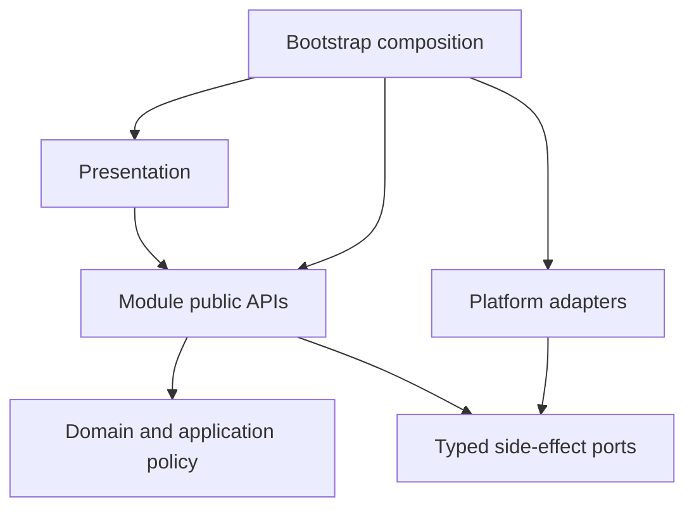

# IsleMind Architecture

**Status:** Active architectural source of truth.

**Platform:** Expo SDK, React Native, Expo Router, strict TypeScript, and Bun.

**Product runtime:** Chat is the conversational and durable assistant execution entry. Documents is a supporting user-owned editor with explicitly requested, ephemeral model proposals, not another agent/task/effect mode. Obsolete product-mode metadata may be decoded only inside an owner-private migration reader and cannot select navigation, permission, or reply behavior. Agent workflows and Tavern workspaces are active domain capabilities inside Chat, not alternate product modes.

## 1. Objective

The architecture keeps product behavior inside explicit ownership boundaries without imposing framework ceremony on local helpers.

> A capability should be added inside one owning module, through an existing public API or one justified boundary contract, without editing unrelated stores, screens, or provider branches.

The target system must be:

- easy to change inside clear ownership boundaries;
- strict at untrusted, persistent, permission, and side-effect boundaries;
- simple inside a boundary, without ports or schemas for local helpers;
- recoverable and diagnosable for durable work;
- responsive on representative Android devices;
- explicit about temporary compatibility code and its deletion condition.

## 2. Non-Goals

- Replacing Expo, React Native, Expo Router, TypeScript, or Zustand without demonstrated product or engineering benefits that justify migration. Existing choices may be reconsidered when requirements or evidence change.
- Applying layered architecture to every UI helper.
- Creating a general event bus, service locator, decorator container, or permanent legacy facade.
- Adding a contract file when an inferred local type or direct function call is sufficient.
- Preserving removed writers, formats, routes, or names without executable compatibility evidence.
- Weakening permission, validation, cancellation, recovery, or network trust controls to reduce file count.

## 3. Target Shape



```text
src/
  bootstrap/        composition, startup, restoration
  core/             shared pure contracts, IDs, errors, schemas
  modules/          business ownership
  platform/         reusable storage, native, network, telemetry effects
  presentation/     routes, screens, feature controllers, design system
```

Internal folders such as `domain/`, `application/`, `ports/`, and `adapters/` are created only when they contain meaningful separation. Empty-layer ceremony is forbidden.

## 4. Module Ownership

| Module | Owns | Excludes |
| --- | --- | --- |
| `conversations` | Conversation lifecycle, messages, drafts, projections | Provider protocol, tool execution, raw storage |
| `documents` | User-owned editable Markdown, immutable captured origin, revision/review policy and persistence | Knowledge indexing, independent source authority, provider transport, tools/durable task execution |
| `workspaces` | Chat workspace authority, revision, review, writeback | Conversation persistence, provider protocol, task execution |
| `assistant-runtime` | Run lifecycle, streaming, cancellation, journals, recovery orchestration | Screen state, provider serialization, concrete storage |
| `providers` | Catalog, credentials policy, capability, routing, normalized stream, health and fallback | Chat UI, task policy, RAG policy |
| `knowledge` | Documents, memories, indexing, retrieval, citations, context candidates | Chat rendering, provider wire formats |
| `tasks` | Durable task state, permission, confirmation, idempotency, artifacts, task journal | Provider and Android implementations |
| `integrations` | Tool manifests and MCP, built-in, web, workspace, and Android protocol adapters | Permission decisions and task lifecycle |
| `data-management` | Portable export, import, reset, cancellation admission, refresh policy | Native picker/sharing, raw repositories, secrets |
| `settings` | Preferences and configuration use cases | Credential secret implementation |
| `diagnostics` | Redacted health, timeline, recovery, and performance projections | Secret or raw provider-payload retention |

The exact allowed entry points are listed in [module public API](./module-public-api.md).

## 5. Dependency Rules

1. New business behavior belongs in `src/modules/<owner>/`.
2. Shared pure primitives belong in `src/core/`; reusable effects belong in `src/platform/`.
3. `bootstrap/` is the only composition root and the only layer that creates concrete adapters.
4. Cross-module imports use only `@/modules/<owner>`. Deep and relative cross-module imports are forbidden.
5. Domain code imports only its own domain and `core`.
6. Application code does not import React, Expo, Zustand, HTTP, SQLite, or concrete adapters.
7. Presentation consumes module public APIs. It does not become persistence or execution authority.
8. Zustand stores hold UI projections and transient interaction state, not the sole durable copy of user work.
9. `src/services/` is compatibility-only. A retained service requires a target owner and deletion condition.
10. Value and type import cycles fail CI.

## 6. Contract Budget

Contracts exist only when at least one condition is true:

- data crosses a module, process, native, network, or persistence boundary;
- an untrusted input requires runtime validation;
- a durable record requires versioning or recovery semantics;
- an adapter must be substitutable in focused tests.

Contracts do not exist merely to rename a local object, mirror an implementation, preserve a deleted symbol, or create a one-consumer interface. Local helpers use direct calls and inferred types. Cross-module aliases and compatibility re-exports are deleted after consumers move.

Each public contract has one owner. The owner exports it from `index.ts`; consumers never import owner-private folders.

## 7. Runtime Model

```text
Conversation
  -> AssistantRun
  -> ContextSnapshot
  -> ProviderGateway
  -> StreamEvent sequence
  -> optional ToolExecution / TaskExecution
  -> RunJournal / TaskJournal
  -> durable records
  -> UI projection
```

| Contract | Responsibility |
| --- | --- |
| `AssistantRun` | Identity, state, timing, cancellation, and terminal result |
| `ContextSnapshot` | Immutable attributable context |
| `ChatRequest` / `StreamEvent` | Provider-neutral request and stream |
| `ToolDefinition` / `ToolRequest` / `ToolResult` | Integration-neutral tool protocol |
| `RunEvent` | Ordered redacted run lifecycle |
| `TaskCommand` / `TaskEvent` | Durable side-effect and long-running work lifecycle |
| `Result<T, ErrorCode>` | Typed cross-boundary success or failure |

All I/O accepts `AbortSignal`. Timeouts, retry admission, cancellation, cleanup, and terminal projection are coordinated by the runtime, not reimplemented per screen.

Streaming HTTP has two lifetimes: the header deadline ends when fetch returns, but caller cancellation remains attached to the open native request. The transport composes the caller and timeout signals with Expo's `AbortSignal.any`; clearing the timer does not detach cancellation or abort siblings. The executor also cancels its acquired reader to settle a pending read, with idempotent cleanup. Normal terminal EOF retains its 50-ms native close grace. Reader cancellation alone is insufficient on Android: Expo can stop JS delivery while a native socket read remains blocked. This distinction was reproduced and repaired on the isolated API35 emulator; buffered/bodyless paths and other platforms do not inherit that evidence.

Provider protocols enter one Providers-owned gateway. Provider-native and MCP continuation turns preserve exact cancellation, task identity, terminal receipt, usage, trace, and replay semantics.

Context assembly freezes attributable conversation, memory, knowledge, attachment, and approved tool inputs before dispatch. Retrieval and provider wire formats remain independent.

Chat's **Continue in new chat** action creates an independent, in-memory Conversation draft from a terminal message prefix, not a fork of an AssistantRun. Conversations owns the pure transcript/configuration copy; the Chat store owns draft selection, and presentation owns confirmation/navigation. Copied messages receive new identities and keep text, terminal status, captured provider/model and citations, but not execution traces, pending confirmations, run/lifecycle identities or generation-cost metrics. Workspace/command bindings and conversation-scoped memory remain with the source. A sending/streaming message inside the prefix blocks the copy; later source work is neither stopped nor replayed. No schema migration or branch graph is required.

Creating or editing that draft does not save it or start work. The existing first-reply persistence barrier saves the copied prefix and new turn before provider dispatch; normal attachment retention rules still apply. Selecting a saved conversation discards unsent drafts. Only the **focused** deep-link screen may select a conversation: hidden screens still receive source updates and must not discard the active draft. Branch navigation supplies the existing Chat return intent so Back can return to the source. Browser/Jest evidence for these interactions is not Android lifecycle or native durability evidence; the native release gate remains separate.

Chat Markdown export is a presentation-owned snapshot, not another Conversation, TaskArtifact or saved document. Its formatter leaves ordinary Copy text unchanged and adds source summaries only for Export: retained per-message order, literal/redacted titles, source kind and eligible explicit HTTP(S) links through the existing source-URL policy. It neither fetches source bodies nor adds excerpts, sourceUri, document/chunk IDs, headings or execution traces. Source numbering describes the retained list, not verified support for an answer; no global Markdown reference definitions may rebind another message's citations. Because titles may be private, source-bearing exports require disclosure/confirmation before clipboard or file effects. Clipboard failure must not be reported as success; sharing unavailability/failure remains an explicitly labelled clipboard-only result after a successful copy. Sharing is not proof of an external save, and temporary-file cleanup is best effort. The pinned Expo Clipboard Web patch preserves the legacy command's Boolean result; native clipboard code is unchanged.

Current output stores are not interchangeable editable-document infrastructure. Tasks artifacts describe execution evidence/URIs, context artifacts are session-local, and workspace review concerns Tavern snapshots/private memory. The native-only writable workspace-file port has bounded namespaced CAS/receipt semantics but no general document library/editor or portable-payload inclusion. Source-aware Markdown export improves external reuse; it does not complete the retained editable-deliverable capability or authorize automatic knowledge indexing, new retention or writeback.

Knowledge owns lexical/vector fusion before local reranking. Raw negative BM25 remains attributable to SQLite; normalized relevance is higher-is-better. When vector candidates are present, hybrid fusion applies the same 62% vector / 38% lexical weights to shared and single-modality hits: an absent modality contributes zero, not a full-weight lexical bonus. An entirely unavailable vector channel retains the existing FTS fallback scale. This scoring correction does not alter vector-space identity, permissions, source scope, or retrieval defaults.

Local neural embeddings use the catalogued tokenizer configuration, not an approximate character splitter. The BERT/WordPiece adapter honors cleaning, Chinese boundaries, accent/case normalization, literal special tokens, continuation prefix and word-length limits; its preprocessing identity remains `onnx-pipeline-v3`. Vector compatibility requires the source and full model identity, not dimension alone: valid old vectors remain stored but are not compared with another preprocessing/model space or silently relabelled. Explicit reindexing uses canonical text; lexical/hash fallback must not destroy a valid old vector. When indexing explicitly requests a model ID, bootstrap must not admit a different catalogue fallback model for that write. Read-only query fallback remains available; it does not authorize replacing the requested model's durable vectors.

The opt-in multilingual MiniLM pipeline uses the focused platform XLM-R Unigram tokenizer and identity `onnx-unigram-v1`, with the upstream 128-token limit. Its serialized Precompiled charsmap, grapheme/scalar normalization, whitespace/Metaspace, literal specials and Float64 Viterbi rules follow the pinned Hugging Face Rust reference, not generic NFKC. `unicode-segmenter/grapheme` supplies grapheme boundaries; no second model runtime or general SentencePiece interpreter is introduced. Compact vocabulary lookup avoids an object trie. Vocabulary parsing uses built-in JSON parsing in at most 4,096-entry batches; normalization and Viterbi yield during long inputs. Raw/normalized input bounds are 32,768/65,536 UTF-16 units; vocabulary is at most 262,144 entries with pieces of at most 32 scalars. Unsupported/malformed/oversized inputs reject rather than approximate. Preprocessing finishes before native session allocation. Shared tokenizer initialization cannot be poisoned by one cancelled caller, and resource retirement invalidates pending encoding admission before it can allocate a late session. Native inference itself is not preemptible: late cancellation discards results and releases tensors/sessions only after settlement.

Catalogue presence, functional `available()` and passing fidelity checks do not certify a resource budget or production readiness. The multilingual implementation has actual Hermes/ORT/SQLite fixture evidence, but its prospective opt-in production admission sign-off remains **NO-GO**: the final API35 x86_64 debug cold-admission sample exceeds the unchanged five-second target. Warm/bounded-input responsiveness and snapshot-memory targets passed in that environment, not across OEMs or release builds. The implementation remains available for explicit local evaluation; FTS/default model and bundled assets are unchanged. The living evolution report records the exact receipts and qualifications. Neither supported tokenizer replaces the independent native interruption/recovery release gate.

Embedding availability is asynchronous admission, not a cheap metadata getter. Both bootstrap query and index factories pass the operation signal through `EmbeddingProvider.available({ signal })` into catalogue/file verification; direct `embed` admission does the same. Cancellation rejects rather than becoming an unavailable/fallback result or diagnostic failure, and a cancelled resolution cannot populate the provider's successful-descriptor cache. The outer owner's abort race alone is insufficient: it can stop waiting while file verification continues. Integrity checks, per-provider descriptor lifetime, shared tokenizer/session lifetime and result-cache policy remain distinct and unchanged; no cross-provider trust cache or hash bypass is introduced to hide admission cost.

App-private Android file integrity uses the existing ReactPackage/config-plugin convention to stream full SHA-256 through `MessageDigest`, not the JS/UI thread. Each operation owns its digest and cancellation identity; two workers, eight queued requests and 256 KiB read buffers bound native work. Native code canonicalizes files/cache paths, checks the opened regular file's size and complete byte count, and closes the descriptor before settlement. The adapter rechecks cancellation and the returned digest/length; native failure never silently downgrades to another reader. No file bytes cross the bridge, and no stat/mtime trust cache, new permission, or effect authority is added. The bounded one-MiB Expo/JS fallback remains for missing native support and other URI locations/platforms; its latency is not fixed by Android evidence. Model admission, staged installation and cached APK verification share this adapter, not a new Knowledge policy.

Android ONNX registration and binary selection are separate build obligations. `react-native.config.js` explicitly admits ORT's ReactPackage because its legacy `unimodule.json` otherwise hides it from Expo 57's RN package list. The existing ONNX postinstall patch pins the native AAR to the installed JS package version and selects exact CMake header/library paths, so a cached older AAR or `latest.integration` cannot silently choose another numerical runtime. Release fingerprints include both inputs. JS package metadata is not proof of the loaded native version; native evidence reads `OrtApi.version`. Neither this build correction nor tokenizer parity establishes multilingual answer quality, OEM/ARM64 behavior or production readiness.

Source verification is a read-only projection through Knowledge's `KnowledgeLocalSourceReader`, lazily bound by `app/source.tsx`; presentation does not instantiate storage. A document and its ordered retained chunks are read in one transaction. Memory reads require its exact ID and either local-user or the requesting conversation's scope. Missing/out-of-scope sources are indistinguishable, and an explicitly missing citation never falls back to another citation. Captured excerpts remain separate from current saved text: citations have no historical revision hash, so a timestamp notice is not proof of revision equality. Exact chunk identity, not title/ordinal similarity, identifies a still-retained cited section. Focus/identity changes cancel obsolete reads. The reader does not reconstruct original files, retain another copy, fetch source URIs automatically, or grant retrieval/replay authority; opening a safe HTTP(S) origin is an explicit action.

Chat exposes bounded, title-based captured-source actions beside the answer rather than requiring an initial visit to the first source. Rendering or expanding this list does not read source bodies. Selection passes the exact conversation/message/citation identity to the existing reader, without forwarding an origin-URL override. A shared presentation selector rejects missing, blank or duplicate citation IDs; even the reader's legacy default must resolve uniquely. Message memoization observes conversation identity and immutable citation-array updates, so a source-only change cannot leave obsolete controls. Captured lists may include uncited retrieval results and later supplemental material: list order, a chunk index, `[1]` or `[S1]` is not an authoritative claim-to-source binding. Titles remain literal, and the UI explicitly distinguishes captured references from verified support. No provider prompt, citation schema, source-read permission or durable execution boundary changes.

Work-artifact auditing is a deterministic structural transformation of supplied content, not generation or semantic verification. The manifest asks for the actual existing/new draft in `content`; `sourceMessageId` is optional annotation, never a lookup or role, and a new draft needs no invented message ID. Citation inputs retain supported string labels/reference objects; numeric indices are rejected at catalog admission rather than silently dropped. Its parser shares the formatter's canonical section labels so localized copy/reparse retains item kinds, and ordered action text does not become evidence merely by mentioning sources or decisions. For colon-labelled inline fields, the heading length limit and kind classification apply to the label, not its body: long evidence stays evidence and body keywords cannot change its kind. Bare numbered headings require a complete canonical label, not a numbered inline item; explicit Markdown headings retain the wider heading aliases. An audit tool may succeed while reporting missing coverage: neither that task status nor populated sections prove that the user's broader task is complete, a citation supports a claim, or an action is authorized. Workflow `acceptanceChecks` remain descriptive prompts/trace context, not an executable semantic gate. Same-version pure work-artifact replay reconstructs from supplied arguments; unlike retained AssistantRun terminal output, it is not a versioned archive of the original derived artifact.

Provider-native declarations preserve the canonical JSON Schema at the Providers boundary. Google uses `FunctionDeclaration.parametersJsonSchema`, not the mutually exclusive typed OpenAPI-subset `parameters` field, which cannot represent array-valued `type` unions such as string-or-object citations. Other provider envelopes and the catalog's admission authority are unchanged. Host wire-shaping regressions and Google's current public discovery schema support this mapping; they do not certify live provider/model acceptance.

The model-facing work-artifact receipt is explicitly advisory. It retains raw structural quality, audit outcome, counts and template diagnostics without copying the opt-in human handoff/follow-up prompt into a new model task. Absent template categories are not automatically user requirements or missing source facts. Feedback asks for the requested deliverable using available sources and recorded constraints/statuses, not invented facts or generic template completion. Human follow-up affordances and compact structured trace metadata remain available. No validator, task admission, permission, or terminal-success policy is weakened.

The bounded model-driven Chat probes confirm the semantic distinction. Earlier small-model runs omitted the requested draft audit or supplied the request/source notes; a higher-capacity local-model run supplied a generated draft but omitted required source details. Its long-inline-evidence classification defect was repaired narrowly with exact-input host replay. A subsequent current-code baseline confirms that both complete source documents reach the model, while generic audit feedback redirects the final answer into unrequested template completion. The scoped-feedback sample removes that detour and retains pending states, but still omits a source constraint; another case still omits explicit vendor-provenance qualification. Draft/citation arguments differ between samples, so this is bounded host evidence, not an isolated causal or general quality guarantee. Correct tool use remains distinct from semantic completion. No native parser behavior, broader parser rewrite, mandatory audit or automatic success gate is implied. Exact outcomes and limitations belong in the living evolution report. The portable local LLM remains evidence tooling, not a shipping inference runtime or a new Judge/acceptance authority.

Broader source-use prompting is not an established fidelity or trust boundary. A later shared-prompt candidate restored two omissions in the repeated host cases but dropped an explicitly requested permitted alternative in an independent case, with both complete sources still delivered and no context compression. That candidate and its candidate-specific test additions were withdrawn; the prior shared prompt and the scoped work-artifact receipt above remain unchanged. Exact rejected code and counterevidence are retained in the evolution record. Source-backed document review/revision is a separate user-controlled capability, not an automatic verifier: captured origin references do not grant retrieval permission, and any adopted edit must remain user-controlled through the existing revision-fenced document owner.

## 8. Permission And Trust

Access control has one decision owner:

- Tasks decides permission, confirmation, limit, idempotency, and durable task admission.
- Integrations describes manifest risk and output boundaries and implements protocols; it cannot grant execution.
- Bootstrap binds only admitted capabilities to concrete ports.
- Presentation requests an action and renders the decision; it does not authorize.
- Historical product-mode data is audit or migration input only and cannot affect a decision.

Untrusted manifests, persisted rows, native results, tool arguments, URLs, paths, and network responses are validated and bounded. Unknown, malformed, stale, or incomplete authority fails closed.

Static metadata with no user-state access may run without a durable task only when it is explicitly classified as pure and still observes cancellation. Reads of user data, mutations, external effects, and long-running work require task admission.

Native and web capabilities are advertised only when every required concrete port is bound. A manifest alone never proves runtime availability.

Network adapters enforce public HTTPS, bounded redirects, bytes and time, structured parsing, and cancellation. A locally admitted native crawl does not fall through to a vendor after a local trust or fetch failure. Workspace paths stay inside durable namespaces with revision and idempotency checks.

## 9. Persistence And Recovery

Each durable record has one owning module, one repository port, strict decode validation, and explicit migration policy.

SQLite transactions run on each provider's initialized, private connection through the shared per-database operation queue. The queue prevents other application adapter calls from joining an asynchronous transaction. Native and web both use `withTransactionAsync`; Expo's native exclusive helper creates a separate connection that does not inherit connection-local foreign-key settings. The adapter requests WAL with `synchronous=FULL`; effective settings must be verified on the target, not inferred from successful PRAGMA submission. Native WAL/FULL is the required durability policy: pending effect/journal receipts must not trade away per-commit synchronization for cache-write speed. Transaction support is required, never silently replaced by non-transactional writes. A failed connection initialization is closed before retry. This queue is process-local; SQLite, not the JavaScript queue, governs external connections, and actual durability still depends on the native filesystem/VFS and device.

Web persistence is a separate evidence boundary. The installed Expo SQLite Web implementation owns a dedicated worker and an OPFS access-handle pool with pathname/flag/digest headers; the exercised effective journal is **DELETE / FULL=2**, not native WAL. Use a new, explicitly disposable persistent browser profile for Web filesystem/restart evidence, never a user profile. Nonpersistent contexts are separate isolation/failure controls, not substitutes for on-disk retention evidence. Browser-profile persistence is distinct from a Storage API persistence grant; neither implies physical power-loss durability. Context/profile identity must accompany origin/storage-key identity, and actual document/worker isolation headers must be observed rather than assumed from Metro configuration. An in-memory Chat projection is not proof that its durable rows remain accessible. Preserve raw pre-failure records/files and distinguish failed reads from an authoritative empty store; do not clear, reseed or replay work to hide an unexplained discontinuity. Evolution report §§29–30 records private-context OPFS failure reproduced without IsleMind/Expo/SQLite, alongside exact retained files/records across idle and a full browser restart in a separate persistent profile. This narrows the environment boundary; it does not certify general Web durability, identify the browser/host deletion mechanism, close native gates or justify changing recovery authority.

The pinned Expo SQLite Web patch publishes one shared initialization promise per worker, resolving only with the complete SQLite API/persistent VFS/memory VFS tuple. Simultaneous requests await the same attempt. Failed pool acquisition drains all pending opens and closes acquired handles; later initialization failures close acquired VFS resources before clearing that exact promise and preserving the original error. A transient exclusive OPFS lock conflict must not poison later Retry with a partial `Invalid VFS state`. Default exclusive access remains required: another tab must release its handles before this worker can acquire them. This is initialization recovery, not multi-tab write coordination, run/task replay or a substitute for the database operation queue. The Web additions share `patches/expo-sqlite@57.0.2.patch` with the byte-preserved native WAL backport; reassess them when a compatible upstream worker provides equivalent atomic initialization and failure cleanup.

Knowledge's secondary-index owner installs transactional invalidation for canonical chunk replacement/deletion and cache provenance changes. Async embedding commits must still match their captured source; provider jobs additionally require the exact current attempt identity. Cancellation or late completion cannot recreate a removed job or overwrite a newer one. Cached source text is checked against canonical content/provenance before reuse or persistence. Derived indexing never grants permission to replay a provider call.

| Data | Authority |
| --- | --- |
| Conversations and messages | Conversations repository |
| Editable saved documents and captured origin | Documents repository (`saved_documents`, migration `saved-documents/v1`) |
| Runs and run journal | Assistant Runtime repository |
| Tasks, task journal, artifacts | Tasks repository |
| Knowledge and memory | Knowledge repositories |
| Settings | Settings persistence |
| Provider metadata and credentials | Providers policy plus secure storage |
| Workspace revisions and receipts | Workspaces repository |

Secrets never enter portable payloads, ordinary logs, telemetry, or UI state. Export, import, and reset coordinate owners through Data Management and bootstrap; they do not scan storage directly.

**Retained editable documents (2026-09-09):** Documents is a supporting user-owned library, not another Chat/agent mode or durable task/effect entry. A terminal, nonempty assistant answer can seed an unsaved document; a blank document is also supported. Only an explicit successful Save acknowledges retention. Editing never rewrites Chat, and deleting Chat never deletes the independent document. Optional origin captures the original answer, terminal status and bounded reference metadata/excerpts, not execution traces, source-body backups, permissions or live source authority. A stopped/failed answer stays stopped/failed in that capture. Editing and a structurally valid reference list do not certify the answer or the edited text. Preview does not fetch images or open links; Copy text excludes captured origin. Nothing is automatically indexed, sent to a model, or executed.

The Documents adapter uses the existing queued SQLite provider, not another storage engine. Drafts detach and validate before awaiting persistence; save/delete compare opaque revisions, so a stale editor cannot overwrite newer work or resurrect a deleted document. Imported provenance requires primitive status/type strings rather than coercible values. Atomic snapshot replacement accepts only the recorded source/target states; rollback is idempotent and refuses newer-writer drift. The editor keeps a conflicted local draft until explicit reload/discard or Save a copy. UI drafts are transient, not acknowledged durable output.

**Source-backed revision (2026-09-09):** Documents owns bounded review/proposal policy through `DocumentRevisionPort`; bootstrap binds live Chat lookup, Knowledge's read-only owner and the existing provider runtime. A captured reference alone never authorizes a read. Each explicit read rechecks the exact live terminal message/origin/citation, current Knowledge scope and canonical ready source identity; memory must be active, non-sensitive, unexpired and correctly scoped. The user inspects and separately includes current retained text. Selected snapshots are re-read/compared before dispatch; replacement requires refresh and reselection, not silent use of different bytes. Source sections may overlap and are not original-file or historical-version reconstruction.

The user chooses the provider/model and sees its destination/proxy before sending the current title/body, instruction and selected source text only. Captured origin and the full Chat are omitted. Requests reject a total input over 24,000 characters, instructions over 2,000 characters or more than 12 distinct sources, with an additional existing-estimator context check and no silent truncation. Existing credential/access/privacy/session policy applies. `allowFallback: false` excludes provider/model/credential fallback candidates; it does not redefine same-target transport/protocol handling. Default fallback behavior, including empty `fallbackProviders`, is unchanged. Tools, search and remote compaction are not enabled; partial, failed, cancelled or tool-call completion is not an accepted proposal.

Proposals are ephemeral and explicitly unverified, not a durable run, recovery/replay instruction or success acknowledgement. Background/focus loss cancels active reads/generation and late results are ignored; draft, route or saved-object changes invalidate proposals. Acceptance rechecks the document's durable revision and changes only the unsaved draft. Independent Save still owns persistence, conflict fencing and immutable origin. Small host/Web model probes include a correct revision, omitted requested citations and a proposal that retains a false claim while commenting on it. Human-controlled adoption is useful control, not evidence of reliable automatic correction or certified citation links.

The current proposal contract remains a complete Markdown body. Exact-match edit applicability is not source fidelity or instruction compliance: a model can select unique spans while retaining false assertions or changing explicitly protected text. The rejected host-only exact-edit candidate in evolution §38 is not a runtime parser, public protocol or replacement prompt. Selected source snapshots and their `[S1]` order currently belong to transient proposal review; adoption carries the body, not a durable record of that source selection. Saved origin remains the original Chat capture, not the reviewed source versions behind later edits. Do not reconstruct that missing association from citation-array positions, overwrite original origin, or imply that a source label certifies a claim. Keeping reviewed evidence inspectable after adoption is a separate capability question, not permission to fetch or persist sources automatically.

Portable `savedDocuments` is distinct from Knowledge's `context.documents`. The `documents` category participates in full/selective backups and reset; bootstrap appends a seventh recovery participant while recognizing the earlier five- and six-participant envelopes. Selective import merges against the participant's current snapshot. Explicit full snapshots replace the collection; legacy absence preserves it. Each imported record receives a fresh opaque revision to fence open editors. Captured text/excerpts are included in a document backup, unlike body-only copy. Host SQLite and the isolated production Web adapter/coordinator have exercised these rules, including a declared post-write failure/rollback seam and same-profile browser restart; native document lifecycle, OS sharing, power loss and production readiness remain unverified. This capability does not close E4 or change WAL/FULL policy.

**Web restart evidence / remaining HOLD (2026-09-09, evolution §§34–35):** The original §34 full profile remains unopened and byte-preserved after its `Invalid VFS state` / `BOOT-STARTUP` restart failure. A storage-only copy, excluding browser account/cookie/key/preferences/cache data, reconstructs all three saved document bodies, revisions and immutable origins exactly through the production owner, even before the repair; integrity passes. This establishes reconstructable copied application storage, not full-profile equivalence or the original failure's cause. A separate deliberate competing-tab experiment establishes the sticky-initialization defect: actual `NoModificationAllowedError` is followed by `Invalid VFS state`, which persists after the owner closes. With the patch, actual Chromium Web Retry succeeds after owner/worker closure in the same previously failing worker without reload, and a further controlled browser-process restart reconstructs the same records with **DELETE / FULL=2**. An automatically restored app tab was observed holding OPFS in the disposable profile, so restart checks must inspect existing pages before opening another app tab; this is not a retrospective diagnosis of §34. Focused host concurrency/cleanup regressions complement, but do not generalize, that browser evidence. Original full-profile causality, abrupt browser death, other browsers, signed-release Web behavior and hardware durability remain unverified. Web release readiness remains on hold; no Android/OEM or native-gate conclusion follows.

**Web Chat hydration counterevidence (2026-09-09, evolution §36):** A full-page reload in a new disposable persistent Chromium profile left the Chat projection empty with `isLoading=true` and a captured `NoModificationAllowedError`, while its durable conversation rows and active selection remained readable. The direct route said the Chat was not found and history said there was no history. Explicitly invoking the existing load action populated the projection without reseeding, but retained the stale application error. The exact triggering worker/lifecycle ordering was not captured; do not equate this with the original §34 failure, data loss or failure of §35's bounded worker Retry repair. Failed hydration is not an authoritative empty store. Startup/load-state truthfulness and user-reachable recovery remain an open whole-Chat reliability concern, separate from the subsequently exercised source-selection UI and from native run recovery.

**Hydration admission repair (2026-09-09, evolution §37):** Chat hydration is now a required startup prerequisite, not a counted-but-ignored initialization error. Bootstrap still drains both initial Chat/settings loads, but a rejected Chat load blocks the existing startup/Retry surface before run recovery or Chat admission. Optional settings-error policy is unchanged. The Chat store shares one pending hydration attempt and releases it on either success or failure; rejection settles `isLoading` without clearing existing records, drafts, selection, history cursor or unrelated errors. This is per-store in-flight coalescing, not a transactional refresh or a new fence for arbitrary concurrent local mutations. Existing successful-load normalization, paging, selection and background hydration semantics are unchanged. Actual isolated Chromium Web contention now displays `BOOT-STARTUP` and an actionable Retry instead of empty/not-found Chat. Retry while the owner remained, and one immediately after its page/worker closed, still failed honestly. A later explicit Retry in the same worker reconstructed the exact retained terminal fixtures; a subsequent full-page/worker reload and ordinary history navigation also succeeded without test-side hydration. Worker-close notification alone did not establish immediate OPFS lock release. These are Metro Web observations, not a release export, browser-process kill, native interruption or WAL/FULL validation; Web HOLD and native gates remain open.

Current durability policy is intentionally strict:

- product and new `AssistantRun` rows are Chat-only;
- conversations use current SQLite records and the current active-conversation record;
- workspaces use current native SQLite or current browser v2 storage;
- portable recovery uses the current envelope key and a large-value native blob store where required;
- unsupported historical writers and removed formats are not restored to make stale tests pass.

SQLite migration identity is the `(scope, version)` pair, not its display name. Knowledge records retain `knowledge/v3` and subsequent migrations; RAG replay snapshots now own `knowledge-rag-replay/v1`. A historical `knowledge/v3` marker named `knowledge-rag-replay-snapshots` identifies the old collision. Only that case applies the canonical base migration under `knowledge-records-repair/v3`, before the FTS v4 migration. The historical marker and replay rows are retained. Healthy databases must not rerun legacy v3 conversion, which can rewrite explicit memory scopes. Host and native SQLite checks cover both initialization orders, this historical repair and idempotent adapter reconstruction; no second migration ledger or public recovery API is introduced.

`AssistantRun` schema v4 persists the exact captured handoff atomically with `run.created` as strictly validated durable evidence only; it does not grant recovery authority. Rich and Plain Chat store the same final canonical `ChatRequest` snapshot with a versioned capability revision, stable request hash, and bounded context receipt. The older redacted activity-request shape is decode-only for existing SQLite rows and has no runtime or public writer. Rich text, citation, tool-call, usage, and bounded trace-lifecycle markers are journaled as `stream.event` checkpoints before terminal completion; trace content and metadata remain excluded, and the evidence remains diagnostic rather than replay authority. During an in-flight run, visible output is stored as ordered JSON-encoded delta segments behind a predecessor-checked v2 header; selection, cancellation, effect and terminal barriers materialize the ordinary v1 snapshot and clear segments atomically. Adjacent callback text is coalesced in a bounded 256-event/1 MiB buffer; overflow aborts the activity rather than dropping evidence. Nested Rich provider turns persist bounded started/completed continuation identities. On restart, an unmatched identity is attached to the interrupted failure with `resume: new-turn-only`; recovery safely terminalizes the run and never replays a provider request or tool effect. Unsupported or incomplete rows are terminal decode-only no-replay inputs. Recovery does not infer effect authority unless an awaited durable final-output/success barrier exists.

Recovery never infers that an external effect happened. Unknown cleanup or commit state is fenced for explicit retry, repair, or quarantine. Concurrent recovery callers are idempotent at the runtime boundary: a stale terminal write re-reads the durable disposition and never replays or overwrites a run that another caller already recovered.

An acknowledged `cancellationRequestedAt` remains authoritative across process death: both run and task recovery terminalize it as cancelled, not interrupted/failed. Queued tasks remain queued; interrupted confirmation expires; unknown in-flight effects fail interrupted without replay. Competing recovery writes re-read the durable terminal disposition; genuine read/write failures remain retryable failures rather than fabricated success.

Bootstrap requires successful Chat hydration, then completes run recovery, workflow checkpoint reconciliation, workspace receipt reconciliation, and task recovery before admitting Chat. A hydration or run/task recovery failure blocks admission through the existing startup retry UI. This ordering matters because the active-run/task registries are runtime-instance-local, not a cross-instance liveness oracle. Later successful recovery cannot substitute for a failed Chat projection load. `AppState` background notifications and resume recovery do not guarantee execution or a final flush when Android kills a process.

Terminal run persistence and message projection are separate commits. A succeeded run is intentionally absent from `listRecoverable`, so stale message reconstruction must also use the Assistant Runtime repository's read-only `getLatestForResponseMessage(conversationId, responseMessageId)` lookup. Bootstrap exposes it through the existing presentation runtime binding; presentation neither opens SQLite nor resumes an effect. The additive response-message index (migration v10) bounds that lookup. Recovery rechecks live/cancelled/terminal message state after awaits, projects authoritative output only onto an orphaned sending/streaming placeholder, and awaits the reconstructed message's persistence. A missing owner uses the existing orphan cancellation path; an unavailable owner read does not. Already cancelled messages are not reinterpreted as successful.

**Native SQLite maintenance (2026-09-07):** Expo SQLite 57.0.2 vendors SQLite 3.50.3, which predates the upstream WAL-reset fix. `patches/expo-sqlite@57.0.2.patch`, registered through Bun's `patchedDependencies`, backports upstream SQLite commit `e7987a7a2c42fb375ac8ff4b1925c2c4238c925a`: after acquiring read-lock 0, a checkpointer must reject an obsolete WAL salt before copying frames or advancing backfill. This remains **3.50.3 with a focused backport**, not a full 3.50.7 upgrade. Namespaced Expo symbols, schemas and application transaction/recovery policy are unchanged. `expo.autolinking.android.buildFromSource: ["expo-sqlite"]` is essential: Expo 57 otherwise selects a prebuilt Android AAR that would ignore the patched C source. Package/lock/patch and source-build selection belong together; release source fingerprints include the patch. Reassess or retire the backport when a compatible upstream Expo artifact demonstrably includes the fix; a version string alone is insufficient.

**Native evidence boundary (2026-09-07):** the E4 isolated API-35/x86_64 Android debug campaign exercised backgrounding, actual PID death/restart, native SQLite reconstruction/rollback, cancellation and competing recovery, plus real HTTP streaming and the terminal-commit/projection crash window. E13 additionally links the adapted upstream WAL-reset regression to the exact rebuilt APK library and verifies the stale-backfill guard, integrity, FTS5 and transaction-local WAL/FULL/foreign keys on that emulator. The scheduling hook is upstream's normally inert fault 660 in a separate probe process, not a naturally reproduced IsleMind corruption incident. This is not signed-release, ARM64/OEM, low-memory-killer, Doze, physical-flash, power-loss, iOS or web-binary validation. WAL/FULL configuration and process-death persistence are distinct from hardware durability. The application queue is not a universal native connection/checkpoint exclusion proof. The remaining native release gate stays **open**; do not lower synchronization or claim production readiness from host or emulator passes.

**2026-09-08 continuation:** the same disposable environment additionally verified the migration repair, actual held-HTTP-stream closure on cancellation, cancelled output/journal reconstruction after SIGKILL, and preserved interrupted/successful Chat terminal reconstruction. The first native cancellation campaign failed despite passing host evidence and remains retained. Final campaigns contain 19 **Native verified** and 3 **Partially verified** passing assertions; controlled startup/cancellation seams are identified, not counted as physical gestures. Their provider emits synthetic SSE, whereas the three real-model Chat outcomes are **Host verified** Windows evidence with semantic omissions. Neither cohort establishes Android model quality or closes the native release gate.

## 10. Presentation And Mobile Quality

Presentation owns routing, screens, feature controllers, localization binding, and reusable visual components. Domain and application layers emit stable codes and parameters, not translated strings.

The design system owns semantic typography, color, spacing, radius, border, shadow, icon, control, feedback, loading, empty, and error primitives. Feature screens do not create parallel token systems.

Mobile behavior must cover:

- safe areas, gesture regions, keyboard avoidance, and restoration after navigation;
- 44 dp or larger touch targets and accessible labels, roles, values, and focus;
- light, dark, reduced-motion, and no-motion modes;
- loading, empty, error, offline, cancellation, success, and retry states;
- long and localized text without overlap;
- virtualized long lists and stable layout dimensions.

Animation communicates state or spatial continuity, completes quickly, respects reduced motion, and never delays a control, error, cancellation, or durable effect.

## 11. Performance

- Startup composes only essential runtime paths.
- Low-frequency settings, diagnostics, native bridges, and heavy feature panels load on demand.
- Lists use virtualization, stable keys, selector-based subscriptions, and bounded stream buffers.
- Parsing, indexing, import, and model preparation use cancellable jobs with visible queue state.
- Large artifacts are referenced by URI and metadata, never retained as base64 in view state or persistent JSON.
- Network requests are cached or coalesced only when identity, freshness, cancellation, and error semantics remain explicit.

Hybrid knowledge retrieval enumerates the selected corpus before applying its best-vector candidate limit; a recency window must not silently make older compatible vectors unreachable. Query-vector source discovery uses the same scope. Keyset pages bound transferred rows and retained candidates, yield for interaction/cancellation, and keep model work outside transactions. Fresh results and cached evidence are checked against canonical source identity. This is exact candidate search for a stable corpus, not ANN or a transaction-wide snapshot across concurrent edits; device latency and memory still require measurement.

Debug-client Metro timings and memory are diagnostic evidence only. Release or profile builds on named devices establish production budgets.

## 12. Change Method

Architectural changes proceed in bounded, independently buildable slices:

1. Identify the live authority, owner, public boundary, persistence effect, and any required compatibility reader.
2. Add or reuse the smallest target API and focused behavior test.
3. Compose concrete effects in bootstrap.
4. Move one caller path and verify cancellation, recovery, permission, and error behavior.
5. Delete the old path, alias, source assertion, and redundant prose after replacement coverage passes.
6. Keep only durable architectural rules here; implementation history belongs in Git history.

This document contains durable architecture only. The public API document contains allowed entry points only. Temporary compatibility readers stay owner-private and carry their deletion condition next to focused executable evidence.

## 13. Verification

Every slice runs the smallest relevant checks first, then the boundary it changes:

- strict TypeScript;
- focused owner behavior and compatibility tests;
- public API, dependency direction, deep-import, and cycle audits;
- persistence and migration fixtures when durable data changes;
- cancellation, permission, idempotency, redaction, and recovery fixtures when effects change;
- real-device Android evidence when native behavior or mobile presentation changes.

Source-marker tests are temporary. Remove them when a behavior, type, dependency, or device test covers the invariant more reliably.

## 14. Completion Criteria

The architecture remains healthy when:

1. the source tree and executable dependency gates agree;
2. domain and application code are free of framework and concrete-adapter imports;
3. providers, tools, Android, storage, and telemetry cross owned ports;
4. durable runs and tasks support cancellation, recovery, redacted diagnosis, and safe retry;
5. new providers, tools, retrieval strategies, and screens do not require unrelated module edits;
6. representative release-device budgets and product workflows pass;
7. migrated service facades, duplicate contracts, dead feature flags, and stale architecture assertions are deleted.

## 15. Open Decisions

| Decision | Required evidence |
| --- | --- |
| Hosted gateway, accounts, sync, billing | Product, privacy, and operating-cost requirements |
| Durable trace retention | Privacy policy and measured storage budget |
| Release performance budgets | Named release/profile builds on representative Android devices |
| EAS, OTA, and native-plugin policy | Upgrade, rollback, signing, and release-channel evidence |

No open decision blocks local module ownership, strict boundaries, or deletion of proven dead compatibility code.
