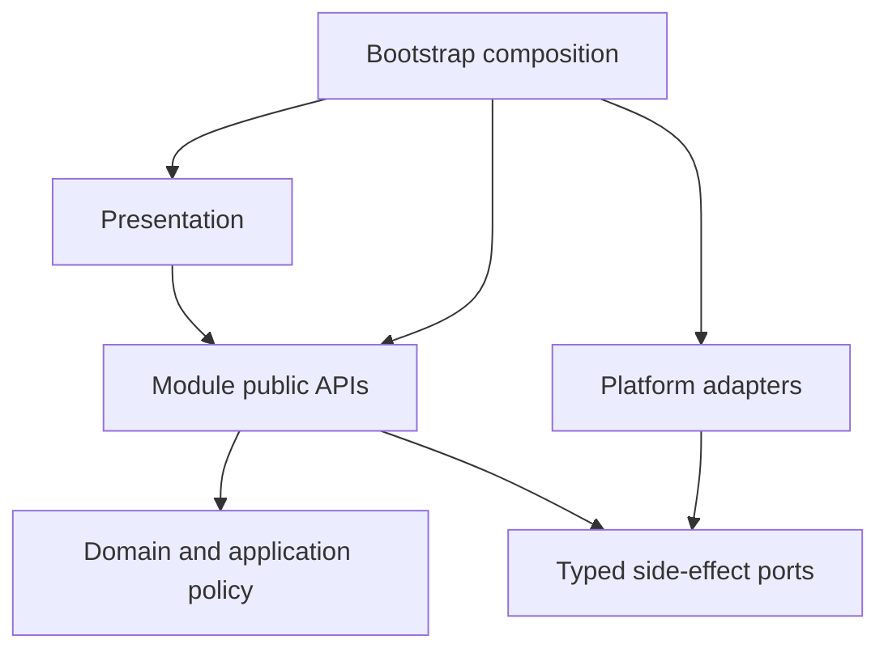

# IsleMind Architecture

**Status:** Active architectural source of truth.

[Documentation index](../README.md) · [Module public API](./module-public-api.md). This document owns durable rules, thresholds and unresolved architectural decisions.

**Platform:** Expo SDK, React Native, Expo Router, strict TypeScript, and Bun.

**Product runtime:** Chat is the conversational and durable assistant execution entry. Documents is a supporting user-owned editor with explicitly requested, ephemeral model proposals, not another agent/task/effect mode. Obsolete product-mode metadata may be decoded only inside an owner-private migration reader and cannot select navigation, permission, or reply behavior. Agent workflows and Tavern workspaces are active domain capabilities inside Chat, not alternate product modes.

## 1. Objective

The architecture keeps product behavior inside explicit ownership boundaries without imposing framework ceremony on local helpers.

> A capability should be added inside one owning module, through an existing public API or one justified boundary contract, without editing unrelated stores, screens, or provider branches.

The target system must be:

- easy to change inside clear ownership boundaries;
- strict at untrusted, persistent, permission, and side-effect boundaries;
- simple inside a boundary, without ports or schemas for local helpers;
- recoverable and diagnosable for durable work;
- responsive on representative Android devices;
- explicit about temporary compatibility code and its deletion condition.

## 2. Non-Goals

- Replacing Expo, React Native, Expo Router, TypeScript, or Zustand without demonstrated product or engineering benefits that justify migration. Existing choices may be reconsidered when requirements or evidence change.
- Applying layered architecture to every UI helper.
- Creating a general event bus, service locator, decorator container, or permanent legacy facade.
- Adding a contract file when an inferred local type or direct function call is sufficient.
- Preserving removed writers, formats, routes, or names without executable compatibility evidence.
- Weakening permission, validation, cancellation, recovery, or network trust controls to reduce file count.

## 3. Target Shape



```text
src/
  bootstrap/        composition, startup, restoration
  core/             shared pure contracts, IDs, errors, schemas
  modules/          business ownership
  platform/         reusable storage, native, network, telemetry effects
  presentation/     routes, screens, feature controllers, design system
```

Internal folders such as `domain/`, `application/`, `ports/`, and `adapters/` are created only when they contain meaningful separation. Empty-layer ceremony is forbidden.

## 4. Module Ownership

| Module | Owns | Excludes |
| --- | --- | --- |
| `conversations` | Conversation lifecycle, messages, drafts, projections | Provider protocol, tool execution, raw storage |
| `documents` | User-owned editable Markdown, immutable captured origin, revision/review policy and persistence | Knowledge indexing, independent source authority, provider transport, tools/durable task execution |
| `workspaces` | Chat workspace authority, revision, review, writeback | Conversation persistence, provider protocol, task execution |
| `assistant-runtime` | Run lifecycle, streaming, cancellation, journals, recovery orchestration | Screen state, provider serialization, concrete storage |
| `providers` | Catalog, credentials policy, capability, routing, normalized stream, health and fallback | Chat UI, task policy, RAG policy |
| `knowledge` | Documents, memories, indexing, retrieval, citations, context candidates | Chat rendering, provider wire formats |
| `tasks` | Durable task state, permission, confirmation, idempotency, artifacts, task journal | Provider and Android implementations |
| `integrations` | Tool manifests and MCP, built-in, web, workspace, and Android protocol adapters | Permission decisions and task lifecycle |
| `data-management` | Portable export, import, reset, cancellation admission, refresh policy | Native picker/sharing, raw repositories, secrets |
| `settings` | Preferences and configuration use cases | Credential secret implementation |
| `diagnostics` | Redacted health, timeline, recovery, and performance projections | Secret or raw provider-payload retention |

The exact allowed entry points are listed in [module public API](./module-public-api.md).

## 5. Dependency Rules

1. New business behavior belongs in `src/modules/<owner>/`.
2. Shared pure primitives belong in `src/core/`; reusable effects belong in `src/platform/`.
3. `bootstrap/` is the only composition root and the only layer that creates concrete adapters.
4. Cross-module imports use only `@/modules/<owner>`. Deep and relative cross-module imports are forbidden.
5. Domain code imports only its own domain and `core`.
6. Application code does not import React, Expo, Zustand, HTTP, SQLite, or concrete adapters.
7. Presentation consumes module public APIs. It does not become persistence or execution authority.
8. Zustand stores hold UI projections and transient interaction state, not the sole durable copy of user work.
9. `src/services/` is compatibility-only. A retained service requires a target owner and deletion condition.
10. Value and type import cycles fail CI.

## 6. Contract Budget

Contracts exist only when at least one condition is true:

- data crosses a module, process, native, network, or persistence boundary;
- an untrusted input requires runtime validation;
- a durable record requires versioning or recovery semantics;
- an adapter must be substitutable in focused tests.

Contracts do not exist merely to rename a local object, mirror an implementation, preserve a deleted symbol, or create a one-consumer interface. Local helpers use direct calls and inferred types. Cross-module aliases and compatibility re-exports are deleted after consumers move.

Each public contract has one owner. The owner exports it from `index.ts`; consumers never import owner-private folders.

## 7. Runtime Model

```text
Conversation -> AssistantRun -> ContextSnapshot -> ProviderGateway
  -> StreamEvent sequence -> optional ToolExecution / TaskExecution
  -> RunJournal / TaskJournal -> durable records -> UI projection
```

| Contract | Responsibility |
| --- | --- |
| `AssistantRun` | Identity, state, timing, cancellation, terminal result |
| `ContextSnapshot` | Immutable attributable context |
| `ChatRequest` / `StreamEvent` | Provider-neutral request and stream |
| `ToolDefinition` / `ToolRequest` / `ToolResult` | Integration-neutral tool protocol |
| `RunEvent` | Ordered redacted run lifecycle |
| `TaskCommand` / `TaskEvent` | Durable side-effect and long-running work lifecycle |
| `Result<T, ErrorCode>` | Typed cross-boundary success or failure |

### Execution and context

- All I/O accepts `AbortSignal`. The runtime coordinates timeouts, retry admission, cancellation, cleanup and terminal projection; screens do not duplicate this authority.
- Streaming HTTP separates the header deadline from the open request lifetime. Expo's `AbortSignal.any` composes timeout and caller signals; clearing the header timer must leave caller cancellation attached without aborting siblings. The executor also cancels its acquired reader to settle pending reads, with idempotent cleanup. Reader cancellation alone need not close a blocked Android native socket. Normal terminal EOF retains its 50-ms native close grace.
- Provider protocols enter one Providers-owned gateway. Provider-native and MCP continuations preserve cancellation, task identity, terminal receipts, usage, trace and replay semantics.
- Provider HTTP requests never automatically follow redirects: both buffered and streaming calls use Expo fetch so the policy is enforceable on native as well as Web. Manual quota-query callers may inspect the original 3xx; credentials and prompt bodies must not be forwarded. Configure the final API URL directly if an endpoint redirects. `test:provider-transport-security` exercises loopback redirects, deadlines and cancellation without live credentials.
- Current Claude 5 request controls follow the [migration guide](https://platform.claude.com/docs/en/about-claude/models/migration-guide) and [structured-output contract](https://platform.claude.com/docs/en/build-with-claude/structured-outputs) (checked 2026-09-22). Opus/Sonnet 5 use adaptive thinking, preserve `xhigh`, and map explicit `none` to `thinking.type=disabled`; Fable/Mythos remain always-on. Official Claude 5 JSON output uses `output_config.format` merged with effort, not a forced synthetic tool (rejected by Fable 5.1). It requires an explicit JSON schema; schema-free `json_object` fails locally. Older Claude and compatible proxies retain their existing tool-schema mapping. Catalog metadata and wire-level tests must change together; documentation checks are not live API certification.
- Claude Opus/Sonnet 4.6 offer `low`, `medium`, `high`, `max` and thinking-off, not `xhigh`, per the [effort contract](https://platform.claude.com/docs/en/build-with-claude/effort). The [Sonnet 4.6 model page](https://platform.claude.com/docs/en/models/sonnet-4-6/overview) specifies 128K synchronous output (checked 2026-09-23); the 300K batch-only beta is not a Chat limit. Default output remains 8192. Older saved `xhigh` values retain their existing `max` wire mapping rather than sending an unsupported value.
- Model availability evidence is not provider health, credential status, policy or network status. Unknown availability does not block execution or grant capabilities. Operational errors preserve trusted model state; retirement requires classified scoped lifecycle evidence, never a generic 404/410 or catalog omission. Existing failover policy ranks candidates before the existing candidate cap, with complete credential/protocol/endpoint route identity when resolved. The out-of-band actual execution target contract cannot itself commit a stream or become a second persisted Conversation preference.
- Each wire attempt awaits actual-target reporting before dispatch, including hidden executor fallback and WebSocket/HTTP paths. Observer failure is not a provider health failure or a retry opportunity. The runtime adapter forwards the target out-of-band and binds continuation state to its actual provider/upstream model. Hydrated credential provenance is explicit and removed alongside keys before provider metadata persistence; it is never reconstructed by comparing secrets.
- Conversation preference is the existing providerId/model/providerModelMode triple. Reading legacy unbound history never assigns a provider; full-save and first-reply barriers still govern dispatch. Explicit selections are manual and remember the versioned global pair in Settings, while inherited setup and temporary execution routing do not update that global memory. No cross-store atomicity is claimed. Conversations migration 3 preserves existing values and message bytes; snapshot v3 retains old readers, and portable payload v2 retains v1 import without changing the backup envelope.
- Context assembly freezes attributable conversation, memory, knowledge, attachment and approved tool inputs before dispatch. Retrieval policy remains independent of provider wire formats.

### Conversation drafts and export

- **Continue in new chat** copies a terminal message prefix into an independent in-memory draft, not an AssistantRun fork. Conversations owns transcript/configuration copying; the Chat store selects drafts; presentation confirms and navigates. New message identities preserve text, terminal status, captured provider/model and citations, but exclude execution traces, pending confirmations, run/lifecycle identities and generation costs. Workspace/command bindings and conversation-scoped memory remain with the source. A sending/streaming message in the prefix blocks copying; later source work is neither stopped nor replayed.
- Creating/editing a draft neither saves it nor starts work. The first-reply persistence barrier saves the prefix and new turn before dispatch; attachment retention still applies. Selecting a saved conversation discards unsent drafts. Only a focused deep-link screen may select a conversation. Branch navigation preserves the Chat return intent; hidden screens must not discard the active draft.
- Markdown export is a presentation-owned snapshot, not a Conversation, TaskArtifact or saved document. Ordinary Copy remains unchanged. Export preserves per-message source order, literal/redacted titles, source kind and eligible explicit HTTP(S) links under the source-URL policy; it excludes source-body fetching, excerpts, sourceUri, document/chunk IDs, headings and execution traces. Source numbers are not verified answer bindings, and global Markdown definitions must not rebind another message's references.
- Source-bearing export requires disclosure/confirmation before clipboard or file effects. Clipboard failure cannot report success; unavailable/failed sharing reports clipboard-only success only after a successful copy. Sharing is not proof of an external save; temporary-file cleanup is best effort. The Expo Clipboard Web fallback must propagate the legacy copy command's Boolean result.
- Task artifacts are execution evidence/URIs; context artifacts are session-local; workspace review owns Tavern snapshots/private memory. The native workspace-file port has bounded namespaced CAS/receipt semantics, not a general document library or portable-document inclusion. Export grants no indexing, retention or writeback authority.

### Knowledge retrieval and model admission

- Knowledge owns lexical/vector fusion before local reranking. Raw negative BM25 remains SQLite-attributable; normalized relevance is higher-is-better. With vector candidates, shared and single-modality hits use 62% vector / 38% lexical weighting; a missing modality contributes zero. A wholly unavailable vector channel uses the FTS fallback scale. Scoring must preserve model-space identity, permission and source scope.
- BERT/WordPiece honors the catalogued cleaning, Chinese boundaries, accent/case normalization, literal specials, continuation prefix and word-length limits under `onnx-pipeline-v3`. Vector compatibility requires source and full model/preprocessing identity, not dimension alone. Keep incompatible valid vectors stored without comparison or relabelling; reindex from canonical text. Lexical/hash fallback cannot destroy a valid vector. An explicitly requested indexing model cannot be replaced by a catalogue fallback; read-only query fallback grants no write authority.
- Opt-in multilingual MiniLM uses the focused XLM-R Unigram tokenizer, `onnx-unigram-v1` and a 128-token limit. Precompiled charsmap, grapheme/scalar normalization, whitespace/Metaspace, literal specials and Float64 Viterbi follow the pinned Hugging Face Rust reference, not generic NFKC. `unicode-segmenter/grapheme` supplies boundaries; compact vocabulary lookup avoids an object trie or general SentencePiece interpreter.
- Multilingual MiniLM remains **EXPERIMENTAL / OPT-IN**. Cold admission has an unchanged ≤5,000 ms target, excluding download; first native embedding is a separate measurement. Automatic fallback never verifies or selects experimental models, even if downloaded or bundled; it uses a verified standard model or no local model. Explicit model-and-source selection is required.
- Tokenizer bounds are 32,768 raw / 65,536 normalized UTF-16 units, 262,144 vocabulary entries and 32 scalars per piece. Built-in JSON parsing processes at most 4,096 vocabulary entries per batch; normalization/Viterbi yield during long inputs. Malformed, unsupported or oversized input rejects rather than approximates. Preprocessing completes before native session allocation. One cancelled caller cannot poison shared initialization; retirement invalidates pending encoding admission. Native inference is not preemptible: late cancellation discards results and releases tensors/sessions only after settlement.
- `EmbeddingProvider.available({ signal })` is asynchronous admission, not a metadata getter. Query/index factories and direct embed admission propagate cancellation through catalogue/file verification. Cancellation rejects rather than becoming unavailable, fallback or diagnostic failure; a cancelled resolution cannot populate the successful-descriptor cache. Descriptor, shared tokenizer/session and result-cache lifetimes are separate. An outer abort race cannot replace cancellation of verification; no cross-provider trust cache or integrity bypass may hide admission cost.
- Android app-private file integrity streams full SHA-256 through `MessageDigest` using the ReactPackage/config-plugin boundary, not the JS/UI thread. Per-operation digest/cancellation identity, two workers, eight queued requests and 256 KiB buffers bound work. Canonical files/cache paths, opened regular-file size and complete byte count are checked; descriptors close before settlement. The adapter rechecks cancellation and digest/length. No file bytes cross the bridge, native failure cannot silently downgrade, and stat/mtime is not a trust cache. The bounded one-MiB Expo/JS fallback serves missing native support or other URI/platform paths. Admission, staged installation and cached APK verification share this adapter without new permissions.
- Android ONNX registration and binary selection are separate build obligations. `react-native.config.js` admits ORT's ReactPackage; the postinstall patch pins the native AAR to the installed JS version and selects exact CMake headers/libraries, never `latest.integration` or a stale cached runtime. Release fingerprints include both inputs. Package metadata is not proof of the loaded native version; inspect `OrtApi.version` for native evidence.
- Catalogue presence, functional availability and tokenizer fidelity are not production resource-budget or answer-quality certification. Explicit local evaluation, default model/assets and production admission are separate decisions. Performance or cancellation claims require evidence at the affected platform boundary.

### Source inspection and provider passages

- Knowledge's `KnowledgeLocalSourceReader`, lazily bound by `app/source.tsx`, owns read-only source verification; presentation never instantiates storage. Document and ordered retained chunks are read in one transaction. Memory requires its exact ID and local-user or requesting-conversation scope. Missing and out-of-scope are indistinguishable; an explicitly missing citation cannot fall back to another. Captured excerpts differ from saved text: local citations lack a canonical-source revision hash, so timestamps cannot establish revision equality. Only exact chunk identity identifies a retained cited section. Focus/identity changes cancel obsolete reads. No original-file reconstruction, extra retention, automatic URI fetch or retrieval/replay authority follows; safe HTTP(S) opening is explicit.
- Captured-source actions are bounded, title-based and do not read bodies when rendered/expanded. Selection passes exact conversation/message/citation identity, never an origin-URL override. The shared selector rejects missing, blank or duplicate citation IDs, including legacy default resolution. Memoization observes conversation identity and immutable citation-array updates. Lists can contain uncited retrieval or supplemental material; order, chunk indices and `[1]`/`[S1]` do not establish claim support. Titles are literal; captured references and verified support remain distinct.
- Providers owns request-scoped Google `generateContent` grounding collection. It selects the text parser's candidate, preserves cumulative raw chunk slots including unsupported entries, and never flattens part-local UTF-8 byte ranges into Chat offsets. JSON, buffered SSE and live SSE bind only exact retained passage text present in the final visible answer after thinking/tool-text filtering. Shared SSE framing supports optional spacing, multiline fields and EOF metadata. An unreadable grounding gap or changing candidate index invalidates the association map; title-only sources supply no stable association identity. The contract adds no inline markers, factuality verdict or Interactions API assumptions.
- Optional `providerSupport` uses core's validated `islemind.provider-citation-support.v1`: one Google snapshot, exact raw-UTF-8 answer SHA-256 and bounded provider-reported text/part/byte ranges. Bounds are 128 raw slots, 64 declarations, 16 source indices per declaration and 32,768 combined passage characters across sources; per source, 16 passages, 2,048 characters each and 8,192 combined. Answers over 262,144 characters retain no associations. Invalid, missing or over-budget evidence stays unknown; quotations are never clipped. Compute the answer digest lazily once per collection.
- Duplicate URLs merge same-answer passages. Continuations merge support only when other captured citation fields match, replacing with a later valid snapshot rather than accumulating history. Never rehash surviving old support onto new answer text. Conversations retains optional metadata in full-message JSON; legacy citations remain valid. The UI validates persisted/imported metadata, displays selectable literal passages with incomplete/not-fact-checked notices, and warns on answer mismatch. This is neither a source-content hash/body copy nor read/effect authority, automatic model input or certified inline binding.
- Web source preview is an immediate localized unsupported state: idle background, no skeleton/Refresh and no WebView shim initialization or mount. Safe original-link actions use the URL guard and Linking; rejected capability/opening attempts show failure feedback. No proxy, iframe, automatic fetch or new permission substitutes for missing preview support. Native preview retains loading, failure/retry and same-host/no-HTTPS-downgrade navigation.
- A reader attempt's React key comprises conversation ID, message ID, resolved citation ID, safe URL and explicit Refresh counter. Context/target changes or Refresh remount the reader; loading/failure state and callbacks belong to that instance, including A → B → A. The parent background uses the same reset identity. Title, excerpt, answer and provider-metadata changes alone do not restart previews. Component lifetime isolation does not establish native network teardown or source revision equality.

### Work-artifact protocol

- Work-artifact auditing structurally transforms supplied `content`; it neither generates the draft nor verifies semantics. Optional `sourceMessageId` is annotation, not lookup or role. Citation inputs accept supported string labels/reference objects; numeric indices reject at catalog admission. Parser and formatter share canonical section labels for localized roundtrips. Ordered action text does not become evidence by naming sources or decisions.
- For colon-labelled fields, heading length/classification applies to the label, not its body. Bare numbered headings require a complete canonical label, not a numbered inline item; explicit Markdown headings retain broader aliases. Same-version pure replay reconstructs arguments, not a versioned archive of the original derived artifact.
- Provider-native declarations preserve canonical JSON Schema. Google uses `FunctionDeclaration.parametersJsonSchema`, not the mutually exclusive typed OpenAPI-subset `parameters`, so array-valued `type` unions retain their meaning. Providers owns wire envelopes; catalog admission remains authoritative.
- Model-facing audit receipts are advisory: retain structural quality, outcome, counts and template diagnostics without turning opt-in human follow-up text into a new model task. Missing template categories are not automatically user requirements or missing facts. Feedback stays scoped to the requested deliverable, sources, constraints and recorded statuses; human follow-up and bounded trace metadata remain separate.
- Tool success, populated sections, workflow `acceptanceChecks` and source-use prompts do not certify task completion, claim support or authorization. Human-reviewed document revision remains separately controlled by the revision-fenced Documents owner. Evidence tooling is not a shipping inference runtime or an additional acceptance authority.

## 8. Permission And Trust

Task permission has one decision owner; this is not a claim that every direct interactive workflow has an established mapping to Tasks:

- Tasks decides permission, confirmation, limit, idempotency, and durable task admission.
- Integrations describes manifest risk and output boundaries and implements protocols; it cannot grant execution.
- Bootstrap binds only admitted capabilities to concrete ports.
- Presentation requests an action and renders the decision; it does not authorize.
- Historical product-mode data is audit or migration input only and cannot affect a decision.

Untrusted manifests, persisted rows, native results, tool arguments, URLs, paths, and network responses are validated and bounded. Unknown, malformed, stale, or incomplete authority fails closed.

Static metadata with no user-state access may run without a durable task only when it is explicitly classified as pure and still observes cancellation. **Reads of user data, mutations, external effects, and long-running work require task admission.** This retains the broad normative requirement; it is not a claim that implementation satisfies it. Model/tool-triggered operations are an unambiguously covered subset, not a replacement scope. How the separately documented direct interactive workflows satisfy this requirement is **not established**, as recorded below. This inventory neither narrows the rule nor creates exceptions nor verifies an authorization bypass. Existing checks must not be removed on the strength of this matrix.

Native and web capabilities are advertised only when every required concrete port is bound. A manifest alone never proves runtime availability.

Provider continuation serialization preserves protocol identity rather than matching tool names. Anthropic SSE thinking/signature deltas are assembled by response-local block index; complete signed, omitted-text and redacted blocks remain separate, and internal indexes are removed before completion/wire output. OpenAI Responses parallel calls match stable item/call IDs, with name-only repair limited to unambiguous legacy items. Gemini GenerateContent echoes a returned `FunctionCall.id` on its matching `FunctionResponse`, retaining thought signatures on their original function-call parts; locally synthesized IDs are not sent as server IDs. DeepSeek Flash/V4 exposes `low`, `high`, `max` plus thinking-off; saved `medium`/`xhigh` map to `high`. Available assistant `reasoning_content` is replayed even without a tool call on that message, as required when tools are enabled. These rules operate on admitted provider/model-bound continuation state, not diagnostic traces or permission to replay interrupted effects.

Rich and Plain completion bridges share `bootstrap/providerContinuationReplay.ts`. Signed thinking (including empty-text blocks), signatures, ciphertext and reasoning whitespace remain exact; display/log truncation is not applied to replay. Both bridges validate against the existing Core request bounds before emitting continuation or tool events. Oversized blocks, summaries, signatures or lists fail explicitly instead of silently sending a truncated prefix. Journals still retain only redacted lifecycle metadata; this does not expand persistent storage or authorize replay after restart.

Protocol references (checked 2026-09-23): [Anthropic thinking](https://platform.claude.com/docs/en/build-with-claude/thinking), [OpenAI reasoning context](https://developers.openai.com/api/docs/guides/reasoning#keeping-reasoning-items-in-context), [Gemini function IDs](https://ai.google.dev/api/generate-content#FunctionCall), [Gemini thought signatures](https://ai.google.dev/gemini-api/docs/thought-signatures), [DeepSeek thinking](https://api-docs.deepseek.com/guides/thinking_mode/).

Network adapters enforce public HTTPS, bounded redirects, bytes and time, structured parsing, and cancellation. A locally admitted native crawl does not fall through to a vendor after a local trust or fetch failure. Workspace paths stay inside durable namespaces with revision and idempotency checks.

<a id="policy-boundary-matrix"></a>
### Policy-boundary matrix

This matrix distinguishes required admission from existing caller checkpoints. A UI gesture, manifest, saved citation, provider response or successful write is not by itself authorization. “Unresolved” below means the broad task rule and the documented caller contract have not been reconciled by a policy decision; it must not be read as a task exemption. Module responsibilities appear in §4 and the public API; they do not assign organizational approval authority.

| Operation class / caller | Documented authorization or admission checkpoint | Policy-boundary owner | Task relationship and limit | Contract source |
| --- | --- | --- | --- | --- |
| Explicitly pure static metadata, no user-state access | Explicit pure classification; cancellation retained | Tasks admission; Integrations capability description | Only the already documented pure class may omit a durable task | §8 above; Public API: Model Operation Boundary |
| Model/tool-triggered reads, mutations, external effects, long-running operations | Permission, confirmation where required, limits and idempotency before admitted execution; concrete port required | Tasks decides; Integrations describes/executes; Assistant Runtime coordinates | Task admission required; manifests and model text cannot grant it | §7–8; Public API: Model Operation Boundary |
| Direct user Chat reply | Successful hydration/recovery and first-reply save barrier; Providers credential/access/capability/routing checks and exact fallback consent | Assistant Runtime, Conversations and Providers, each within its boundary | Tool/effect requests still require Tasks. Mapping of an ordinary interactive provider request to the broad long-running rule is unresolved | §7, §9; Public API: Current Product Contract |
| Interactive local-source inspection | Explicit exact reference; Knowledge rechecks current source/memory scope; missing and out-of-scope are indistinguishable | Knowledge read policy; Presentation only requests | Read-only caller contract is documented; broad task-rule mapping unresolved. It is not a model/tool read capability | §7 Source inspection; Public API: KnowledgeLocalSourceReader |
| Direct document Save/delete; adoption of a proposal | Explicit user action; opaque revision comparison; adoption changes only an unsaved draft, Save separately acknowledges retention | Documents | Revision validation does not itself grant permission; broad mutation-rule mapping unresolved | §9 Editable documents; Public API: Documents |
| Explicit document revision/model proposal | Chosen provider/model and destination; current source revalidation; credential/access/privacy/session policy; tools/search disabled | Documents review policy; Knowledge read scope; Providers dispatch policy | Ephemeral proposal, not a durable run or tool executor. Network dispatch is still an effect; broad task-rule mapping unresolved | §9 Editable documents; Public API: DocumentRevisionPort |
| Copy/export/share or explicit original-link opening | Source-bearing export disclosure/confirmation; explicit safe-URL activation; report failed clipboard/open effects honestly | Presentation export/action boundary; Knowledge source scope; platform adapter trust checks | No automatic source fetch or external-save acknowledgement. Broad external-effect rule mapping unresolved | §7 Conversation drafts and export / Source inspection; Public API: preview contract |
| Portable import/reset/recovery | Owner-coordinated plan, cancellation admission, strict decode and source/target snapshot fences | Data Management; each affected record owner | The snapshot documents these checkpoints, not a general task-admission exception or blanket deletion permission | §9; Public API: Data Management and Durable Recovery Boundary |
| Developer device collection / install / data deletion | Explicit authorization for the exact target, operation, package and affected data before device-scoped work; artifact checks are separate | Tooling caller must obtain authority; organizational policy approver Unknown | Device selection/default serial/physical connection is not consent. Runtime Tasks applicability is not established for developer tooling | §13; §13 verification requirements |

**Unresolved policy:** no recorded decision establishes how direct interactive operations satisfy the broad task-admission requirement. The current document-revision path validates source scope and the chosen target before calling its generation dependency; it does not admit a durable task. Existing callers are evidence of implementation, not an approved exception. An identified policy authority must decide the mapping before any change to these authorization boundaries.

## 9. Persistence And Recovery

Each durable record has one owning module, one repository port, strict decode validation and an explicit migration policy.

Providers owns `provider_model_scopes`, `provider_model_current` and `provider_model_observations` in the existing SQLite database (migration scope `provider-model-availability`, v1). Scope epochs fence configuration/credential invalidation; operation ordering is allocated before network work and seeded by SQL aggregates on restart. Conditional transactional writes make observations idempotent and prevent an older refresh from replacing newer model evidence. Operational failures do not advance decisive model-state ordering. Model history is SQL-filtered, aggregated and cursor-paged using timestamp/ID order plus an insertion high-water; retention deletes bounded batches without deleting current lifecycle proof. No history is hydrated at startup, no network runs in a transaction, and no worker/lease/snapshot subsystem or alternate database is introduced. Query/write/cleanup and normalized observation-byte budgets are explicit composition inputs, requiring calibration on the intended Android target rather than inference from host timings; calibration requires build-bound measurements on the intended target.

Chat admission evaluates the stored preference on each independent turn. Providers resolves eligibility through its existing credential, access, capability, health and failover authorities; unknown availability does not grant capabilities. Same-provider fallback can remain automatic; cross-provider fallback defaults to ephemeral, exact-candidate confirmation and re-reads configuration, credentials, policy and scope afterward. The admission result carries a request-local identity/epoch fence and whether the single fallback budget was consumed. Assistant Runtime saves the preference through the unchanged first-reply full-save barrier, then plans Rich/Plain requests against an ephemeral execution view. The existing executor remains the sole route-fallback executor and runs the full admission pipeline for its selected fallback, without replaying route-bound continuation state or switching after output. Plain Chat does not install the generic gateway's second fallback loop.

Secure-credential mutations fence the same scopes before verified writes/rollback; metadata configuration changes and portable restoration use that fence as well. Discovery, existing non-generating probes and actual Chat attempts feed classified evidence, never response bodies or credentials. Startup opens no history query. The availability profile retains 7 days/500 observations, pages 50 rows (100 maximum), and writes/cleans 8 rows per batch. Each normalized observation is limited to 8 KiB UTF-8; existing identifier and evidence allowlists still apply. Cleanup advances one bounded batch after a commit; age eligibility does not introduce a startup sweep or background worker. Discovery coverage and current lifecycle proof are not pruned with history.

Global proxy changes use the same epoch fence before new settings become dispatchable or durably saved. Failed invalidation prevents later settings snapshots from persisting the unsafe configuration until retry succeeds. The availability details route supplies only the bound public query/action port and explicit page budget to Presentation. It retains one SQL-filtered page, rejects stale filter results and separates offline/credential overlays from model availability. Selector previews remain credential-automatic: a negative scope cannot hide another available or unobserved credential alternative. Known blocked choices use the same availability predicate as runtime admission, which still revalidates every other policy before dispatch.

Discovery completeness requires a valid envelope, known coverage, exhausted documented pagination and no truncation ambiguity; operation scope and epoch must still match at commit. Capped credential/catalog projections are not completeness evidence. Native OpenAI/Anthropic access listings may establish scoped unavailability, never retirement; compatible/custom, Google-filtered, GitHub catalog and MiMo listings remain conservative. Offline, DNS/TLS, timeout, authentication, rate limits and provider outages only record operational observations. Missing models and empty catalogs do not fail credential/provider health. A listed catalog-only model may prove probe reachability while access remains unknown; neither probe nor availability grants capability support. One configured operation deadline covers discovery bodies and all pages, with caller cancellation retained after headers. No arbitrary refresh deadline or catalog ceiling is added.

### Storage and startup boundaries

- SQLite transactions use each provider's initialized private connection through the shared per-database operation queue, preventing unrelated adapter calls from joining asynchronous transactions. Native and Web use `withTransactionAsync`; the native exclusive helper creates another connection without inherited foreign-key settings. Transactions are required, never replaced by non-transactional writes. Failed connection initialization closes before retry.
- Native durability requires WAL with `synchronous=FULL`; verify effective settings on the target rather than inferring them from PRAGMA submission. Effect/journal receipts cannot trade per-commit synchronization for cache speed. The queue is process-local: SQLite governs external connections, while actual durability depends on the native filesystem/VFS and device.
- Web uses a dedicated SQLite worker and OPFS access-handle pool, not the native durability boundary. Preserve pathname/flag/digest headers and record effective journal/synchronization settings rather than assuming native WAL. Failed reads or hydration are not authoritative empty stores. Preserve pre-failure records/files; clearing, reseeding or replaying work cannot substitute for explaining a discontinuity.
- The Expo SQLite Web patch shares one initialization promise per worker and publishes only the complete SQLite API/persistent VFS/memory VFS tuple. Concurrent requests await that attempt. Failed pool acquisition drains pending opens and closes acquired handles; later failures close acquired VFS resources before clearing that exact promise, retaining the original error. Retry cannot reuse partially initialized state. Exclusive OPFS access requires other tabs to release handles; worker-close notification alone does not prove immediate release. This is initialization recovery, not multi-tab write coordination or run/task replay. Retire the patch only with equivalent upstream atomic initialization and cleanup.
- Chat hydration is a required startup prerequisite. Bootstrap drains initial Chat/settings loads, but rejected Chat loading blocks startup/Retry before recovery or Chat admission; settings remain optional. The Chat store coalesces one pending hydration attempt and releases it on settlement. Rejection settles `isLoading` without clearing records, drafts, selection, history cursor or unrelated errors. Coalescing is not a transactional refresh or a fence for arbitrary concurrent local mutations; successful normalization, paging, selection and background hydration retain their policies.
- Knowledge secondary-index invalidation is transactional with canonical chunk replacement/deletion and cache-provenance changes. Async commits must match captured sources; provider jobs also require exact current attempt identity. Cancellation/late completion cannot recreate removed jobs or overwrite newer ones. Cached text must match canonical content/provenance before reuse or persistence. Indexing cannot authorize provider replay.

| Data | Authority |
| --- | --- |
| Conversations and messages | Conversations repository |
| Editable documents and captured origin | Documents repository (`saved_documents`, `saved-documents/v1`) |
| Runs and run journal | Assistant Runtime repository |
| Tasks, task journal, artifacts | Tasks repository |
| Knowledge and memory | Knowledge repositories |
| Settings | Settings persistence |
| Provider metadata and credentials | Providers policy plus secure storage |
| Workspace revisions and receipts | Workspaces repository |

Secrets never enter portable payloads, ordinary logs, telemetry or UI state. Data Management and bootstrap coordinate export, import and reset through owners, not direct storage scans.

### Editable documents and source-backed revision

- Documents is a user-owned library, not another Chat/agent mode or durable task/effect entry. A blank draft or terminal nonempty assistant answer may seed an unsaved document; only explicit successful Save acknowledges retention. Editing does not rewrite Chat, and deleting Chat does not delete the document. Immutable optional origin captures answer, terminal status and bounded reference metadata/excerpts, never execution traces, source-body backups, permission or live source authority. Stopped/failed origin stays stopped/failed. Editing and valid reference structure do not certify content. Preview neither fetches images nor opens links; Copy excludes origin. No automatic indexing, model dispatch or execution occurs.
- The adapter uses the queued SQLite provider. Drafts detach/validate before persistence; save/delete compare opaque revisions to prevent stale overwrites or resurrection. Imported provenance requires primitive status/type strings, not coercible values. Atomic snapshot replacement accepts only recorded source/target states; idempotent rollback refuses newer-writer drift. Conflicted editors retain local drafts until explicit reload/discard or Save a copy; UI drafts are not durable acknowledgements.
- Saved-document v2 retains optional review context. The owner-private reader losslessly normalizes v1 rows/backups without eager rewriting; writers emit v2 so older binaries reject unsupported retained evidence instead of silently dropping it. The schema uses the existing table and migration ledger.
- `DocumentRevisionPort` owns bounded review/proposal policy; bootstrap binds live Chat lookup, Knowledge's read-only owner and the provider runtime. Captured references alone authorize no reads. Each explicit read rechecks the exact live terminal message/origin/citation, Knowledge scope and canonical ready source identity. Memory must be active, non-sensitive, unexpired and correctly scoped. The user inspects and separately includes retained text; selected snapshots are re-read/compared before dispatch. Changed sources require refresh/reselection, not silent byte substitution. Overlapping sections are not original-file or historical-version reconstruction.
- The user selects provider/model and sees destination/proxy before sending only title/body, instruction and selected source text, excluding captured origin and full Chat. Reject over 24,000 total input characters, 2,000 instruction characters or 12 distinct sources; apply the existing context estimator without silent truncation. Credential/access/privacy/session policy applies. `allowFallback: false` excludes provider/model/credential fallback, not same-target transport/protocol handling. Empty `fallbackProviders` alone does not redefine default fallback policy. Tools, search and remote compaction are disabled; partial, failed, cancelled or tool-call completion is not an accepted proposal.
- Proposals are complete Markdown bodies, ephemeral and explicitly unverified, never durable runs, replay instructions or success acknowledgements. Background/focus loss cancels reads/generation; late results are ignored. Draft, route or saved-object changes invalidate proposals. Acceptance rechecks durable revision and changes only the unsaved draft; separate Save owns persistence, conflicts and immutable origin. Exact edit applicability or human adoption does not certify source fidelity, instruction compliance or correction. Source labels describe request selection order, not original Chat citation positions or verified claim support.

### Retained review context and portable documents

- Ordinary acceptance retains no new source copy. A separately disclosed **Accept with review context** action attaches one detached accepted title/body, acceptance time and exact selected source text/identity/update-time/order to the unsaved draft. Revision-fenced Save commits body and context together. Bounds are 12 distinct sources, 24,000 combined source-title/text characters and a 24,000-character accepted body; no unbounded review history.
- Explicit replacement replaces prior review, not immutable Chat origin. Manual or ordinary AI edits preserve retained review and visibly distinguish changed title/body without reattributing sources. Removal requires confirmation and subsequent Save. Omitted repository `save.reviewContext` preserves context; `null` removes it.
- Optional retained copies remain inspectable after source/Chat deletion and travel in backups. They are unverified user-owned content, not live Knowledge, historical-file reconstruction, retrieval/effect authority or proof of correct citation. They are not automatically sent on later revisions, indexed, fetched, opened as links or included in Copy text.
- Portable `savedDocuments` is distinct from Knowledge's `context.documents`. The documents category participates in full/selective backups and reset. Bootstrap's seven-participant recovery envelope accepts the five- and six-participant envelopes. Selective import merges against the current participant snapshot; explicit full snapshots replace the collection, while legacy absence preserves it. Each imported record receives a fresh opaque revision to fence open editors. Backups include captured text/excerpts; body-only Copy does not.

### Durable formats and migrations

- Product and new `AssistantRun` rows are Chat-only. Conversations use SQLite and the active-conversation record; workspaces use native SQLite or browser v2 storage. Portable recovery uses its canonical envelope key and the native large-value blob store where required. Unsupported writers and removed formats are not restored to satisfy stale fixtures.
- Migration identity is `(scope, version)`, not display name. Knowledge records own `knowledge/v3` and later migrations; replay snapshots own `knowledge-rag-replay/v1`. Only a legacy `knowledge/v3` marker named `knowledge-rag-replay-snapshots` admits canonical base repair under `knowledge-records-repair/v3`, before FTS v4. Preserve that marker and replay rows. Healthy databases must not rerun v3 conversion or rewrite explicit memory scopes; reconstruction is idempotent and uses no second migration ledger/public recovery API.
- Native SQLite checkpointing must reject obsolete WAL salt after acquiring read-lock 0, before copying frames or advancing backfill. `patches/expo-sqlite@57.0.3.patch` supplies the focused WAL-reset backport for vendored SQLite 3.50.3, not a full-version upgrade. Bun `patchedDependencies`, package/lock/patch and `expo.autolinking.android.buildFromSource: ["expo-sqlite"]` must agree so a prebuilt AAR cannot bypass patched C source. Release fingerprints include the patch; Expo symbols, schemas and transaction/recovery policy retain their contracts. Retire the backport/source-build requirement only when a compatible shipped artifact demonstrably provides the fix and no other requirement needs the override; a version string is insufficient.
- Web remote-compaction continuation uses the real Expo SQLite/OPFS adapter, not the no-op fallback. Atomic writes share the per-database queue; identity includes conversation, provider, model and response, preventing cross-scope replacement. Reuse requires a valid completed strategy/capability envelope and bounded fragment identities. Corrupt/legacy-incompatible states are not reused; failed writes preserve the prior acknowledged state. Reads/writes emit allowlisted `context.compact.decided` storage diagnostics on failure, and Settings always exposes the browser-local/private-mode limitation. Remote compaction success is separate from persistence success. Browser eviction/clearing is not recoverable application durability.

<a id="version-namespaces"></a>
### Version namespaces and compatibility

Versions below identify different contracts already described in §7/§9 and [the public API](./module-public-api.md). Equality of numeric suffixes implies no relationship. A migration marker, serialized record, snapshot and outer envelope must never be relabelled to make their numbers agree. Participant counts, opaque revisions, app versions and build codes are not schema versions. Reader/writer compatibility is owned by each format, not by shared version numbering.

| Namespace | Documented version / identity | Meaning and supported boundary |
| --- | --- | --- |
| SQLite migration ledger | `(scope, version)`; Conversations 3; `provider-model-availability` v1; `saved-documents/v1`; Assistant Runtime 10/11 | Owner-scoped database evolution, not the serialized object version. Assistant Runtime 10 adds the response-message lookup; 11 adds route details. |
| Knowledge migration scopes | `knowledge/v3`, FTS v4; `knowledge-rag-replay/v1`; narrow `knowledge-records-repair/v3` | Distinct scoped histories; only the named legacy marker admits repair. No cross-scope version comparison. |
| Saved-document serialized row / portable record | v2 writer; owner-private v1 reader | Optional review context survives lossless decode; older binaries reject v2 rather than strip evidence. Table migration identity remains separate. |
| Conversation snapshot | `islemind.conversation-snapshot.v3`; v2/v1/unversioned readers | Snapshot encoding of a Conversation, not migration 3 or the whole backup. |
| Portable payload | Writer 2; reader 1/2 | Data Management's inner data format; unsupported versions cannot begin import. |
| Backup / recovery envelope | Backup wrapper 2; bootstrap accepts the documented five-/six-/seven-participant envelopes | The participant count is not a new envelope version. No additional transport version is established by these counts. |
| AssistantRun serialized schema | v4 | Validated captured request/handoff and durable evidence; not migration 4 or replay permission. |
| In-flight run snapshot/segments | Predecessor-checked v2 header; barrier materializes ordinary v1 snapshot | Storage reconstruction format, not AssistantRun schema v4. Unsupported/incomplete rows are decode-only/no-replay. |
| Browser workspace storage | v2 | Workspaces-local format, not the portable payload or backup envelope. Additional compatibility guarantees are not documented here. |
| Versioned metadata | `islemind.global-model-preference.v1`, `islemind.assistant-run-route-details.v1`, `islemind.message-protocol.v1`, `islemind.provider-citation-support.v1` | Independently validated preference, route, message and citation contracts. Missing historical metadata stays unknown; no inferred authority. |
| Model/preprocessing identity | `onnx-pipeline-v3`, `onnx-unigram-v1` | Embedding-space compatibility, not DB migrations. Equal dimensions or version suffixes cannot authorize relabelling vectors. |
| Release source snapshot | Versioned source-input and APK binding in `scripts/release-freshness-contract.js` | §13 owns the contract; the executable reader owns accepted versions. Missing, unsupported or mismatched bindings fail closed. |
| External protocol / transport negotiation | [the dated MCP review](../technology-radar.md#4-mcp-evolution-and-legacy-retirement--observe) names `2026-07-28` and retained `2025-03-26` compatibility | Protocol dates are neither app versions nor local payload/envelope versions. Constant agreement is not protocol conformance or current server acceptance. |

<a id="data-lifecycle"></a>
### Data lifecycle and deletion reference

Each data category follows its owning module’s contract. **Unknown** means the reviewed documentation supplies no retention duration, deletion cascade or protection guarantee. It is not permission for indefinite retention and not a promise of secure erasure.

| Data category | Storage / authority | Retention and deletion semantics documented here | Independent copies and user-visible consequence |
| --- | --- | --- | --- |
| Conversations/messages and drafts | Conversations repository in SQLite; UI drafts/projections are separate | Only acknowledged saves are durable. Unsent branch drafts can be discarded by saved-conversation selection. General saved-history retention duration and deletion cascades: Unknown. | A branch is independent. Deleting source Chat does not delete saved Documents, their origin/review copies, exports or provider copies. |
| Editable documents, captured origin and review context | Documents repository, `saved_documents`; unsaved editor state is not retention | Explicit Save and revision-fenced delete. Review-context removal requires confirmation and Save; omitted context preserves it, `null` removes it. Retention duration: Unknown. | Origin and explicitly retained review text can outlive Chat/Knowledge. Backups include these copies; ordinary Copy is body-only. Source deletion is not deletion of these copies. |
| Knowledge documents/chunks, indexes, jobs and query caches | Knowledge repositories and derivative indexes | Canonical replacement/deletion invalidates dependent vectors/jobs/cache in the same transaction; late work may not recreate removed state. General retention: Unknown. | Saved Documents, captured citations, exports, summaries and provider copies are not this index. Canonical deletion is not universal semantic forgetting. |
| Reviewed memories | Knowledge repositories; exact user/conversation scope | Active/non-sensitive/unexpired scope gates documented reads; correction, expiry and deletion are distinct. Global retention duration: Unknown. | Deleting a memory cannot establish deletion from prior messages, summaries, retained review text, exports or later re-extraction. |
| Runs, task journals, task artifacts and workspace receipts | Assistant Runtime, Tasks and Workspaces repositories | Durable acknowledgement, cancellation and replay fences apply. A general journal/artifact purge schedule and URI-target erasure guarantee are Unknown. | An artifact URI is not proof its bytes are still available; evidence is not effect/replay authority. Workspace files are not the saved-document library. |
| Session context artifacts and model proposals | Session-local context; ephemeral Documents proposals | Context artifacts are bounded/evictable, not restart-durable; proposals are invalidated/cancelled by documented lifecycle changes. | A pointer does not guarantee recovery. Explicit document retention is a separate copy and action. |
| Provider model observations and lifecycle proof | Providers' SQLite tables | The §9 availability profile bounds observation age/count and batches; pruning history does not prune current lifecycle proof. | Diagnostics and availability records contain allowlisted evidence, not response bodies or credentials. |
| Settings, provider metadata and credentials | Settings/Providers persistence; secrets through secure-storage owner | Credential/config changes fence availability scope. General preferences/credential retention, browser secret protection and key-loss recovery: Unknown in this snapshot. | Secrets must not enter portable payloads, ordinary logs, telemetry or UI state. Secure credential storage is not whole-database encryption. |
| Remote-compaction continuation | Native owner storage or Web SQLite/OPFS, scope-bound to conversation/provider/model/response | Atomic replacement and validation; corrupt/incompatible state is not reused. Browser storage removal cannot be repaired by replaying provider work. Retention duration: Unknown. | Successful remote compaction and acknowledged local persistence are separate; this is not provider-side deletion. |
| Exports, backups and temporary sharing files | User-selected clipboard/file destinations; Data Management payload/envelope; temporary sharing file | Export disclosure and owner-coordinated reset/import; temporary cleanup is best effort. Removal of external exports/backups and their retention: Unknown. | Resetting local categories cannot promise erasure of separately retained clipboard/files, device/OS backups or recipient copies. Sharing does not prove an external save. |
| External provider / service copies | Outside local owner storage | Provider retention, caches, logging, deletion and license/consent decisions require separate evidence; Unknown here. | Local-first storage does not mean offline generation or that local deletion erases remote copies. |

**Protection boundary:** app-private storage, credential protection, redacted diagnostics, atomic writes and hardware durability are different properties. No whole-DB encryption, secure erase, cross-provider deletion or legal clearance is established by this inventory. The historical concerns and still-missing decisions are tracked in [the privacy/licensing decisions](../technology-radar.md#privacy-licensing-disposition). Do not implement new retention/deletion behavior merely to fill an Unknown cell.

<a id="recovery-matrix"></a>
### Recovery and compatibility matrix

| Failure / transition | Durable versus unsaved state | Documented retry / recovery boundary | Actions that must not be replayed / limits |
| --- | --- | --- | --- |
| Startup or Chat hydration read failure | Failed read is not an authoritative empty database; retain existing records, selection and drafts | Block Chat admission; existing startup Retry after prerequisites; settings failure remains optional | Do not clear/reseed or dispatch Chat past a failed required read |
| Interrupted stream/write or process death | Generated/buffered/queued text is not durability-acknowledged text; terminal run and message projection are separate commits | Reconcile journals and project authoritative output with live/cancelled-state rechecks and awaited persistence | No blind provider/tool replay; unmatched continuations are new-turn-only |
| Unknown write/cleanup/commit effect | Neither success nor absence of an external effect may be inferred | Fence for explicit retry, repair or quarantine; re-read durable disposition where supported | Do not repeat an uncertain external effect or overwrite a recovered winner |
| Interrupted cancellation/task confirmation | Only acknowledged cancellation is durable authority; queued tasks stay queued | Recover cancellation before interrupted disposition; interrupted confirmation expires | Expired confirmation is not renewed consent; unknown in-flight effects fail interrupted without replay |
| Document save/delete or stale revision conflict | Preserve local unsaved text, do not treat it as saved | Revision-fenced Save/delete; explicit Reload/discard or Save a copy | No stale overwrite, resurrection or automatic adoption of an old proposal |
| Portable import conflict / interrupted replacement | Only recorded source/target snapshots admit atomic replacement; fresh imported revisions fence editors | Owner-coordinated recovery; rollback refuses newer-writer drift; legacy absence preserves the collection | No direct storage scan, silent merge over a newer writer or replay of imported effects |
| Browser storage loss / unavailable OPFS | In-memory projections and persistence grants do not establish readable acknowledged rows | Preserve available pre-failure evidence; release competing handles before initialization Retry; independent backup restoration is a distinct user action | Do not call clearing/reseeding/replaying a durability recovery; lost bytes are not established recoverable |
| Unsaved branch/editor or failed sharing | Draft/adopted proposal/clipboard/file-share state is not an acknowledged saved record | First-reply save barrier or explicit document Save; report actual clipboard/share outcome | Do not claim external retention from successful UI navigation or share invocation |
| Unsupported versions / malformed rows | Unknown future metadata stays unknown, not rewritten into a known version | Apply only the documented owner-private readers in the version matrix; reject unsupported import before mutation | Decode-only historical run evidence never grants replay; older document readers must not strip v2 context |
| Missing/corrupt compaction continuation | Remote success does not establish a reusable local continuation | Validate scoped completed envelope; failed writes preserve previous acknowledgement; safe fallback only within existing caller policy | No cross-conversation/provider/model reuse or automatic replay of prior remote work |

These rules describe required/documented behavior, not newly executed failure campaigns. Platform evidence and remaining gaps are linked from the [qualification reference](#qualification-reference).

### Run journals, barriers and recovery

`AssistantRun` schema v4 persists the exact captured handoff atomically with `run.created` as strictly validated durable evidence only; it does not grant recovery authority.

- Actual targets arrive through the awaited out-of-band Providers observer, not stream events or preferred Conversation values. Assistant Runtime migration 11 adds nullable versioned route details to existing runs. Attempt selection is journaled before dispatch; retained text/tool-call output atomically selects the run's producing provider/model/details. A later empty attempt cannot relabel earlier output. Rich and Plain project only provider/model and versioned protocol onto messages, never credential or configuration identity. Legacy missing details remain unknown; unknown future metadata is rejected without rewriting it. The immutable original request remains hash-validated even when the actual producing route differs.
- Rich and Plain Chat store the same final canonical `ChatRequest`, versioned capability revision, stable request hash and bounded context receipt. The legacy redacted activity-request shape is decode-only, with no runtime/public writer. Rich text, citation, tool-call, usage and bounded trace-lifecycle markers are journaled as `stream.event` before terminal completion; trace content/metadata remain excluded. Diagnostic evidence is not replay authority.
- In-flight visible output uses ordered JSON delta segments behind a predecessor-checked v2 header. Selection, cancellation, effect and terminal barriers atomically materialize the ordinary v1 snapshot and clear segments. Coalescing is bounded to 256 events / 1 MiB; overflow aborts activity rather than dropping evidence. Distinguish generated, buffered, queued, persisted, durability-acknowledged and terminal state; acknowledged durable output must not be lost.
- Nested Rich provider turns persist bounded started/completed continuation identities. Restart attaches unmatched identities to interrupted failure with `resume: new-turn-only`, terminalizes safely and never replays provider requests or tool effects. Unsupported/incomplete rows are terminal decode-only no-replay inputs. Recovery does not infer effect authority unless an awaited durable final-output/success barrier exists.
- Recovery never assumes an external effect occurred. Unknown cleanup/commit state is fenced for explicit retry, repair or quarantine. Concurrent callers are idempotent: stale terminal writes re-read durable disposition without replaying or overwriting already recovered runs. Genuine read/write failures stay retryable failures, not fabricated success.
- Acknowledged `cancellationRequestedAt` survives process death and terminalizes run/task recovery as cancelled, not interrupted/failed. Queued tasks remain queued; interrupted confirmation expires; unknown in-flight effects fail interrupted without replay. Competing writes re-read durable terminal disposition.
- The provider callback bridge rejects pre-cancelled dispatch and fences text, trace, citation and completion callbacks after cancellation or transport termination. Already accepted buffers are flushed; aborted/failed dispatch releases its matching active stream without clearing a newer reply. Presentation send promises must reject unaccepted sends (including a newly acquired conversation lock), so Composer restores rather than clears the unsent draft.
- Startup requires Chat hydration, then run recovery, workflow checkpoint reconciliation, workspace receipt reconciliation and task recovery before Chat admission. Hydration or run/task recovery failure blocks through startup Retry. Active registries are runtime-instance-local, not cross-instance liveness oracles. Later recovery cannot compensate for failed projection loading; AppState background/resume notifications cannot guarantee execution or a final flush before OS process death.
- Terminal run persistence and message projection are separate commits. Succeeded runs are absent from `listRecoverable`; orphan reconstruction also needs Assistant Runtime's read-only `getLatestForResponseMessage(conversationId, responseMessageId)`, bounded by the response-message index (migration v10). Bootstrap exposes the binding; presentation neither opens SQLite nor resumes effects. After awaits, recheck live/cancelled/terminal state, project authoritative output only onto orphaned sending/streaming placeholders, and await message persistence. Missing owners use orphan cancellation; unavailable owner reads do not. Cancelled messages cannot be reinterpreted as successes.

## 10. Presentation And Mobile Quality

### Settings editing and offline help

- `settingsRegistry.ts` owns navigation IDs, categories, aliases and help topics, not defaults or user data. Old settings routes remain valid. Search is isolated from Store subscribers and debounced; results do not mount editors.
- `SettingsEditBoundary` coordinates explicit navigation, native removal/back and Web unload. A busy save blocks departure. Confirmed discard clears parent-owned drafts even if a route remains mounted. Drafts never enter Store, URL, logs or persistent caches; process-death recovery is not promised.
- API, MCP, Skill and advanced text fields explicitly save. `SettingsFieldSession` retains governance text drafts outside conditional sections. Check the current committed value before applying a draft, use the existing persistence queue, and announce Saved only after it completes. Failed writes retain input; committed memory and durable storage are distinct, and secure-store multi-key writes are not transactional.
- Reversible preferences use field-scoped undo revisions. Later edits, including value changes away and back, must not be overwritten. Permissions, imports and deletion have no generic undo. Sliders preview locally and commit on release, not each frame.
- The contextual guide is a full-screen reading layer owned by its editor. Opening it dismisses the keyboard without submitting forms. Closing restores the trigger, not input focus. `/help` and `/help/[slug]` reuse the reader independently. Markdown under `docs/user-guide` is the single source; see the documentation index for fingerprint review and CI generation rules.
- Field location waits for page focus, transition and measured layout. Request identity, leaving, unmounting or user dragging invalidates stale callbacks. Font/width changes use a visible anchor and relative offset; unchanged layouts are not forcibly restored. Native focus, keyboard, large-text and performance claims require platform evidence, not typechecking alone.
- Android system font changes may still recreate the Activity and discard local editors. Adding `fontScale` to the manifest alone is not a safe retention fix: native text measurement must also update without clipping. Keep the existing native window policy until both layout and editor lifetime are verified together.

Presentation owns routing, screens, feature controllers, localization binding, and reusable visual components. Domain and application layers emit stable codes and parameters, not translated strings.

The design system owns semantic typography, color, spacing, radius, border, shadow, icon, control, feedback, loading, empty, and error primitives. Feature screens do not create parallel token systems.

Animal Island UI is supplied by the sibling `animal-island-ui-rn` workspace (`../animal-island-ui`, branch `rn`), not an app-owned RN port. The fork owns generic rendering, assets and native fixes; IsleMind owns settings, semantic role projection, localization and business adapters. Metro shares host runtimes and watches the fork source. See [UI integration](../../src/components/ui/isle/README.md) for installation and CI/EAS boundaries. Release freshness snapshots include the fork sources.

Explicit appearance selections use `useThemeSelection` and the fork's root `ThemeTransitionProvider`: a browser snapshot ripple or native-driver cover/reveal keeps the live application tree mounted. Rapid family/mode/accent requests preserve each mutation in order; selecting the current value is a no-op. The existing settings store remains the persistence authority. Hydration, system appearance changes and programmatic settings actions stay immediate, and the OS reduced-motion preference bypasses the reveal. The web token bridge commits in a layout effect so snapshots contain the matching CSS and React theme. Appearance cards reserve stable spacing/borders; the web selection hook restores the initiating control's viewport position after themed header changes without moving focus. Individual theme-specific input adapters may replace their internal native node, but their controlled draft remains outside the adapter. Transitions must not reset drafts or navigation.

`SettingsThemeAccentControl` owns local editing and contrast-adjusted preview rendering, so typing does not update settings or rerender the full settings page. Its draft and last applied custom color survive foldout closure within the page session, but are not persisted. Preset selections never overwrite a manually edited draft; the custom radio recalls its displayed, previously applied color rather than applying an unseen draft. Apply/Enter validates and normalizes the color; blur only validates. Success is shown only when the settings value confirms application. Validation is associated with the input, and compact layouts stack the input and action with a stable feedback area. These are application-level settings semantics; input/button rendering and theme transition effects continue to come from the shared RN fork when Animal Island is selected.

Settings radio layouts use the fork's unstyled `RadioGroup` across all five themes. On Web it owns a single Tab entry, wrapping arrow navigation, Space activation on release, Home/End, disabled-option skipping and RTL direction. It activates existing press handlers rather than writing checked state, so fast keyboard selections still use the same theme-transition and persistence path. Nested editors keep their input keys. Native radio nodes remain independently accessible; Web keyboard tests are not evidence of native screen-reader behavior.

Mobile behavior must cover:

- safe areas, gesture regions, keyboard avoidance, and restoration after navigation;
- 44 dp or larger touch targets and accessible labels, roles, values, and focus;
- light, dark, reduced-motion, and no-motion modes;
- loading, empty, error, offline, cancellation, success, and retry states;
- long and localized text without overlap;
- virtualized long lists and stable layout dimensions.

Animation communicates state or spatial continuity, completes quickly, respects reduced motion, and never delays a control, error, cancellation, or durable effect.

Native stack, main-pager navigation and bounded control/overlay interactions follow the system motion preference across all themes. Android starts conservatively until the accessibility query resolves; continuous scenic decoration retains its separate conservative/lifecycle budget. Settings catalog changes mount readable incoming content without waiting for an exit animation. Closing a system detail or changing catalogs resets its scroll offset and cancels pending reveal callbacks; reselecting the current tab or returning to the retained Settings page preserves its position. The animated settings scroll tree must not use native clipped-subview removal.

`useThemeMotion` resolves semantic roles (`page`, `section`, `accent`, `overlay`, `scenic`) from `themeMotion.ts`, with memoized frames and easing. Use it for state changes rather than adding per-screen timers or replaying entrances when text/streaming data updates. `IsleMotionFrame` defaults page/section/overlay content to a readable first frame (opacity at least 0.65); use the same `readable` option for custom critical-content containers. Reduced motion removes entrance translation/scale and staggering, using a short opacity change; no-motion starts settled. Stateful knobs/chevrons snap under reduced motion. Native-stack transitions use platform presets and platform-controlled timing, not a simulated JS page replacement.

Motion dependencies point inward: `themeMotion.ts` owns `MotionIntensity`, declarative profiles and the pure frame resolver; `useMotionPreference` adapts platform accessibility, and `useThemeMotion` adds the Reanimated easing implementation and React memoization. Theme modules must not import application hooks, even for types; the theme audit checks this boundary. The hook retains a type-only compatibility export, but internal consumers import the contract from its theme owner. Base durations have one authority, `THEME_MOTION_DURATIONS`: `page` uses `page`, `section`/`overlay`/`scenic` use `panel`, and `accent` uses `emphasis`. Profiles retain geometry, curve identity and bounded staggering, not copied duration numbers. Native stack and JS page motion read the same page token. Continuous ambient cycle periods and physical spring parameters describe different effects and are not base transition durations. Do not create new registries or engines to tune an individual screen.

| Theme | Interaction vocabulary |
| --- | --- |
| Minimal | Short cubic easing, restrained press opacity, focus-rule reveal, quiet page fade |
| Monet | Sinusoidal easing, soft wash/edge focus, gentle lifted sections and sheets |
| Material 3 | Emphasized easing, indicator expansion, shared-axis sections, native horizontal navigation |
| Liquid Glass | Fluid easing, bounded press/switch spring, rim focus, lifted overlays |
| Animal Island UI | Fork-owned playful controls and appearance reveal; app-owned navigation/feedback uses the island profile |

Inputs animate their decorative layers, not their editable native node. Press effects reset when disabled or interrupted by an accessibility preference change. Dropdowns remove their options immediately on close/disable so exiting controls cannot accept stale actions. Dialog confirmations, errors, toast actions and sheet dismissal never wait for animation completion. Keep one page-level transition owner: do not wrap every native-stack screen or virtualized/streaming row in another keyed entrance. New effects must preserve focus, drafts, scroll restoration, touch targets and hidden-page lifecycle boundaries; do not enable unbounded background loops simply to make navigation feel animated.

Liquid Glass uses a shared material renderer in `src/components/ui/isle/GlassSurface.tsx`. Each `IsleScreen` owns one full-screen environmental backdrop target; headers, composers and navigation are siblings of that target, not its descendants. Never put application content or a `BlurView` inside the target: Android targeted blur can otherwise sample itself recursively. A surface owns one clipped blur, tint and rounded optical rim; nested glass reuses the parent material instead of adding another blur pass. The optical geometry follows measured layout, avoiding stale Android SVG percentage bounds when the composer expands. Retained inactive pages disable their blur passes without remounting content. Content frames and the native composer input stay transparent, without Android elevation or inset rectangular highlight layers; keyboard focus highlights the outer curved rim. Message bodies retain their readable content treatment.

The fluid environment uses one analytic GPU liquid-lens pass (`LiquidGlassScene` / `liquidGlassRenderer`): merging contours change thickness and surface normals, driving environmental refraction, Fresnel reflection and edge caustics together. Native `expo-gl` submits frames on the Reanimated UI runtime; Web uses the same shader in WebGL. The decorative framebuffer has a 960-physical-pixel longest-edge budget, scaled back to the full window; text, glass rims and blur targets retain native resolution. It follows each display VSync without a 30/60 FPS application cap. Actual performance depends on the device and must be measured, not inferred from scheduling. Motion/intensity preferences remain authoritative, typing stays restrained, reduced motion/static mode draws a still surface, app inactivity pauses the clock, and hidden routes release GPU resources without remounting content. Three bounded transform-only SVG light layers remain the startup/failure/unavailable-GPU fallback (Android soft-field raster budget: 1024 physical pixels). Only Liquid Glass opts into Android's actual system motion preference after the native query; other families retain their conservative default. Android API 31+ uses the environmental blur target, Web uses supported backdrop filtering, and iOS uses `expo-blur`. Reduced-transparency/high-contrast preferences use a readable solid material. Native binaries need a rebuild for `expo-gl`; older binaries retain the fallback. This is procedural environmental optical approximation, not a fluid simulation, screen-content refraction or native iOS Liquid Glass.

Android's `android-display-refresh` config plugin owns a temporary high-refresh window hint and VSync composition callback while visible Liquid Glass is animating. It chooses the fastest supported mode at the current physical resolution, without writing device settings or overriding another feature's explicit mode. The composition callback keeps asynchronous `TextureView` buffer arrival from leaving the root traversal at half cadence; it does not advance the shader clock or repeat animation phases. `useDisplayRefreshRate` shares this ownership across overlapping routes and bridges short route handovers. Static/reduced motion, reduced transparency, app pause and teardown release the hint and callback, restoring the prior window preference. Existing binaries without the module remain compatible but require rebuilding to gain this scheduling fix. OS refresh limits and power/thermal policy still take precedence. Native GL submits with `endFrameEXP` only, since that operation already flushes and presents the command batch.

For Android performance validation, distinguish application rendering from frame presentation. Perfetto's app FrameTimeline slice ends at GPU completion or buffer submission, not on-screen presentation; correlate its display-frame token with SurfaceFlinger's actual timeline when measuring presentation. `Buffer Stuffing` can add latency while motion remains smooth, so neither discard it nor equate it with missed rendering deadlines. Compare warm release builds, static backgrounds and a non-glass theme without changing device refresh settings. Treat unresolved `gfxinfo` completion timestamps (`9223372036854775807`) as unavailable measurements, not real multi-second stalls or passing samples. Frame timing alone does not establish touch-to-display latency. See the [FrameTimeline semantics](https://perfetto.dev/docs/data-sources/frametimeline).

Narrow composers use an explicit input/control-row stack, not percentage-width flex wrapping: the controls must contribute their full height to native Yoga measurement and remain above the IME. The keyed input parent stays mounted across wide/narrow and focus changes to preserve drafts and selection.

<a id="platform-acceptance"></a>
### Platform and design acceptance reference

Composer size state is independent of focus: automatic Compact/Review transitions use 4/2-line hysteresis and Review/Large transitions use 8/5 lines; blur and keyboard dismissal preserve long-draft size. Manual expansion/collapse and invalid transient measurements follow the [size-state contract tests](../../src/components/chat/composerLongDraftState.test.ts). Model, input and send controls must remain independently usable without losing draft, selection or focus. Interaction surfaces and active blur passes are different counts. Host state tests do not establish native layout, IME synchronization or platform acceptance.

When the actual composer width is below 420dp, the draft occupies a full row and model/tool/send controls wrap below it instead of compressing the text column. The input parent stays mounted across resizing and focus changes; stacked controls are included in the Large editor's height budget. Wide canvases retain inline controls. Geometry tests cover both arrangements; browser layout checks do not establish native IME behavior.

- Web source preview uses a terminal unsupported notice with explicit safe-link activation; no automatic WebView, iframe or proxy. Native preview attempts are identity-scoped so obsolete callbacks cannot affect another source.
- Glass qualification requires matched content, position, tint and logical dimensions for no-tint, tint-only and blur-plus-tint controls. Tint alone reduces edge variance: under constant-alpha linear blending, Laplacian variance scales by `(1 - alpha)^2`. A lower variance does not establish convolution blur.
- Measure full-frame and isolated blur-pass cost separately. Test actual narrower logical widths, font scaling, IME, scrolling, tables, fenced code, images and light/dark themes. Changing pixel dimensions and density together may increase logical width.
- API <31 fallback, native blur causality/cost and the full Composer interaction criteria remain unqualified. The old debug-session captures and measurement script are unavailable; their reported timings and visual claims cannot serve as acceptance evidence. Fresh controlled device measurements are required.

## 11. Performance

- Startup composes only essential runtime paths.
- Low-frequency settings, diagnostics, native bridges, and heavy feature panels load on demand.
- Lists use virtualization, stable keys, selector-based subscriptions, and bounded stream buffers.
- Parsing, indexing, import, and model preparation use cancellable jobs with visible queue state.
- Large artifacts are referenced by URI and metadata, never retained as base64 in view state or persistent JSON.
- Network requests are cached or coalesced only when identity, freshness, cancellation, and error semantics remain explicit.

Hybrid knowledge retrieval enumerates the selected corpus before applying its best-vector candidate limit; a recency window must not silently make older compatible vectors unreachable. Query-vector source discovery uses the same scope. Keyset pages bound transferred rows and retained candidates, yield for interaction/cancellation, and keep model work outside transactions. Fresh results and cached evidence are checked against canonical source identity. This is exact candidate search for a stable corpus, not ANN or a transaction-wide snapshot across concurrent edits; device latency and memory still require measurement.

Debug-client Metro timings and memory are diagnostic evidence only. Release or profile builds on named devices establish production budgets.

## 12. Change Method

Architectural changes proceed in bounded, independently buildable slices:

1. Identify the live authority, owner, public boundary, persistence effect, and any required compatibility reader.
2. Add or reuse the smallest target API and focused behavior test.
3. Compose concrete effects in bootstrap.
4. Move one caller path and verify cancellation, recovery, permission, and error behavior.
5. Delete the old path, alias, source assertion, and redundant prose after replacement coverage passes.
6. Keep only durable architectural rules here; retain implementation history in Git and generated evidence outside the repository.

`docs/architecture/` contains exactly `architecture.md` and `module-public-api.md`: durable rules and allowed entry points. The [documentation index](../README.md) links design constraints and technology decisions. Keep one authoritative source for each rule. Update current documentation when behavior changes; keep generated reports, machine-local paths and one-time work logs outside the repository. Runtime integrity digests and versioned evidence contracts remain mandatory where defined.

## 13. Verification

Every slice runs the smallest relevant checks first, then the boundary it changes:

- strict TypeScript;
- focused owner behavior and compatibility tests;
- public API, dependency direction, deep-import, strict two-file documentation and value/type cycle audits;
- persistence and migration fixtures when durable data changes;
- cancellation, permission, idempotency, redaction and recovery fixtures when effects change;
- real-device Android evidence when native behavior or mobile presentation changes.

Host tests establish host behavior, not native integration. Web rendering does not certify native WebView mounting, event ordering, network teardown or OS opening. Synthetic provider fixtures and wire-schema checks do not prove live provider acceptance, semantic completion or answer quality. Intercepted external-opening calls establish arguments/user activation, not real navigation or popup-blocker success. Native assertions identify exact runtime, build, ABI, device, workload and any synthetic or controlled seams; debug-emulator process-death persistence is not signed-release, ARM64/OEM, low-memory-killer, Doze, physical-flash, power-loss or other-platform evidence. WAL/FULL configuration is distinct from hardware durability, and the application queue is not universal native connection/checkpoint exclusion. Missing native evidence leaves its release gate unsatisfied; never reduce synchronization to obtain a pass.

Web filesystem/restart evidence uses an explicitly disposable persistent browser profile, never a user profile. Nonpersistent contexts are isolation/failure controls, not on-disk retention evidence. Record profile/context, origin/storage-key identity, effective journal settings and actual document/worker isolation headers. Profile persistence, Storage API persistence grants, readable durable rows and in-memory projections prove different things. Inspect existing app tabs for OPFS contention before opening another. Distinguish copied application storage from full-profile equivalence, controlled reload/restart from abrupt death, and Web results from native durability. Preserve unresolved failures instead of extrapolating later successes into release readiness.

Private Chromium contexts can lose idle OPFS files independently of application code. SQLite transactions cannot guarantee browser-owned origin retention. Polling files to keep a browser control alive is not a durability fix or a valid untouched-idle test; private-context retention remains unqualified.

The reusable [Web storage collector](../../scripts/qualify-web-storage.js) runs against a local development Metro Web server using `--url`, an absolute Chromium executable via `--browser`, and a new external output directory via `--out`. It creates its own persistent profile and blocks external requests. The default idle interval is 30 minutes; `--idle-ms` changes that scope and must be reported. Use the named `checks` in `results.json` for counts, and inspect `passed`, `errors` and any failure before interpreting a run. An incomplete report is not a pass. Share the raw report with its build/environment context; do not copy hand-counted totals into permanent documentation or distribute browser profiles.

Native evidence collection requires an explicitly scoped, authorized target. Connected devices, inventory order or a default serial do not confer authorization. Verify target resolution before invocation; missing or ambiguous target authority blocks device mutations rather than permitting fallback to another device. Tooling must be checked against this rule before use.

Current-APK installation admits a readable nonempty artifact, matching checksum, consistent configuration and matching source-input snapshot before uninstall or install, including keep-data replacement. Installation consumes an owned staged copy; receipts bind to its admitted bytes and the original artifact identity/time, not a reread mutable build path or fresh copy timestamp. Cleanup runs on success/failure without hiding the original error. These host checks do not authorize deletion, attest a trusted source-to-binary build, prove native compatibility or make package-manager installation transactional.

Release source snapshots are versioned and bind the writer's observed APK SHA-256 and positive byte count to the captured source inputs. Installer, smoke and QA validators compare that binding with captured artifact evidence; a copied status flag, filename or timestamp is not identity. Legacy, missing, unsupported, unreadable or mismatched bindings cannot qualify as current or be upgraded by a reader. Source-input changes remain blocking independently of byte identity. Writers reject unreadable/changing artifacts and publish through an exclusive same-directory temporary file/rename; failures preserve the preceding snapshot and surface cleanup errors. A coherent local receipt is not signed/reproducible-build or power-loss durability evidence.

Build-scoped local receipts retain literal prepared-variant inputs separately from the exact final-workspace inputs used for freshness. Only catalog/format-validated model-bundle generation and restoration may differ between those sets; generated source and its timestamp remain content-checked in each. Content/path observations surround compilation attempts, retries, copying, validation and publication; a retry cannot silently adopt changed inputs. Copied artifact identity is captured before restoration and checked before publication. Default release-bundle restoration runs after failures too, without hiding the original error; failed qualification cannot reach optional installation.

Boundary observations are not compilation isolation: transient edit/revert races, complete generated-native/model-binary coverage and trusted source-to-binary attestation require separate evidence. A post-build snapshot invocation alone supplies observation evidence, not a build-window or per-variant claim.

Source-marker tests are temporary. Remove them only when behavior, type, dependency or device coverage protects the invariant more reliably; do not weaken a gate to obtain a passing result.

### Isolated availability qualification

`scripts/build-native-availability-apk.js` builds a fresh disposable source/native copy outside the repository. It does not copy the working Android tree or production signing material. A dedicated debug-signed `qualification` build type retains optimized bundled Hermes with developer support disabled; production `release` remains unchanged. The default `com.islemind.stage9` profile has no INTERNET permission. Explicit `--network` selects the separate `com.islemind.stage9.network` identity and INTERNET grant. Both profiles have separate components/schemes, no shared UID and backup disabled. Qualification requires actual APK identity, debuggability and test-certificate checks.

`scripts/collect-native-availability-evidence.js` requires an explicit ADB executable/serial and an explicitly authorized target within its supported guard. A previous collection does not authorize further device operations. APK inspection precedes opt-in installation. The original `com.islemind.app` is never installed, launched, stopped or cleared. Strict C4 collection still requires unchanged original private-file hashes; inability to read production storage is a blocker, never an empty successful snapshot.

`--mode qualification` is a separate storage-probe scope for hosts whose production app denies `run-as`. It checks production public package/APK identity, inspects the actual isolated private database, and verifies SQLite data and integrity across a test-app process restart without reseeding. `validate-native-availability-evidence.js --qualification` emits a scoped probe verdict; production private preservation remains `not-inspected` and full C4 remains `not-certified`. Probe receipts cannot replace strict C4 measurements or preservation evidence. Network permission is a qualification capability, not authorization for paid/provider requests.

`--mode lifecycle` requires an already installed, hash-matching qualification APK. It boots the actual ExpoRoot and application persistence owners, verifies acknowledged conversation/document/continuation data through background/foreground and process force-stop/relaunch, and checks interrupted/cancelled run recovery and terminal-journal idempotency across three more starts. WAL/FULL/foreign-key and integrity assertions remain mandatory. Keep results with the exact build and environment used. Admission timing hooks are applied only to the disposable provider source; SDK exports and production code are never monkey-patched.

C4's UI first-page p95 limit is **≤500 ms**. A later favorable repetition cannot erase a retained failure without a prospectively documented aggregation rule. Latency and original-data preservation are independent requirements. Never weaken a legitimate production-storage access boundary to obtain a receipt.

Qualification uses static in-process discovery/probe fixtures and the actual SQLite adapter, runtime, screen and bootstrap. The isolated fixture disables automatic update checks through the ordinary settings owner before full-app startup; retaining the missing INTERNET permission prevents native HTTP dispatch. Query/aggregate timing is native SQLite plus the awaited bridge/queue, not desktop SQLite. Render timing includes a real screen commit and two native frame callbacks. Hermes memory comes from JSI instrumentation; Android FrameMetrics/gfxinfo and JS frame intervals are separate measurements. Raw timings retain cold samples, outliers and OS-invalid frame-duration sentinels; thresholds must not be relaxed after collection.

Run calibration, bounded-profile confirmation, full-app empty/populated startup, interrupted transactions/batches, actual background/foreground transitions, repeated restart, maximum-identifier payload and independent age-retention cases. `scripts/validate-native-availability-evidence.js` checks the complete receipts together with host gates and original-data preservation. Generated evidence belongs under `test-evidence/qa/provider-model-availability-android/`, not in this two-file architecture directory.

The availability profile in §9 bounds write batches for queue headroom and requires virtualized current summaries as well as history. The weekly age window remains an operational-history policy, to be validated independently of the count ceiling; timings alone cannot determine a useful number of days. Large catalogs still have proportional processing/storage cost, and SQLite file high-water pages need not shrink after pruning. A local qualification scope cannot certify signed-production, other-OEM/API/ABI, 16-KiB-page, LMK/Doze, physical power-loss, live-provider acceptance or answer quality without that evidence.

<a id="qualification-reference"></a>
### Qualification and release reference

These gates define required evidence, not a release decision. Private-context OPFS loss has been reproduced without application code and remains a browser-platform limitation, not qualified retention. C4 latency qualification and production private-data preservation are independent; isolated Android lifecycle tests do not establish production-signed or cross-OEM behavior. Historical reports do not certify the current source version.

| Gate | Definition / requirement | Sampling and evidence required | Boundary / missing method |
| --- | --- | --- | --- |
| Multilingual cold admission (E2) | ≤5,000 ms, fresh provider/resources, verified files, download excluded; first embedding is separate | Preserve all named admission samples and environment/build/phase context; compare representative intended scope before qualification | A single-device target pass is not model-quality or global product qualification. Cross-device population, percentile and aggregation rule are not established for a general rollout. |
| C4 availability latency and preservation | Native availability qualification in the isolated harness; UI first-page p95 ≤500 ms **and** complete local matrix/production-preservation obligations | SQL/query/aggregate, write/cleanup, startup, rendered page, scrolling, memory, interruption, restart, bounds and age-retention evidence through the documented collector/validator; original private-file evidence required for strict C4 | The [collector](../../scripts/collect-native-availability-evidence.js) records its protocol; the [validator](../../scripts/validate-native-availability-evidence.js) requires the shared acceptance policy and complete, unchanged APK/private-file/directory evidence. Empty snapshots and report-defined relaxed budgets cannot pass. Freeze the method before collection. A storage probe is not full C4. |
| E4 interruption / recovery | Acknowledged durable output, cancellation, no repeated effects, terminal ordering, idempotent recovery and startup admission on the intended platform | Named app/build/environment; background/resume, process death/restart, unknown effects, migration/restore interruption and applicable integration failures | Debug/emulator or isolated qualification scope does not cover production signing, cross-OEM, LMK/Doze, disk-full or hardware power loss. No representative sample count is established here. |
| Web persistence / compaction | Readable acknowledged state and validated scoped continuation; failed reads cannot become empty success | Named origin/storage key, profile type, worker/lifecycle/settings and relevant reload/exit/failure controls when known; preserve failing cases | A passing persistent profile cannot qualify a failing private context. Root cause, durability beyond scope and unknown environment fields stay Unknown. |
| Build / artifact provenance | Exact package/version/ABI, bounded source-input/artifact binding and relevant alignment checks | Build and artifact receipts from admitted inputs; exact identity where recorded | Build success is not signing, installation, runtime behavior or a trusted reproducible-build attestation. |
| Signing / installation / runtime | Real release credentials and matching signed artifact; separately authorized target and install/data policy; runtime evidence for that exact candidate | Distinct signing, install and execution receipts; never substitute debug signing or unsafe production-data reads | No credential material in evidence. Permission to build or a target serial is not permission to install/delete/release. |
| Privacy / security / licensing and release decision | Documented dispositions for applicable data/protection/distribution concerns; actual organizational release decision | [Privacy/licensing decisions](../technology-radar.md#privacy-licensing-disposition), identified decision authority and explicit documentary decision | Neither zero advisories nor this reference grants legal clearance, accepted risk, qualification or approval. Applicable gate inventory/decision authority is not fully established for an intended release. |

For every future gate decision, fix thresholds, cohort, repetitions, exclusions, aggregation and failure treatment before collection. Record exact commands, environment, build identity, outputs and limitations only when known. Retain cold samples, failed attempts, outliers and sentinel interpretation. A missing method or inaccessible preservation evidence cannot be replaced with a favorable repetition. Organizational approval is an independent documented decision, never an interpretation of test names or an automatic consequence of qualification.

## 14. Completion Criteria

The architecture remains healthy when:

1. the source tree and executable dependency gates agree;
2. domain and application code are free of framework and concrete-adapter imports;
3. providers, tools, Android, storage, and telemetry cross owned ports;
4. durable runs and tasks support cancellation, recovery, redacted diagnosis, and safe retry;
5. new providers, tools, retrieval strategies, and screens do not require unrelated module edits;
6. representative release-device budgets and product workflows pass;
7. migrated service facades, duplicate contracts, dead feature flags, and stale architecture assertions are deleted.

## 15. Open Decisions

| Decision | Required evidence |
| --- | --- |
| Hosted gateway, accounts, sync, billing | Product, privacy, and operating-cost requirements |
| Durable trace retention | Privacy policy and measured storage budget |
| Release performance budgets | Named release/profile builds on representative Android devices |
| EAS, OTA, and native-plugin policy | Upgrade, rollback, signing, and release-channel evidence |
| Direct interactive operations versus the broad task-admission rule | Explicit policy mapping and review of the [boundary matrix](#policy-boundary-matrix); no exemption inferred from existing callers |
| Privacy, deletion/retention and intended distribution licensing | Current threat/retention decisions, applicable UI/model license review and documented disposition; see [Privacy/licensing decisions](../technology-radar.md#privacy-licensing-disposition) |

No open decision blocks local module ownership, strict boundaries, or deletion of proven dead compatibility code.

## 16. Agent Harness

The application-scoped `applicationAssistantRuntime` owns new Chat, Rich continuation,
workflow and Agent execution. Provider adapters supply model events; the Harness owns
the loop and durable lifecycle; Tasks remains the authority for concrete effects.
The native service is a resource host, not another executor or a second Hermes runtime.
No arbitrary plugin code or mandatory backend is introduced.

### Definitions, delegation and authorization

- Agent definitions are strict, revisioned records with instructions, model/capability
  binding, tool/knowledge scopes, Skills, delegates, review policy and budgets. Runs
  freeze the definition. JSON mode alone does not qualify a model for action output.
- Imported definitions configure neither endpoints nor credentials and grant no
  authority. They are included in the Settings backup category; restored capability
  revisions are unverified. Concurrent edits conflict rather than being overwritten.
- Delegation is depth one, at most two concurrent children and six children per root;
  reviewers consume the same quota. The actual child's authority intersects the
  parent's frozen effective catalog, schema and knowledge scope, including when the
  child selects a different model. Independent children use host-vetted local reads,
  not a remote tool's self-declared safety annotation.
- Ordinary chat does not add a review request. Research/artifact review is opt-in,
  read-only and bounded to two reviews/reworks. A final revised answer is not a promise
  of a third review. Child results and review JSON never grant permissions.
- Writes require exact pending-operation confirmation, bound to run, catalog,
  parameters and continuation digest. Visibility of a plan is not approval. Notification
  navigation never approves or resumes a run. Documents still require explicit save.

### Budgets, context and interruption

The default shared root budget is 24 actual model attempts, 48 tool executions,
120,000 cumulative tokens and 30 active minutes (overlapping children count once;
human waiting does not count). Attempt IDs atomically reserve and settle SQLite
records. Repeated cumulative usage replaces a record rather than adding it; complete
usage replaces estimates, partial usage retains outstanding reservation, and cancelled
or failed requests are not free. Unknown prices stay unknown and cannot satisfy an
amount cap. These are dispatch limits, not an exact billing ceiling or remote rollback.

Context packing remains at 70%. The final assembled wire envelope, including tools,
system instructions, protocol fields, media and normalized output/reasoning reserves,
must fit within 85% of the selected model window. Actual usage calibrates estimates by
provider/model/protocol; the 15% margin is not a mathematical error bound. Automatic
compression being off does not disable this gate. The user's current Agent task is
never truncated merely to admit a smaller model.

Until their adapters carry root attempt reservations, pre-run application-model
summaries are downgraded to local structured packing (`harness_admission_required`),
and model-operation/pre-run/FLARE retrieval uses FTS, not hidden provider embeddings
or agentic-index inference. This is a deliberate capability restriction, not a claim
that those independent model paths already participate in the shared ledger.

Application-wide local-heavy admission is bounded, fair and cancellable. Managed text
has an 8 MiB admission budget; this is not a measurement of Hermes heap or native
tensors. Wire-attempt copies and response reserves are retained until transport
settlement, including cancellation. JSON is bounded before cloning/parsing; fragmented
response bodies are coalesced rather than retaining one buffer per packet. Cache-only
trims do not cancel active inference; critical pressure retires resources and prevents
new dispatch. In-flight native sessions release only after completion. No explicit GC
is used, and no system memory-recovery callback is assumed.

The SQLite engine keeps WAL/FULL and short same-file serialized transactions. An
external-effect intent is committed before dispatch, the Tasks receipt before Harness
advancement. An interrupted/uncertain effect is not automatically retried. SQLite,
files and remote services do not share an exactly-once transaction. Legacy v1/v2 runs
remain read-only; new v3/v4 runs cannot be interpreted by old readers. A new run from
an old conversation does not inherit its approval.

For a rollback build, set `ISLEMIND_AGENT_HARNESS_ENABLED=0` before bundling. This
closes new Chat/Rich/Agent run admission before persistence/dispatch; it does not
delete data, rewrite engine versions or activate the legacy executor. Invalid values
fail configuration. Existing records remain readable in the compatible build.

### Android and maintenance

Background execution requires per-run foreground opt-in. The dedicated `dataSync`
service uses 15-second leases with 5-second renewal and native generation/start/token
fencing. Waiting releases CPU leases independently of uninterruptible-operation
cleanup. Notification identity and immutable explicit PendingIntent are retained
through `STOP_FOREGROUND_DETACH`; a stale stop cannot dispose a new start. This reduces
the app-created notification gap, not OEM process-kill risk. `UI_HIDDEN` is cache-only;
[Android 14+ does not deliver all running-memory warnings](https://developer.android.com/reference/android/content/ComponentCallbacks2).

Wait/terminal transitions request coalesced, transaction-external WAL maintenance,
without waiting for disk work before releasing leases. The minimum normal interval is
30 seconds. [PASSIVE](https://www.sqlite.org/c3ref/wal_checkpoint_v2.html) may leave frames
pending: pressure uses `(logFrames - checkpointedFrames) * pageSize`, with 16 MiB warning
and 64 MiB new-work blocking, not the physical WAL length. No lock retry loop, blocking
checkpoint escalation or WAL deletion is performed. Web storage is not assumed to be WAL.

### Qualification boundary

Host SQLite tests, transport/permission fault schedules, native-template compilation
and rendered web UI are separate evidence classes. They do not establish Android
notification click races, OEM survival, Android 15 service deadlines, lock-screen
power, startup p95, sustained Hermes memory or a real-model research/write workflow.
Use isolated application data and an explicitly authorized provider/cost cap for those
checks. Do not describe Phase 1–5 as qualified solely because static and unit checks pass.
