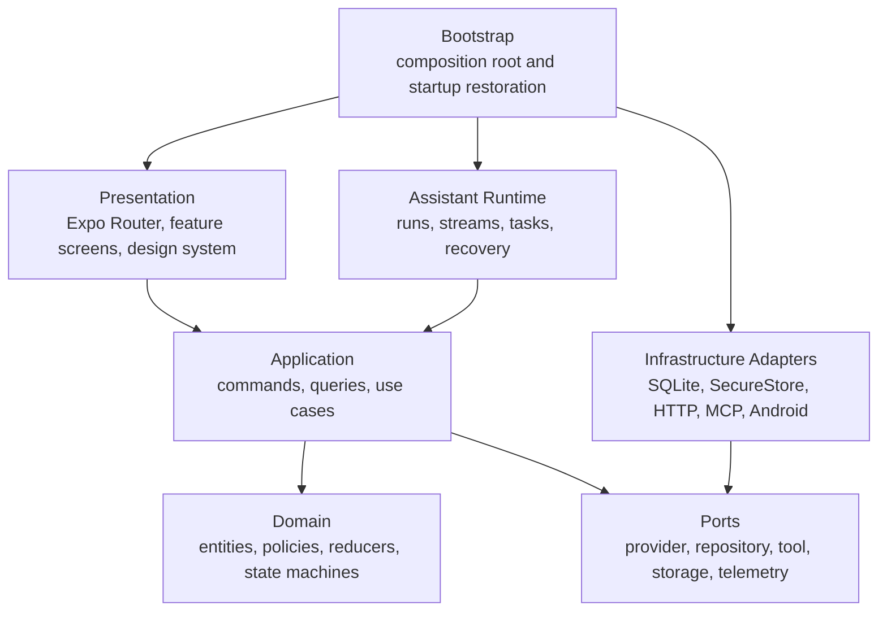

# IsleMind vNext Architecture Refactor Plan

**Status:** In progress. See `vnext-migration-status.md` for the current executable state, compatibility inventory, deletion queue, and latest validation evidence.

**Scope:** Whole application architecture, runtime, data, quality, and delivery foundations

**Platform decision:** Expo SDK, React Native, and strict TypeScript remain the client platform

**Product runtime decision:** Chat is the only product and execution entry. Agent/Companion product-mode persistence, selectors, writers, decoders, labels, search projection, and alternate runtime branches are removed. Tavern remains only as the current Chat workspace domain over native SQLite or the browser v2 key-value envelope; removed Tavern envelopes and migration selectors are not accepted.

**Compatibility cutover:** Older writers and the removed persisted formats are unsupported. Conversations load only the current SQLite records and persist only `ACTIVE_CONVERSATION`; `CONVERSATIONS`, `ACTIVE_CONVERSATION_BY_MODE`, persisted `productMode`, and `modeConversations.ts` are gone. AssistantRun persistence accepts only `kind: 'chat'`; existing non-Chat rows fail closed, and SQLite migration v5 remains solely as an inert migration-ledger tombstone. Portable recovery has no AsyncStorage recovery-blob fallback. Workspaces accepts the current native SQLite format and current browser v2 key-value envelope; Tavern v1 envelopes and key-value-to-SQLite migration APIs are deleted. Restoration of any removed path or marker is an architecture-boundary failure.

**Durable workspace evidence rule:** `AssistantRun` schema v4 persists the exact captured handoff atomically with `run.created` as strictly validated durable evidence only; it does not grant recovery authority. Unsupported or incomplete no-handoff data is classified as terminal decode-only no-replay inputs at the fail-closed boundary. Recovery never infers effect authority unless an awaited durable final-output/success barrier exists.

## 1. Executive Decision

IsleMind is still in a fast-development phase. This is the right time to replace an accumulated implementation structure with a deliberate application architecture, rather than preserving indefinite compatibility layers.

The refactor is a **targeted architectural rebuild**, not a cosmetic reorganization and not a platform rewrite. New work moves directly to the target architecture. Existing code is used as behavior and data reference until its replacement has passed the relevant acceptance criteria, then it is deleted.

The target outcome is simple:

> A new capability must be implementable as a feature module, an adapter implementation, or a versioned contract change. It must not require editing an unrelated global service, store, screen, or provider-specific branch.

## 2. Goals and Non-Goals

### Goals

- Establish clear, mechanically enforceable dependency direction.
- Create one durable Chat execution model for conversation, streaming, long-running work, tools, and recovery.
- Isolate model-provider protocols, storage, MCP, and Android APIs behind ports and adapters.
- Make state ownership, persistence, cancellation, permissions, telemetry, and data migration explicit.
- Improve delivery speed by allowing feature teams to work inside bounded modules with stable public APIs.
- Treat performance, failure recovery, privacy, and accessibility as architecture-level quality attributes.

### Non-Goals

- Do not replace Expo, React Native, Expo Router, or TypeScript as part of this program.
- Do not apply Clean Architecture mechanically to every small helper or UI-only component.
- Do not introduce a permanent legacy facade layer.
- Do not introduce a general-purpose event bus, decorator-based IoC container, or a new state library without a demonstrated need.
- Do not claim a hosted backend is required before product requirements for accounts, sync, billing, or remote execution are decided.

## 3. Current-State Evidence

| Observation | Evidence | Consequence |
| --- | --- | --- |
| Route, UI, store, provider, RAG, agent, MCP, Android, and persistence concerns already exist. | `app/`, `src/components/`, `src/store/`, `src/services/`, `src/presentation/` | The application needs explicit bounded modules rather than another horizontal service layer. |
| Former integration hubs required runtime-responsibility splits. | The deleted `src/services/chatRunner.ts` and `src/services/tavern.ts` facades, bootstrap-owned toolchain composition, and remaining large settings/chat components | Keep sequencing in owning modules, concrete binding in bootstrap, and presentation projection in feature commands. |
| Provider behavior spans multiple protocols and capabilities. | `src/services/ai/` | Provider differences need one canonical gateway and adapter contracts. |
| The app is local-first with multiple storage mechanisms. | Target-owned portable payload and reset policy in `src/modules/data-management/`, Conversations-owned SQLite persistence, Settings-owned settings-record persistence, Providers-owned metadata-record persistence, strict failure-aware application-record policy and concrete payload/reset/recovery composition in `src/bootstrap/`, reusable storage effects in `src/platform/storage/`, repository adapters, verified secure key-value storage in `src/core/secureKeyValueStorage.ts`, Expo SecureStore/web adaptation in `src/platform/secureStorage/`, and provider credential policy in `src/modules/providers/providerCredentialStorage.ts` | Persistence ownership, migrations, export/recovery, and secret boundaries require explicit ports plus composed recovery. |
| Existing work has already reduced value and type import cycles. | `scripts/architecture-dependency-audit.js`, `scripts/architecture-boundary-audit.js` | Preserve this baseline while replacing implementation-shaped checks with module-boundary checks and behavioral tests. |

## 4. Architecture Principles

1. **Vertical modules, horizontal platform:** Business capabilities live in modules; storage, native APIs, network, and telemetry live in platform adapters.
2. **Pure domain logic:** Business policies and state transitions remain React-, Expo-, HTTP-, SQLite-, and Zustand-free.
3. **Ports before side effects:** All network, provider, tool, persistence, and native operations cross a typed port.
4. **One execution model:** Chat, agent, MCP, Android actions, and future generation jobs share cancellation, policy, task, trace, and recovery semantics.
5. **Durable facts, projected UI:** Important runs and tasks are durable records; stores provide projections for rendering and interaction.
6. **Explicit public APIs:** Cross-module deep imports are forbidden. A module exposes a small public API with versioned contracts.
7. **Delete after migration:** Compatibility code has an owner, exit condition, and removal milestone.
8. **Measure instead of assume:** Runtime performance budgets are based on device measurements and become release gates.

## 5. Target System Shape



### 5.1 Source layout

```text
src/
  bootstrap/                 # Composition root, startup, restoration, dependency wiring
  core/                      # Result, errors, IDs, clocks, schemas, typed events
  modules/
    conversations/
    workspaces/
    assistant-runtime/
    providers/
    knowledge/
    tasks/
    integrations/
    data-management/
    settings/
    diagnostics/
  platform/
    storage/
    secure-storage/
    network/
    native/
    telemetry/
  presentation/
    app-shell/
    features/
    i18n/
    design-system/
```

Modules use internal `domain/`, `application/`, `ports/`, and `adapters/` directories only when they contain meaningful code. Screens, feature hooks, view-model projections, localization bindings, and visual components belong only in `presentation/`. The architecture must not create empty-folder ceremony or two competing homes for presentation code.

### 5.2 Module ownership

| Module | Owns | Does not own |
| --- | --- | --- |
| `conversations` | Conversation lifecycle, messages, drafts, message projections | Provider protocol, tool execution, raw database access |
| `workspaces` | Chat workspace state, workspace authority/revision, review/writeback policy, and migration from historical Tavern data | Conversation persistence, provider wire protocols, task execution |
| `assistant-runtime` | `AssistantRun`, stream lifecycle, `RunJournal`, cancellation, run recovery, context-to-output orchestration | Screen state, provider-specific serialization, SQLite queries |
| `providers` | Model catalog, credentials policy, capabilities, routing, normalized streaming, health/fallback | Chat UI, task persistence, RAG policy |
| `knowledge` | Documents, indexing, retrieval, memories, citations, context candidates | Chat rendering, provider request wire formats |
| `tasks` | Chat-linked plans, task state machine, policy decisions, artifacts, confirmation, and task-specific journal entries | Provider protocol, Android API implementation |
| `integrations` | Tool manifests and protocol adapters for MCP, built-in, and Android tools | Permission policy and global task lifecycle |
| `data-management` | User-initiated portable backup, import, reset contracts, cancellation admission, and post-commit projection refresh | Module repository implementation, native file picker/sharing APIs, raw storage, or secret persistence |
| `settings` | User preferences and configuration use cases | Credential secret storage implementation |
| `diagnostics` | Redacted health, timeline, recovery, and performance projections | Raw secret or provider payload retention |

### 5.3 Adapter placement and composition

`platform` owns reusable technical implementations: SQLite access, SecureStore access, filesystem access, HTTP transport, Expo/Android native bridges, and telemetry sinks. A module adapter owns only domain translation and may use platform ports. For example, an OpenAI adapter belongs in `modules/providers/adapters/` and serializes the provider protocol, while the reusable HTTP client belongs in `platform/network/`.

No module creates a hidden singleton for an adapter. `bootstrap/createAppContainer()` composes platform implementations, module adapters, repositories, and use cases. This keeps tests able to substitute any port without importing Expo or a native implementation.

### 5.4 Cross-cutting ownership

| Concern | Target owner | Boundary |
| --- | --- | --- |
| Localization | `presentation/i18n` | Locale resolution and translation resources; domain/application emit stable message IDs and parameters rather than translated strings. |
| Attachments, speech, image processing, and files | Feature module owns the use case; `platform/native` owns device/file/media APIs | UI does not read files or invoke native media APIs directly. |
| Updates, release channels, and native plugins | `platform/native` plus release configuration | Runtime code receives version/capability information through ports; it does not inspect EAS or plugin internals. |
| Diagnostics and telemetry | `modules/diagnostics` plus `platform/telemetry` | The module defines redacted event schemas; the platform sends them to a selected sink. |

## 6. Dependency Rules

1. Presentation imports public application APIs and presentation contracts only.
2. Domain imports only its own domain code and `core`.
3. Application imports its module domain, ports, `core`, and public contracts from another module.
4. Adapters implement ports. Application and domain code never import a concrete adapter.
5. `bootstrap` is the only composition root allowed to instantiate concrete adapters.
6. All cross-module imports use a declared public entry point. No deep imports.
7. New business code must not be added to `src/services/`; legacy code moves into a target module or a temporary migration adapter.
8. `src/store/` is a presentation projection layer. It cannot become the source of truth for durable runs, tasks, or data migrations.
9. Both value-import cycles and type-import cycles fail CI.
10. Modules do not contain screen components or feature view models; `presentation/features/<module>` consumes only their public APIs.

These rules are enforced by static dependency checks, ESLint import restrictions, and a documented module public-API manifest. Existing source-marker tests are retained only until an equivalent contract or behavior test exists.

## 7. Runtime Kernel

### 7.1 Canonical execution pipeline

```text
Conversation
  -> AssistantRun
  -> ContextSnapshot
  -> ProviderGateway
  -> StreamEvent sequence
  -> ToolExecution and/or TaskExecution
  -> RunJournal and, when applicable, TaskJournal
  -> Durable records and UI projections
```

The runtime owns the lifecycle of an invocation. It is not a chat-screen concern and it is not an agent-only concern.

### 7.2 Core contracts

| Contract | Responsibility |
| --- | --- |
| `AssistantRun` | Stable identity, requested capability scope, state, timing, cancellation, and terminal result of one execution. |
| `ContextSnapshot` | Immutable, attributable input composed from messages, memory, knowledge, attachments, and approved tool context. |
| `ChatRequest` / `StreamEvent` | Provider-neutral request and streaming protocol. |
| `ToolDefinition` / `ToolRequest` / `ToolResult` | Unified contract for MCP, built-in, Android, and future tools. |
| `RunEvent` | Ordered, redacted lifecycle record for every `AssistantRun`, including ordinary chat runs that never create a task. |
| `TaskCommand` / `TaskEvent` | Durable agent and long-running task state transitions and task-specific audit records. |
| `Result<T, ErrorCode>` | Cross-layer success/failure contract; raw thrown exceptions do not cross module boundaries. |

All I/O accepts `AbortSignal`. Provider streaming is represented by `AsyncIterable<StreamEvent>` or an equivalent explicit typed protocol. Retries, timeouts, cancellation, and cleanup are implemented once in the runtime, not separately per provider or screen.

Provider-neutral reasoning and generation-parameter identity is Core-owned: consumers import `ReasoningEffort`, `GenerationParameterKey`, `GenerationParameterSource`, and `GenerationParameterSources` only from `@/core`. Provider contracts may use those types internally but do not re-export them. `ChatRequest`, `ProviderRuntimeChatRequest`, and provider request planning require an explicit source map; untyped input that omits provenance fails closed as provider defaults, and architecture mutation coverage blocks restoration of numeric-value-to-explicit inference.

### 7.3 Runtime ownership boundaries

- `assistant-runtime` owns the lifecycle of an `AssistantRun`, `RunJournal`, stream sequencing, context freeze, cancellation propagation, and recovery coordination.
- `tasks` owns task state transitions, the Chat-neutral `workflowToolPermissionPolicy` (permission decisions, evidence/limit evaluation, compatibility trace projection, and input-schema validation), confirmation decisions, idempotency, artifact lifecycle, and task-specific journal entries linked to a run. A historical mode may still be projected into an existing trace field, but it is audit data only and cannot alter a permission result. Historical `AgentToolPermission` contract values, `agent-policy-*` trace IDs, `Agent policy ...` titles, and persisted mode/evidence strings remain readable compatibility data until their durable schema migration is proven.
- `integrations` owns tool manifests, mode-free manifest execution policy, and MCP, built-in-tool, and Android protocol adapters. `resolveManifestExecutionPolicy` derives risk, confirmation, and output-boundary policy without Workspaces input; `annotateManifestExecutionPolicy` defensively removes historical `supportedModes` and `modePolicyReason` before a manifest is published. Integrations cannot bypass the task policy or create its own task lifecycle.
- The application built-in catalog is distinct from production workspace capabilities. Immutable `app_info` may execute without a task after cancellation admission because it reads no user state; `get_settings` and the five Settings mutations require an allowed running durable task under their canonical `builtin:islemind-builtins:<action>` identity before reading or changing settings.
- The built-in capability target is a bounded four-tool catalog (`search_web`, `crawl_web`, `read_file`, and `edit_file`). Its contracts, path/network policy, receipt validation, and adapters are exported only through `@/modules/integrations`; bootstrap binds them only when task admission and exact concrete ports are supplied. `crawl_web` prefers the Android native DNS-to-connection-bound manual-fetch pair when both ports are present; it uses the explicitly vendor-derived remote crawl port only when the local pair is absent and never crosses from a failed local trust boundary to the vendor path. Native target permits are short-lived and single-use, reject non-public resolution, disable proxies and automatic redirects, pin OkHttp DNS to every admitted public address, and stream within the target MIME, timeout, redirect, and byte limits. The vendor path never claims local address pinning. `read_file` may bind a read-only durable Knowledge projection rooted at `knowledge/<documentId>.txt`; it exposes only ready imported documents, ordered chunks, a content-hash revision, `text/plain`, and bounded bytes, never picker caches or source/database paths. The unrealized media tool contracts were deleted; any future media-artifact tool requires a new durable, revisioned, contained port and focused validation rather than restoring those manifests. A catalog is not advertised as runnable merely because its manifest exists.
- External web discovery crosses an Integrations-owned provider adapter with an injected transport and bootstrap-owned settings projection. New installations select `islemind`, a zero-credential best-effort adapter over Bing's public RSS response; it is neither an IsleMind-hosted index nor an SLA-backed search service, and it remains distinct from Fetch/crawl of a known URL. The RSS path uses a structured XML parser with general entity expansion disabled, a bounded response, fixed named-entity decoding, cancellation propagation, public-HTTPS result validation, deduplication, and bounded projection. Existing explicit provider selections remain valid. Tavily requests only ranked result records: the optional generated answer is omitted, raw page content is disabled, and the request is capped at the documented 20-result maximum. Google Custom Search remains an existing-customer compatibility path through its January 1, 2027 discontinuation; `bing` denotes only an explicitly configured compatible endpoint because first-party Bing Search APIs retired on August 11, 2025. The adapter validates and deduplicates canonical public HTTPS URLs while continuing through ranked results for distinct bounded output. Bing-compatible and custom endpoints require public HTTPS on the standard TLS port; hostname validation does not claim DNS resolution-to-connection pinning.
- External-agent sessions remain an Integrations-owned contract boundary, not a production launcher. The frozen public mapping binds Codex CLI, Codex Desktop, Claude Code, and Grok CLI to four exact durable task capabilities and three closed `stdio` protocols. Descriptor and request admission clone and freeze only normalized output; caller-owned wrappers, descriptors, and capability arrays remain unchanged. Focused fixtures exercise matching request admission for all four products, unrelated and cross-product task rejection before port work, task expiry, exact resume correlation, bounded outcomes, and cancellation. No concrete vendor adapter, process launch, persistence, sandbox, permission binding, or end-to-end runtime session is claimed.
- `providers` owns canonical-to-provider conversion and emits normalized stream events. It cannot mutate conversations, task records, or UI stores.

The runtime calls task and provider ports; it does not import a concrete MCP, Android, or provider adapter.

### 7.4 Provider Gateway

The provider module exposes one gateway. OpenAI, Anthropic, Gemini, Bedrock, and compatible endpoints are adapters behind it.

The gateway owns capability discovery, credential resolution, request validation, provider serialization, stream normalization, tool-call normalization, health checks, fallback policy, and redacted diagnostics. UI, knowledge, and task modules must never branch on a provider protocol.

Rich Chat now enters that same gateway instance through the Providers-owned `startRuntimeStream` compatibility contract. Bootstrap binds the concrete `streamProviderChat` adapter once in `conversationProviderGateway`; initial Chat streaming, provider-native tool continuation, and tagged-MCP continuation call only the gateway. The complete `ProviderRuntimeChatRequest`, callback identities, `ProviderRuntimeCompletionResult`, stream handle, cancellation, fallback/health effects, compaction evidence, citations, traces, replay state, usage, and provider tool calls remain unchanged. `AssistantRuntime` receives that exact gateway instance, so rich Chat no longer has a parallel direct provider entry. The callback contract remains transitional: delete `startRuntimeStream` only after the canonical `ChatRequest` / `StreamEvent` protocol can represent every rich request field and one validated terminal receipt without loss, and after replacement coverage proves identical finalization and continuation behavior.

Remote context compression is vendor-first but route-evidence-bound. Native OpenAI compaction is admitted only when the request-planning resolver proves that the selected provider/model/request uses the Responses API; explicit `false` and unknown route evidence fail closed. Reusable OpenAI continuation state requires the same exact `native-openai-responses` / `native-compaction` / `remote-available` decision before any state lookup; omitted, Anthropic, local, unavailable, or failed evidence cannot reuse it. Active state persistence requires and stores that same triple, and Assistant Runtime carries it unchanged from request planning through reply start, stream lifecycle, and finalization. Completed and failed lifecycle recording also requires the exact decision fields; omitted runtime evidence is never promoted to `remote-available`. When native compaction is unavailable, `auto` may use the privacy-gated structured local packer, while `required` blocks. Provider/model fallback recomputes this admission and, for a non-native route, sends the prepared bounded local messages/context with Responses continuation and compact fields removed.

Provider-native search follows the current direct-vendor contracts without rewriting compatible relays. Direct OpenAI Responses emits `tools: [{ type: "web_search" }]`; `web_search_preview` remains accepted only as explicit compatible-relay metadata. Direct current Anthropic routes emit `web_search_20260318` and omit the optional `response_inclusion` field to preserve its `full` default, while compatible Anthropic relays retain `web_search_20260209` and legacy models retain `web_search_20250305`. Anthropic native compaction keeps `context_management.edits: [{ type: "compact_20260112", trigger: { type: "input_tokens", value } }]` with beta header `compact-2026-01-12`.

### 7.5 Task and tool execution

All external side effects use a shared task model:

- states: `queued`, `running`, `awaiting-confirmation`, `succeeded`, `failed`, `cancelled`, and `expired`;
- explicit policy evaluation before execution;
- idempotency keys for externally visible commands;
- append-only task journal with bounded retention/checkpoints, linked to the owning `RunJournal`;
- durable cancellation and cleanup records;
- artifact metadata for provenance, retention, and safety.

Provider-selected model operations use an immutable catalog capped at 64 declarations and execute at most one call per model turn. Integrations exposes the neutral `ConversationToolCatalog*`, `listConversationToolCatalog`, `listStaticConversationToolCatalog`, `resolveManifestExecutionPolicy`, and `annotateManifestExecutionPolicy` contracts; bootstrap exposes `listConversationToolManifests`, `listStaticConversationToolManifests`, and `resolveConversationTool` through `@/bootstrap/conversationToolCatalog`. Dynamic discovery and static Settings review are both mode-free: neither API accepts a product-mode discriminator, both apply the same neutral annotation after source assembly, and neither filters a tool by historical mode. Chat ownership is established by the public conversation and Assistant Runtime entry contracts; workflow and durable-task execution carry exact identity and cancellation evidence rather than a fixed mode value. Ordinary provider-tool admission and the downstream durable task-policy options accept no product-mode input; Tasks defensively discard any legacy mode field before policy or executor work. Forged historical-mode caller data cannot select catalog or execution admission. Provider-native tool turns preserve caller-independent authority through durable task policy without manufacturing Agent authority or a synthetic `AssistantRunId`. Their stable step and idempotency identity includes the exact conversation and assistant-message IDs, normalized call ID, canonical operation ID, frozen catalog revision, argument digest, and call index; the exact cancellation signal crosses task execution. A real observation always returns through model continuation so pre-tool prose cannot become the terminal answer. Terminal task receipts are reused without repeating an executor, and cancellation observed after an effect suppresses model continuation or rerouting. Bootstrap task execution is Chat-neutral through `taskBoundToolRuntime`; the former `agentToolTaskRuntime` path and its eight Agent-named public contracts/functions, plus both `agentToolCatalog.ts` paths and every Agent-named catalog API, are deleted and restoration-gated. Workspaces' Agent-named annotation, filter, availability, and mode-policy helpers are also deleted and restoration-gated. Historical `supportedModes` and `modePolicyReason` values may be accepted at an untrusted manifest boundary only so the Integrations annotator can remove them; they are never execution authority and no target serializer writes them, so this slice requires no bulk data migration. Manifest IDs, source discriminators, order, schemas, hashes, `agent:` idempotency keys, `agent-confirm-*` IDs, and visible Agent trace/copy remain compatibility data.

Workflow search-tool admission is Tasks-owned through `createWorkflowSearchToolAdmissionPolicy` and composed by `bootstrap/workflowSearchToolAdmission`. Chat reply startup, provider-native tool turns, model-operation catalog discovery, and Chat workflow resolution share that binding. It preserves native/off local-search suppression, canonical `toolId` precedence with the bounded legacy source/server/name fallback, caller order and unchanged-array identity, frozen-input nonmutation, configured permission ceilings, and the post-filter 64-declaration fail-closed limit. The former `agentSearchToolAdmissionPolicy.ts` and `bootstrap/agentSearchToolAdmission.ts` paths plus their Agent-named public symbols are deleted and restoration-gated. Persisted `agentWorkflowAllowReadOnlyTools`, `agentWorkflowAllowReadWriteTools`, and `agentWorkflowAllowDestructiveTools` settings keys remain compatibility inputs until Settings persistence and every consumer forward-migrate with replacement coverage.

Tagged-MCP fallback turns likewise admit their durable task with mode-free options, stable selected/requested tool identity, and the exact cancellation signal even when persisted conversation metadata is historical. The untouched conversation metadata remains available only to revision-message and generation-parameter projection; it cannot restore Agent or Companion execution authority.

Persisted model-operation confirmation resumes through `AssistantRuntime.resumeModelOperation`. One realm-local claim admits only one consumer while the pending envelope is loaded. A reconstructed catalog-bound session validates the exact run/call/catalog/task identity plus the frozen provider-neutral request, protocol mode, pre-tool output, and continuation state before approval or decline is journaled. Cancellation reaches neither the operation session nor later provider work, and a repeated, tampered, or unavailable continuation fails closed. Terminal transitions clear the pending envelope; restart recovery expires unresolved destructive tasks and never replays an uncertain side effect. Cross-runtime exactly-once behavior remains grounded in atomic run/journal persistence plus the operation task's durable idempotency key.

New explicit workflows use `createAssistantChatWorkflowRunRuntime` and `AssistantRuntime.executeActivity({ kind: 'chat' })`. Context assembly precedes durable activity creation, and the exact Chat `AssistantRunId` reaches checkpoints, tasks, confirmations, artifacts, cancellation, and terminal recovery. `AssistantRuntime.recoverInterruptedRuns()` is parameterless, and every recovered record must already decode as Chat. Existing non-Chat AssistantRun rows fail closed. SQLite migration v5 is retained only as an inert migration-ledger tombstone; it performs no rewrite, and no late Agent decoder exists.

Structured reply startup is Conversations-owned through `createConversationChatWorkflowReplyStarter` and composed directly in `bootstrap/conversationReplyStart`. Explicit workflow dispatch and confirmed-action restart share that starter. New activity records are `chat-turn | chat-workflow`; no Agent/Tavern task kind or product-mode metadata is accepted at this boundary. Confirmation-time manifest discovery is parameterless and mode-free, and restart carries only the exact tool request, current limits, and `userConfirmed: true`.

Presentation message entry persists the current Chat conversation/message schema before runtime dispatch. Active, queued, interrupted-replay, setup, retry, regenerate, tagged-MCP, planning, prompt, and workspace contracts carry no product-mode field. Conversation and message records do not persist `productMode`, no decoder reconstructs Agent/Companion metadata, and `ChatWorkspace` has no mode prop. Architecture gates reject restoration of mode-bearing fields, Workspaces mode imports, mode-specific prompts, and extra call-site arguments.

Chat media readiness and boundary-action projection are owned by `src/presentation/features/chat/chatMultimodalPolicy.ts` and `chatBoundaryStatus.ts`; the catalog lives beside them in `chatPresentationCatalog.ts`. Their inputs contain provider/model and current Chat readiness only, while the exact provider capability, generation lock, memory review, action priority, and confirmation behavior is preserved. The former `src/product/` paths, their `ProductMode*` exports, and the `productModes.*` localization namespace are deleted and restoration-gated; current copy uses `chatPresentation.*` only.

Recoverable conversation failures use one ephemeral Chat error channel. New-turn clearing, model-switch validation, ordinary and structured startup, retry/regenerate, web-context failure, assistant terminal projection, and status-banner dismissal all read or write that same value. Historical message or conversation metadata and legacy caller options cannot select an Agent or Companion error bucket. The `modeErrors`, `setErrorForMode`, and `getErrorForMode` store surface, error-mode arguments, fixed-mode resolver, mode-named banner, and mode-specific locale copy are deleted and restoration-gated.

The durable plain-Chat projection contract is mode-free. Startup eligibility retains its separate Chat-only admission check, while pre-terminal projection failures write the single Chat error channel and recovery uses the exact persisted response-message identity without resolving historical conversation mode. The dead projection-state mode and resolver plus the bootstrap projection argument are deleted.

The Tasks-owned `conversationChatWorkflowEntryPolicy`, `conversationChatWorkflowRuntimePolicy`, `workflowOrchestrator`, `workflowStepExecutor`, and `workflowToolPermissionPolicy` expose no execution-mode discriminator. Conversations and Assistant Runtime call them with exact run, cancellation, tool, evidence, and limit identity only. New workflow records use current workflow identities, and architecture gates reject restoration of public workflow mode fields, fixed-mode task calls, and mode forwarding.

Chat task presentation selects active transient activity only by exact conversation identity through `projectConversationTaskStatus`. `@/modules/tasks` now owns the realm-local `conversationTaskActivityRuntime`, which accepts only `chat-turn | chat-workflow`, requires exact conversation/message identity, emits isolated lifecycle observations, bounds progress/metadata/history, and expires stale active records. Assistant reply sessions, structured workflows, terminal projection, conversation control, and the Chat task card all consume that public API. The former ProductMode registry, mode-derived queue/low-disruption metadata, cross-mode snapshot/filtering, unused update method, ProductMode/Agent presentation files, and `productModes.agent.taskCard*` translations are deleted and restoration-gated. The activity projection remains realm-local and is not execution authority. Linked streaming cancellation still aborts the Chat stream. For one active non-streaming `chat-workflow`, Conversations binds the exact activity conversation/message identity to the same live durable Chat `AssistantRun`; the card rejects identity drift, invokes `runtime.cancel(handle.runId)`, aborts the reply request controller, awaits terminal cancellation, and releases the binding. Unbound activities retain observational-only terminalization and do not claim durable Task cancellation. The focused conversation message-command fixture covers the complete binding, durable journal, abort, terminal, and release sequence.

Chat workflow entry, reply-to-message projection, and workflow assistant-message resolution cross Chat-neutral bootstrap and Conversations APIs. `conversationChatWorkflowEntry` composes the Chat-named Tasks entry policy, and `conversationChatWorkflowResolutionRuntime` composes the Chat-named Tasks runtime policy with the Conversations projection/resolver. Its trace dependencies are `projectTrace` and `clampWorkflowOutput`; the local skipped-result helper and its ephemeral reason are `skippedWorkflowRuntimeResolution` and `workflow-not-handled`. The former Agent-named Tasks entry/runtime policy files, entry bootstrap, Conversations projection files, workflow-resolution bootstrap, trace dependency names, skipped-result helper, and `agent-not-handled` reason are deleted and restoration-gated without changing persisted data or historical metadata readability.

The consumer-free Tavern narrative turn planner and its schema, speaker, plan, and options contracts are deleted and restoration-gated. Workspaces still owns narrative summaries, context packing, snapshot/review/writeback behavior, persistence, migrations, and portable recovery; no persisted schema, storage key, decoder, or historical record was changed by the planner deletion.

Chat workflow-skill saving is presentation-owned through `conversationWorkflowSkillSaveController`, `workflowSkillSuggestionSelector`, `saveApprovedConversationWorkflowSkillRuntime`, and `saveConversationWorkflowSkillFromMessage`. Tasks publicly exposes only `WorkflowSkillSuggestion`, `WorkflowSkillSavePreview`, the generic create/save contracts, `WorkflowSkillPolicy`, `WorkflowRuntimeBlockState`, and `createWorkflowSkillFormattingPolicy`; the formatter implementation and public export use the neutral `workflowSkillFormattingPolicy.ts` path, and the duplicate run-summary shape is a projection of `WorkflowExecutionRun`. The old Agent-named controller, selector, suggestion/save/preview/formatter types and methods, `agentWorkflowSkillFormattingPolicy.ts` path, policy/factory/runtime-block contracts, snapshot selection/blocking methods, runtime option fields, bootstrap file, runtime field/seam, command, bubble helper, confirmation helper, and callback names are deleted and restoration-gated while exact message reread, approval metadata, persistence results, refresh, visible failure behavior, and frozen-input nonmutation remain unchanged. Workflow-skill lifecycle classification, list/filter, edit-review reset, approved state transitions, and runtime snapshot admission now use only Chat-neutral policy methods through Tasks and `bootstrap/workflowSkills`. The stable `not_agent_workflow` reason, translation keys, Agent-named IDs, control tags, approval tags, and `agent-workflow-output:*` markers remain compatibility inputs. Exact legacy `islemind.agent.workflow.v1` records remain readable only through the strict Tasks decoder and normalize in memory to `islemind.workflow.v2`; new definitions, approved saves, serialization, Android templates, presentation projection, and plugin projection write v2.

Persisted workflow-definition admission is Tasks-owned through `workflowDefinitionPolicy` and composed by `bootstrap/workflowDefinitions`. The public neutral contract accepts only exact legacy v1 and current v2 discriminators, reports the source schema and rewrite need, and returns deeply detached frozen v2 records. Unknown schemas, non-boolean enablement, malformed required fields, invalid enums or timestamps, accessors, hostile proxies, dangerous prototype keys, sparse or cyclic structures, unsupported JSON values, and excessive argument depth, node count, or payload size fail closed without throwing. Runtime selection and orchestration validate every supplied definition before planning or tool execution, including when the manifest list is empty; invalid selected records project `workflow-invalid`. The former Agent-named policy/bootstrap paths, exports, schema-only casts, coercive sanitizer, and ambiguous export API are deleted and restoration-gated. The private legacy decoder remains until durable skill storage, conversation snapshots, raw skill imports, and portable backups have forward-migration evidence.

Workflow transition, step-count, goal-hash, and bounded diagnostic projection are Tasks-owned through the Chat-neutral `workflowRuntimePolicy` API. The former Agent-named policy path and all Agent-named exported runtime symbols are deleted and restoration-gated; Tasks consumers and bootstrap use the generic public contracts only. Newly emitted evidence uses `islemind.workflow-runtime.v2`, `workflowRuntime*` trace metadata keys, and neutral transition-error wording while preserving every status, failure and transition reason, the exact transition matrix, the `fnv1a32-*` hash, counters, and the last-eight transition window. Historical `islemind.agent.workflow-runtime.v1` metadata remains readable as inert generic trace data and is not rewritten or granted execution authority, so this slice requires no task or checkpoint persistence migration.

Workflow permission-evidence construction is Tasks-owned through the Chat-neutral `createWorkflowPermissionEvidencePolicy` API and composed by `bootstrap/workflowPermissionEvidence`. The former Agent-named policy file, exported contracts/factory, and bootstrap binding are deleted and restoration-gated. The live `agent-plan:*`, `source:visible-agent-request`, and `visible Agent plan` values remain unchanged compatibility evidence until their downstream diagnostic and persisted-record consumers are version-migrated.

Workflow observation, step attribution, failure metadata, and bounded pending-action context are Tasks-owned through the Chat-neutral `createWorkflowObservationPolicy` API and composed by `bootstrap/workflowObservation`. The former Agent-named observation policy file, contracts/factory, and bootstrap binding are deleted and restoration-gated. The live trace title `Agent plan`, source `agent-workflow-skill`, failure field names, and prompt labels remain unchanged compatibility evidence until their persisted trace and downstream policy consumers are version-migrated.

Workflow RAG evidence quality admission and bounded repair-pause projection are Tasks-owned through the Chat-neutral `createWorkflowRagEvidencePolicy` API and composed by `bootstrap/workflowRagEvidence`. The former Agent-named RAG evidence policy file, contracts/factory, and bootstrap binding are deleted and restoration-gated. The live `agent-pending-rag-evidence-*` pending-action identity, `rag_evidence` intent, repair codes and strategies, and existing visible repair copy remain unchanged compatibility evidence until their persisted-message and downstream policy consumers are version-migrated.

Workflow pending-action construction and output formatting are Tasks-owned through the Chat-neutral `createWorkflowPendingActionPolicy` API and composed by `bootstrap/workflowPendingAction`. Descriptor-safe snapshots, metadata precedence, detached resumable arguments, exact waiting projection, and terminal-trace identity remain covered. The former Agent-named policy path, exported contracts/factory, and bootstrap binding are deleted and restoration-gated. The live `agent-pending-*` identity, `permission_required | evidence_insufficient` reasons, `resumeToolRequest`, confirmation authority, Android localization keys, visible Agent copy, and exact bounds remain compatibility evidence until the runtime, checkpoint, and message-action contracts are version-migrated.

Workflow cancellation progress and step-limit pause construction are Tasks-owned through the Chat-neutral `createWorkflowContinuationPolicy` API and composed by `bootstrap/workflowContinuation`. The former Agent-named continuation policy path, exported contracts/factory/constant, and inline bootstrap construction are deleted and restoration-gated. The live `agent-pending-step-limit-*` pending-action identity, `cancelled | waiting | step_limit_reached` states, progress metadata fields, blocked-reason value, stable hash, exact bounds, and existing visible Agent/agentic workflow copy remain unchanged compatibility evidence until their persisted checkpoint, terminal-trace, and message-action consumers are version-migrated.

Workflow post-step outcome resolution is Tasks-owned through the Chat-neutral `createWorkflowStepOutcomePolicy` API and composed by the Tasks bootstrap orchestrator. The former Agent-named policy path and exported contracts/factory are deleted and restoration-gated. Cancelled-step precedence, `permission_required | evidence_insufficient` waiting projection, exact pending-action and transition-step identity, `repairNextStep` propagation, visible tool-failure projection, Android runtime-state extraction/merge, and frozen-input nonmutation remain behaviorally covered. Agent-named checkpoint contracts plus their visible and persisted literals remain compatibility inputs until those downstream contracts are independently neutralized.

Android workflow runtime-state carry-forward is Tasks-owned through the Chat-neutral `androidWorkflowRuntimeStatePolicy` API. `bindAndroidWorkflowRuntimeState`, `extractAndroidWorkflowRuntimeState`, and `mergeAndroidWorkflowRuntimeState` preserve dotted and namespaced Android identities, explicit-operation precedence, missing-only argument filling, successful-observation admission, detached nested arrays, and fail-closed hostile-input handling. The Tasks orchestrator and bootstrap composition use only the neutral public contracts; the former `agentAndroidWorkflowRuntimeStatePolicy` path and its seven Agent-named exports are deleted and restoration-gated. This state exists only inside one workflow run, so the rename changes no persisted schema, task identity, trace value, or device contract.

The seven-definition Android workflow catalog is Tasks-owned through `androidWorkflowCatalog.ts`, `AndroidWorkflowCatalogDependencies`, `AndroidWorkflowCatalog`, and `createAndroidWorkflowCatalog`; bootstrap composes it through `androidWorkflowCatalog`. Chat workflow resolution and Settings use only the neutral binding. The former `agentAndroidWorkflowCatalog.ts` Tasks/bootstrap paths and Agent-named source symbols are deleted and restoration-gated. Definition order, tool requests, permission ceilings, acceptance checks, sanitizers, timestamp behavior, the exact workflow contract hash, and persisted `agent-workflow-android-*` IDs remain unchanged compatibility data.

Android undo follow-up construction is Tasks-owned through the Chat-neutral `workflowAndroidUndoFollowUpPolicy` API. `buildWorkflowAndroidUndoFollowUp`, `appendWorkflowAndroidUndoFollowUp`, and `projectWorkflowAndroidUndoFollowUpMetadata` preserve first-valid-receipt selection, fail-closed malformed and hostile input handling, frozen-input nonmutation, successful-output-only guidance, and error-trace metadata. The completion policy and Tasks barrel use only the neutral contracts; the former `agentAndroidUndoFollowUpPolicy` path and Agent-named exports are deleted and restoration-gated. The exact `android.files.undo_operations` identity, visible-confirmation copy, `androidUndo*` metadata keys, and success/error output asymmetry remain compatibility evidence.

Workflow tool-call trace construction, inference, validation, shape comparison, tagged-block stripping, and raw-request detection are Tasks-owned through the Chat-neutral `workflowToolCallTracePolicy` API and composed by `bootstrap/workflowToolCallTrace`. Provider, Chat, MCP, and security consumers use only the neutral public exports; the former `agentToolCallTracePolicy` and `bootstrap/agentToolCallTrace` paths plus every Agent-named trace-policy export are deleted and restoration-gated. The exact persisted `islemind.agent.tool-call-trace.v1` contract value, existing Agent validation strings, metadata field names and ordering, 160-character bounds, redaction, raw-request stripping, and trace-shape equivalence remain compatibility evidence until a versioned trace migration is justified.

Workflow execution limits are Tasks-owned through the Chat-neutral `workflowRunLimitPolicy` API. `WorkflowRunLimits`, `WorkflowRunLimitSettings`, `DEFAULT_WORKFLOW_RUN_LIMITS`, `resolveWorkflowRunLimits`, and `resolveWorkflowRunLimitsFromSettings` preserve the exact defaults, bounds, truncation, permission semantics, nonmutation, fixed trace/background-continuation safeguards, and bootstrap/presentation behavior. The former `agentRunLimitPolicy` path and its six Agent-named public/private symbols are deleted and restoration-gated. New runs use `workflow-run-*`; the six persisted `agentWorkflow*` settings keys, previously written `agent-run-*` identities, trace metadata, and visible Agent compatibility copy remain byte-compatible migration inputs until their independently versioned data and presentation contracts move.

Workflow step execution is Tasks-owned through the Chat-neutral `createWorkflowStepExecutor` API and composed by the Tasks bootstrap orchestrator with the Chat-neutral `TaskBoundToolRuntime` port. The former Agent-named step target path and all 13 Agent-named step contracts/factory, plus the former `agentToolTaskRuntime` bootstrap path and its eight public Agent-named contracts/functions, are deleted and restoration-gated. Exact source, failure, status, and historical-mode literals; no-tool completion; pre-dispatch and post-effect cancellation behavior; request, run, option, and signal identity; unavailable-tool and cancellation copy; trace metadata and bounds; hostile-input safeguards; timestamps; and returned step shape remain behaviorally covered. The persisted `agent:` idempotency keys, `agent-confirm-*` confirmation IDs, Agent-visible trace/copy values, Agent-prefixed Android workflow IDs, legacy v1 workflow-definition data, and checkpoint compatibility contracts remain independent migration inputs.

Workflow planning is Tasks-owned through the Chat-neutral `createWorkflowPlanner` API and composed by the Tasks bootstrap orchestrator. The former Agent-named target path and all 12 Agent-named planner contracts/factory are deleted and restoration-gated. Intent, requested-output, and tool-source literals; explicit classification/time precedence; direct-Chat zero-step planning; selected-workflow order and identity; detached runtime argument binding; Android, RAG, search, and work-artifact sanitization; exact acceptance/tool evidence bounds; redaction; hashing; timestamps; trace metadata; and frozen-input nonmutation remain behaviorally covered. The live `agent-plan-*`, `Agent plan`, and `agent-workflow-skill` values remain compatibility evidence until persisted trace consumers are version-migrated.

Workflow execution results use the Tasks-owned Chat-neutral `WorkflowExecutionRun` and `WorkflowExecutionRuntimeLogOptions` contracts. The orchestrator, workflow-skill projection, and bootstrap consumers import them only through the Tasks public entry. The former Agent-named run-contract path and both Agent-named exports are deleted and restoration-gated without changing field shape, optionality, mutability, cancellation, checkpoint, step, or completion behavior. New records use `workflow-run-*`; previously persisted `agent-run-*` identities, Agent-visible copy, checkpoint schemas, and adjacent Agent-named definition and checkpoint contracts remain compatibility inputs for independent migrations.

Workflow orchestration is Tasks-owned through the Chat-neutral `WorkflowOrchestratorInput`, `WorkflowStepRuntimeDependencyInput`, `WorkflowOrchestratorDependencies`, `WorkflowOrchestrator`, and `createWorkflowOrchestrator` API. `bootstrap/workflowOrchestrator` composes the public Tasks contract and exposes only `runWorkflow`; `conversationChatWorkflowEntry` is its sole production consumer. The former Agent-named Tasks and bootstrap paths, five Agent-named public contracts, unused input alias, and `runAgenticWorkflow` seam are deleted and restoration-gated without changing checkpoint ordering, cancellation, bounded execution, RAG pause, Android state carry, terminal projection, hashing inputs, or input mutation behavior. New runs use `workflow-run-*`; historical `agent-run-*` identities and Agent-visible copy remain compatibility evidence and are never rewritten in place.

Terminal workflow completion uses the Tasks-owned Chat-neutral `createWorkflowCompletionPolicy` contract composed by `bootstrap/workflowCompletion`. The former Agent-named policy and bootstrap paths plus all ten Agent-named contracts, factory, and binding names are deleted and restoration-gated. Terminal runtime transition/status projection, two appended trace identities and order, six step counts, redaction and exact output bounds, failure next-step deduplication, one injected clock read, frozen-input nonmutation, successful Android undo copy, and error-output asymmetry remain covered. Exact `Agent synthesis` and `Agent workflow` titles, historical `agent-run-*` identities, workflow-runtime schema/status values, Android undo metadata, and checkpoint schemas remain compatibility data pending checkpoint-contract and durable-schema migration; new runs are written with `workflow-run-*`.

Workflow-to-checkpoint projection uses the Tasks-owned Chat-neutral `createWorkflowCheckpointProjectionSession` contract. The Tasks orchestrator consumes the generic session dependency and bootstrap injects time, redaction, and the durable checkpoint store through the public Tasks entry. New v2 checkpoints write only the neutral `workflow-goal-*` hash prefix; the strict checkpoint parser continues to accept historical bounded `agent-goal-*` values as opaque read-only data and never derives execution authority from the prefix. The former Agent-named session path and all nine Agent-named projection exports are deleted and restoration-gated, and the writer is gated against restoring the Agent prefix. Status mapping, goal hashing, task/evidence/pending/failure projection, bounds, exact cancellation signal, fail-closed persistence, parent Chat failure, and no-side-effect-replay recovery remain covered.

Checkpoint revision and append-only journal recording use the Tasks-owned Chat-neutral `createWorkflowCheckpointRecorder` contract. The projection session consumes that generic recorder directly, and the former Agent-named recorder path plus its four exported names are deleted and restoration-gated without changing persistence behavior. Exact revisions, journal sequences, monotonic timestamps, pending/failure clearing, completed-step append semantics, signal identity, and `replaySideEffects: false` recovery remain covered. Persisted records now use the neutral `WorkflowCheckpoint` repository and the `islemind.workflow-checkpoint.v2` / `islemind.workflow-checkpoint-journal.v2` schemas; historical `agent-*` identities and Agent-visible trace/error copy remain readable record content but no longer name the public checkpoint contract.

SQLite checkpoint persistence is exposed through the Tasks-owned `createSqliteWorkflowCheckpointRepository` factory and neutral `WorkflowCheckpointDatabase*` bridge contracts. `bootstrap/workflowCheckpoints` composes that public adapter with the shared SQLite provider through `createWorkflowCheckpointRuntime` while preserving exact cancellation and post-commit authority. New storage uses `workflow_checkpoints`, `workflow_checkpoint_journal`, and `workflow_checkpoint_storage` with the exact `islemind.workflow-checkpoint-storage.v2` ready marker. On first access, the repository discovers storage and strictly decodes any v1 source inside the caller-signal transaction, preserves identities, revisions, retained journal sequences, and `replaySideEffects: false`, accepts only equivalent dual-family data, and fails closed on unknown or divergent state. Corrupt current rows or journal suffixes migrate only the same last-safe retained recovery prefix; an invalid first retained anchor fails. The complete v2 dataset is reread and compared before the legacy tables are dropped in that transaction, so cancellation or any migration failure rolls back DDL and data together. The former Agent-named adapter/bootstrap paths and exports are deleted and restoration-gated. Private exact v1 decoders and table discovery remain only for upgrades and are not deletion-safe until legacy database support ends.

Checkpoint persistence orchestration uses the Tasks-owned Chat-neutral `WorkflowCheckpointStore` and `createWorkflowCheckpointStore` API over `WorkflowCheckpointRepository`. Recorders, projection, workflow policies, Conversations, and bootstrap consume only those public names and neutral v2 records; the former Agent-named codec path, record/repository/store exports, parsers, and constants are deleted and restoration-gated. Validation, CAS ordering, cancellation, failure copy, recovery disposition, and `replaySideEffects: false` remain unchanged across fresh v2 storage and transactional v1 upgrades.

Startup checkpoint reconciliation is Tasks-owned through `createWorkflowCheckpointRecoveryCoordinator` and composed by `bootstrap/workflowCheckpointRecovery`. It receives only the exact ordered `AssistantRunId` values returned by Chat run recovery and the same bootstrap cancellation signal. Each unique run is classified as no checkpoint, recovered with `terminal | awaiting-action | reconcile-before-resume | failed-with-evidence`, failed/corrupt, or cancelled; the bounded projection exposes no checkpoint payload or failure message and always fixes `replaySideEffects: false`. The coordinator has no task-creation, executor, provider, workflow-resume, or checkpoint-mutation dependency. It reads the neutral v2 store after repository initialization has transactionally upgraded any supported v1 database, then exposes checkpoint evidence before workspace-receipt and passive-task reconciliation without replay authority.

Workflow message-action selection is Tasks-owned through the Chat-neutral `createWorkflowMessageActionPolicy` API and presentation-owned `workflowMessageActionSelectors` binding. The former Agent-named policy and selector paths plus their exported contracts, factory, and selector names are deleted and restoration-gated. Pending confirmation, evidence repair, recovery, and continuation selection preserve cross-trace ordering, hidden-trace exclusion, exact identity checks, bounded detached resume arguments, redaction, hostile-input failure, and frozen-input nonmutation. The live `Agent workflow`, `Agent synthesis`, and `Agent workflow skill` trace titles; pending/recovery/continuation reason values; metadata keys; visible Agent copy; translation keys; and `islemind.agent.work-artifact-workflow.v1` remain compatibility evidence until their persisted trace and message schemas are version-migrated.

Workflow failure output, visible recovery guidance, tool/source detail attribution, and Android partial-failure rollback projection are Tasks-owned through the Chat-neutral `createWorkflowFailurePolicy` API and composed by `bootstrap/workflowFailure`. The former Agent-named policy path, exported contracts/factory, bootstrap binding, and downstream helper names are deleted and restoration-gated. The generic `WorkflowRuntimeFailureCode` retains the exact failure-code values; `Agentic workflow failed.` copy, `Reason:` and `Next step:` formatting, Android labels/guidance, and 900/700/160/240 bounds remain unchanged compatibility evidence until persisted terminal-trace consumers are version-migrated.

Generic workspace writeback crosses the Workspaces-owned `createChatWorkspaceWritebackRuntime` contract. Current native SQLite and current browser v2 key-value repositories preserve scoped snapshots, authority revisions, Chat writeback receipts, review state, exact-run handoffs, and query-only recovery. The browser adapter strictly accepts only the current v2 envelope and requires cross-context Web Locks for writeback/review admission. Tavern v1 decoding, storage selectors, key-value-to-SQLite migration, migration markers/backups, and old multi-key merge paths are deleted and restoration-gated. AssistantRun handoffs remain strictly validated evidence and never authorize effect replay.

Chat workspace review crosses the Workspaces-owned `createChatWorkspaceReviewRuntime` contract. Bootstrap composes the current native SQLite atomic port or the current browser v2 key-value port when cross-context Web Locks are available; unsupported environments fail closed. Review, private-memory purge, receipt preservation, cancellation, and compare-and-swap authority remain covered. The browser port does not decode v1 envelopes or consult a legacy storage selector.

The Tasks-owned workflow intent classifier and `bootstrap/workflowIntent` binding use Chat-neutral public names. Historical `agent-intent-*` trace IDs and the `Agent intent` trace title remain readable compatibility values; the former Agent-named classifier module and bootstrap binding are deleted and restoration-gated.

Conversation RAG adaptation is Knowledge-owned through `ConversationRagRuntime` and `createConversationRagRuntime`. Chat workflow, provider-tool, and model-operation consumers use that public neutral contract while preserving request-over-default prompt precedence, budgets, retrieval callback identity, cancellation, and nonmutation. The former Knowledge `agentRagRuntime.ts`, its Agent-named factory/contracts, and the older Agent service facade are deleted and restoration-gated; `runAgenticRag` remains the internal orchestration algorithm name, not product authority.

## 8. State, Data, and Security

### 8.1 State ownership

| Store | Allowed data | Forbidden data |
| --- | --- | --- |
| Zustand | Screen interaction state, cached view models, temporary input, UI selections | Sole copy of a run, task, migration, credential, or user data record |
| SQLite | Conversations, messages, knowledge metadata, task/run records, run/task journals, import queue | Raw credentials and unbounded provider payloads |
| SecureStore | Credentials, tokens, secret references | General application state or large payloads |
| AsyncStorage | Preferences, feature settings, bounded recovery coordination metadata, disposable cache | Relational business data, large recovery payloads, secrets |
| File system | Approved attachments and local model artifacts referenced by durable metadata | Untracked or unretained user artifacts |

The shared Expo SQLite adapter opens the worker-backed database on web as well as native. Native uses `withExclusiveTransactionAsync`; web uses `withTransactionAsync`, bundles the SQLite WASM asset, and requires `Cross-Origin-Embedder-Policy: credentialless` plus `Cross-Origin-Opener-Policy: same-origin` from the serving environment. Expo SDK 54 classifies SQLite web support as alpha, so focused adapter tests and source gates do not replace capability-specific current-browser persistence and restart evidence before a SQLite-backed web capability is advertised as durable. Earlier desktop and Android DevTools websocket attempts timed out, but the bounded browser-native page transport no longer depends on CDP: a loopback-only Edge harness bundles the production AsyncStorage Tavern adapter, reopens one PID-specific persistent profile after graceful exact-tree shutdown, and uses two real same-origin tabs. The exact versioned marker survives restart, Web Locks report `cross-context`, the two operations transition `0 -> 1` and `1 -> 2`, and measured overlap is zero. This proves the key-value workspace browser boundary, not Expo SQLite-backed writable capability persistence.

Whole-application portable import keeps its bounded compare-written recovery envelope in AsyncStorage and stores native participant before-images only through the dedicated SQLite blob adapter. The removed AsyncStorage recovery-blob fallback is neither read nor cleaned up. Conversations remain SQLite-authoritative, use only the current conversation schema, and persist only `ACTIVE_CONVERSATION`; no `CONVERSATIONS` cache or `ACTIVE_CONVERSATION_BY_MODE` record participates in recovery.

Durable data includes a schema version, stable ID, timestamps, ownership scope, migration path, and import/export validation. Database migrations are forward-only, transactional where possible, and accompanied by migration fixtures.

### 8.2 Consistency, checkpointing, and recovery

Conversation mutations, `AssistantRun` state, task state, `RunJournal` records, and task-journal entries have an explicit write order. A terminal state is persisted only after its required message, artifact, and journal records are committed. Stream checkpoints are bounded and resumable; a crash leaves a run either recoverable, safely failed, or explicitly cancelled—never silently successful.

Repository methods that update related durable records expose an atomic application-level operation. Where a single SQLite transaction is not possible because the side effect is remote, the task record is persisted first, the side effect is idempotent, and the completion receipt is reconciled on recovery.

### 8.3 Validation and security

- Adopt **Valibot** as the single runtime-schema library unless an Android release-build spike disproves suitability.
- Validate all untrusted boundaries: provider responses, MCP responses, imports, task payloads, persisted envelopes, and native-module input.
- Secrets never enter logs, traces, event journals, analytics, or exports.
- Permission and confirmation policy execute in the task runtime, never solely in UI.
- External or destructive calls are attributable to a task, policy decision, user confirmation, and terminal record.
- Any future hosted gateway is accessed through a port so local BYOK operation remains a supported architecture mode.

### 8.4 Network and tool trust policy

- `platform/network` enforces endpoint parsing, TLS requirements, redirect policy, request-size limits, timeout defaults, and explicit treatment of loopback/private-network access.
- A custom Provider or MCP endpoint has an explicit trust classification. It is never implicitly granted access to local-network targets, credentials, or device capabilities.
- Tool grants identify the exact server, tool, capability scope, and confirmation requirement; a generic "MCP allowed" flag is insufficient.
- Raw network responses are validated, size-bounded, and redacted before they enter a run, task, journal, or diagnostic event.

### 8.5 Data migration and cutover policy

- Development-only data may be reset only through an explicit versioned reset path that reports data loss.
- User data migrations create a verified portable backup before mutation. A failed migration leaves the pre-migration data available for restore or re-import.
- Migrations are forward-only. Downgrade means restore/import from the pre-migration backup, not a hidden reverse migration.
- A migration issue names its source schema, target schema, fixture set, backup format, rollback/restore procedure, and acceptance report.
- Workspaces supports two current storage targets: native SQLite and the browser v2 key-value envelope. They are selected directly by the current runtime platform and are not migration sources for one another. Tavern v1 envelopes, key-value-to-SQLite migration APIs, migration state/marker storage, old multi-key import, and older-writer recovery are unsupported and restoration-gated.
- Portable Tavern workspace replacement runs through the Workspaces-owned `createTavernPortableWorkspaceImportRuntime`: an immutable named backup captures the exact current repository revision and target identity before mutation; import and restore use no-rebase compare-and-swap replacement, exact backup reread, complete repository reload verification, idempotent reconciliation, typed cancellation/effect stages, and restore drift refusal. Bootstrap binds the current repository, a locked AsyncStorage compare-create backup store, and Expo Crypto SHA-256. Disk-backed SQLite and browser-v2 key-value fixtures cover the current formats independently.

## 9. Presentation and Design-System Boundaries

The design system is a platform capability. It owns semantic tokens, primitives, motion, accessibility behavior, and a small number of tested compositions. Feature screens own business layout and view models, but do not invent color scales, interaction semantics, or animation policies.

The product shell and target runtime are Chat-only: History, Chat, and Settings are the only selectable top-level surfaces, and every conversation uses the current mode-free schema. The store `create` and local-setup APIs accept no product-mode argument, `currentId` plus `select(id)` are the sole active-conversation authority, and `ChatWorkspace` accepts no product-mode prop. `modeConversations.ts`, product-mode decoding/labels/search, mode-specific creation, and `ACTIVE_CONVERSATION_BY_MODE` are deleted and restoration-gated. Loading validates only `ACTIVE_CONVERSATION` against current SQLite records, otherwise selects the first current record, and persists `null` for a confirmed-empty repository.

Conversation projection persistence crosses the Conversations-owned `ConversationStorePersistencePort`. `@/bootstrap/conversationStorePersistence` binds the current SQLite conversation repository plus the single `ACTIVE_CONVERSATION` application record before Chat hydration. The store has no legacy storage import, `CONVERSATIONS` fallback, background compatibility hydration, or mode-scoped selection record.

Settings and provider-metadata projection persistence cross the Settings-owned `SettingsPersistencePort` and Providers-owned `ProviderMetadataPersistencePort`. `@/bootstrap/settingsStorePersistence` composes the current application-record adapters before hydration. No consumer imports `src/services/storage.ts`; that facade is deleted and restoration-gated. Provider and credential-group secrets remain exclusively behind the Providers/Core secure boundary.

Mobile evidence follows the same product boundary. Visual worklists cover unified History, Chat, the lower-right Chat toolbox, and Settings/Appearance. Legacy Agent and Tavern routes are verified as redirects, never as current product-surface screenshots. A captured result whose ordered capture set does not match the current worklist is stale historical evidence and cannot satisfy the device or release gate.

Chat message actions and empty-state accessibility copy do not expose product-mode handoffs. The active empty-state component receives no product-mode prop, and the obsolete `ProductModeEmptyState.tsx` type bridge is deleted. The consumer-free `src/product/modeHandoff.ts` contract, Workspaces runtime-policy metadata (`ProductModeHandoff` and `handoffTargets`), manual Tavern Chat/Agent payload formatter, and its five handoff-only data types, the closed 27-file Companion/Tavern presentation island under `src/components/main/`, its three synchronized top-level `tavern` locale namespaces, the `productModes` locale namespace, historical Agent/Companion labels, and five obsolete raw-context trace strings are deleted and architecture-gated against restoration. Historical Agent, Companion, and Tavern routes and native intents still redirect into Chat. Workflow actions, task evidence, artifacts, workspace review, private-memory controls, Settings privacy copy, and writeback remain reachable through Chat-owned contracts; durable Tavern workspace context handoff, review, writeback, migration, and portable recovery are not presentation residue. Existing Agent/Tavern-named contracts are temporary compatibility inputs with explicit migration and deletion gates, not product navigation or final runtime APIs.

Workspaces now exposes only the parameterless `getChatWorkspaceRuntimePolicy()` and frozen `CHAT_WORKSPACE_RUNTIME_POLICY` for current runtime policy. The multi-mode policy map, Agent/Tavern runtime kinds, mode-scoped memory values, and historical policy selector are deleted and restoration-gated; persisted mode decoding and Tavern migration contracts remain separate compatibility inputs. Chat workflow UI consumes neutral `workflowPresentation.ts` and `workflowActionPolicy.ts` helpers, while `agentWorkflowPresentation.ts` and `chatAgentActionUtils.ts` stay deleted. New workflow-settings links emit canonical `focus=workflow`; the Settings route accepts the historical `focus=agent-workflow` input and immediately normalizes it to `workflow`. Current helper/type names and visible labels are workflow-neutral, while the legacy route input, existing translation keys, persisted `agentWorkflow*` settings, workflow schemas, and historical traces remain compatibility data. The direct `/agent` and `/companion` route modules are also deleted; `+native-intent.tsx` alone retains legacy Agent, Companion, and Tavern URI normalization into Chat.

NativeWind remains acceptable for layout productivity. Semantic values resolve through design tokens; no feature adds new ad hoc color, spacing, or motion systems. Reanimated and FlashList remain the baseline for animation and large-list performance.

Settings owns persisted presentation-preference normalization: the canonical `minimal`, `lime-road`, and `markdown` families; `light`, `dark`, and `system` modes; and validated optional hexadecimal accents. Presentation consumes those normalized preferences through the Settings public API and resolves semantic tokens through the theme hook; the web bridge only projects the resulting tokens. Legacy `cartoon` and `island` values are compatibility inputs mapped to `lime-road`, while `glass` maps to `markdown` at the Settings boundary. New screens must not branch on or persist legacy family names.

Theme experience extensions are pure data keyed by the canonical `ThemeId`. They declare a durable foundation, an optional seasonal layer, Animal Island support, semantic motion roles, camera amplitude, and ambient parallax metadata without exposing Moti or Reanimated types to feature controllers. `lime-road` is the permanent fusion of the `animal-island` foundation and `summer-road` layer rather than a short-lived persisted theme ID. All themes retain the public Isle UI interaction and accessibility contracts. `full` motion may animate page and scenic wrappers; `reduced` is opacity-only and `none` is immediate. Controls, reading content, errors, cancellation, and durable effects never wait for decorative animation. Upstream `animal-island-ui` remains a React Native contract adaptation: React DOM, Less, upstream fonts, logos, characters, and bitmap assets stay outside the app.

## 10. Delivery Sequence

The work proceeds as executable architecture slices, not as a repository-wide move operation.

| Milestone | Accountable role | Cannot start until |
| --- | --- | --- |
| A — Baseline, Decisions, and Fences | Architecture owner | None |
| B — Platform Kernel and Walking Skeleton | Runtime and platform owners | Module map, dependency rules, and core contracts approved |
| C — Provider Expansion and Knowledge Migration | Provider and knowledge owners | Walking skeleton passes cancellation and restart recovery tests |
| D — Tasks, Agents, and Integrations | Task and integration owners | Provider gateway and durable task primitives are stable |
| E — Presentation Migration and Deletion | Presentation and feature owners | Public module APIs are stable for the migrated capability |
| F — Hardening and Delivery Operations | Release and quality owners | Target modules own the full primary runtime path |

### Milestone A — Baseline, Decisions, and Fences

**Deliverables**

- Public module map and import rules.
- Core error/result conventions, `RunJournal`/`TaskJournal` contracts, presentation-placement decision, and architecture decision records.
- Dependency-cycle, deep-import, lint, and formatting gates.
- Representative Android performance baseline: startup, first token, long-list scrolling, memory, APK size, cancellation/recovery.
- Network/tool trust-policy contract and storage cutover policy.

**Exit criteria**

- CI fails for illegal dependency direction or cycles.
- Each legacy hub has a named target module and owner.
- Measured baselines are recorded; no target budget is invented without measurement.

### Milestone B — Platform Kernel and Walking Skeleton

**Deliverables**

- `core`, `bootstrap`, platform ports/adapters, validation, and storage migration foundation.
- Minimal provider module: canonical `ChatRequest`/`StreamEvent`, `ProviderGateway`, and one selected provider adapter.
- One thin end-to-end path: persisted conversation -> `AssistantRun` -> `ProviderGateway` -> normalized stream -> durable `RunJournal` checkpoint -> restart recovery -> UI projection.

**Exit criteria**

- The thin path contains no direct UI-to-provider, UI-to-storage, or runtime-to-concrete-adapter coupling.
- Cancellation and restart recovery work through the same `AssistantRun` lifecycle.
- A provider-adapter expansion can be completed without changing the walking-skeleton conversation or UI code.

### Milestone C — Provider Expansion and Knowledge Migration

**Deliverables**

- Remaining provider adapters, provider capability contracts, health/fallback policy, and credential policy contained in `providers`.
- Knowledge import, retrieval, memory, citations, and context assembly moved behind repository and retrieval ports.

**Exit criteria**

- Adding a provider adapter or retrieval strategy does not modify chat UI, task logic, or unrelated provider adapters.
- Provider and retrieval fixtures validate both accepted and rejected boundary data.

### Milestone D — Tasks, Agents, and Integrations

**Deliverables**

- Shared task/event runtime for agent plans, MCP calls, built-in tools, and Android actions.
- Unified confirmation, trace, cancellation, artifact, and cleanup semantics.

**Exit criteria**

- Every external side effect has task identity, permission decision, confirmation state when required, trace, cancellation path, and durable terminal outcome.

### Milestone E — Presentation Migration and Deletion

**Deliverables**

- Feature-owned view models and presentation APIs.
- Design-system consolidation and removal of UI-owned runtime logic.
- Removal of old facades, duplicate contracts, dead feature flags, and migrated `services` paths.

**Exit criteria**

- No legacy path remains after its replacement meets its migration acceptance criteria.
- The new module map describes the actual runtime; it is not aspirational documentation.

### Milestone F — Hardening and Delivery Operations

**Deliverables**

- Performance budgets become release gates.
- Recovery, privacy, export/import, and Android release evidence are automated; destructive portable-data round-trip collectors fail closed unless an explicit device serial and consent flag are provided.
- Diagnostics correlate run, provider, task, and storage events using redacted identifiers.

**Exit criteria**

- Release checks prove quality budgets and recovery behavior on representative Android devices.

## 11. Quality and Verification Strategy

### Fast pull-request gate

- TypeScript strict check.
- ESLint, formatting, public-API, deep-import, and cycle checks.
- Focused unit and contract tests for the changed module.

### Integration gate

- SQLite migration and import/export fixtures.
- Provider stream normalization and cancellation fixtures.
- Run/task journal ordering, task policy, confirmation, idempotency, and recovery fixtures.
- Redaction and privacy-retention fixtures.

### Device and release gate

- Maestro flows for first-run, conversation, provider recovery, knowledge import, task confirmation, and restore.
- Android build, package, native-plugin, and performance evidence.
- Exact-current mobile worklist evidence for History, Chat, toolbox, and Settings/Appearance; removed Agent/Tavern product captures fail freshness admission.
- Manual exploratory review only for behavior not yet automatable; it must produce a named follow-up.

Implementation-shaped source-marker checks are not deleted prematurely. Each is removed only after a behavior, contract, or dependency-rule test covers the same invariant more reliably.

### Budget lifecycle

Milestone A records a baseline for every required budget on named representative Android devices. Before Milestone C begins, the architecture owner records the measured target and tolerance for each budget in this document and wires it into release automation. A budget without a baseline is a tracked decision, not an implicit pass.

## 12. Performance Architecture

Performance work is part of the design, not a final tuning pass.

- Startup composes only essential adapters; optional features and local-model capabilities load on demand.
- Long conversations use virtualized lists, stable item keys, selector-based state access, and bounded stream buffers.
- Heavy parsing, indexing, import, and model preparation use cancellable, observable jobs with explicit queue state.
- Large artifacts are stored by URI and metadata; never retained as base64 in view state or persistent JSON.
- Each runtime operation records duration, bytes, cancellation, and failure classification through redacted telemetry ports.

## 13. Migration Ledger and Rules

The following ledger is the initial migration inventory. Each row becomes a bounded implementation issue before code moves. Its owner, acceptance test, and deletion date are maintained with that issue.

| Current area | Target ownership | Target contract and first slice | Required proof and deletion condition |
| --- | --- | --- | --- |
| Former `src/services/chatRunner.ts` (deleted) | `modules/assistant-runtime`, `modules/conversations`, and conversation presentation | Target-owned reply-session, admission, handoff, context, tool, planning, dispatch, lifecycle, streaming, finalization, and terminal-projection contracts composed by bootstrap | Focused ordinary Chat, Agent fallback, retry/regenerate, web cancellation, Tavern, streaming cleanup, walking-skeleton, and architecture gates pass; the architecture audit forbids facade restoration. |
| `src/services/ai/*` | `modules/providers` plus `platform/network` | `ChatRequest`, `StreamEvent`, ProviderGateway, the transitional lossless rich-runtime stream contract, and route-evidence-bound remote context compression; add one selected adapter first | Gateway/provider contract fixtures pass; initial rich Chat plus provider-native and tagged-MCP continuations enter the same gateway without changing terminal receipt identity; native compaction requires explicit Responses-route evidence and non-native fallback sends bounded local context. Collapse the rich callback contract only after the canonical event protocol has full request and terminal parity. |
| `src/services/context*.ts` | `modules/knowledge` and `modules/assistant-runtime` | Versioned `ContextSnapshot` and retrieval port | Retrieval/context fixtures pass; context assembly no longer depends on chat components or provider wire formats. RAG orchestration is already target-owned. |
| Deleted Agent runtime/service paths | `modules/assistant-runtime`, `modules/tasks`, and Chat presentation | One Chat lifecycle and exact Chat `AssistantRunId` for workflow, task, confirmation, artifact, cancellation, and recovery | New and recovered AssistantRun rows must decode as `kind='chat'`. Non-Chat rows fail closed. Migration v5 is an inert ledger tombstone; no Agent row rewrite or private late-row decoder remains. |
| `src/services/toolchain/*`, `src/services/mcp.ts`, and the former built-in/search services | `modules/tasks`, `modules/integrations`, `platform/native` | Tool manifest, mode-free manifest execution policy and catalog, task-bound tool adapter, bounded application/web/workspace capability ports, MCP catalog/session, target observation normalization, pure search-settings policy, `workflowToolPermissionPolicy`, and native-capability ports | The broad runtime, `mcp.ts`, legacy MCP result projector, consumer-free sync stack, dead sync/runtime-event kinds, `src/services/builtinToolRegistry.ts`, `src/services/searchAdapters.ts`, and `src/services/searchPolicy.ts` are deleted. Integrations owns neutral risk/confirmation/output-boundary annotation, defensive historical-mode metadata scrubbing, the application built-in catalog, canonical app-info copy, the configuration-neutral search adapter, the credentialless IsleMind RSS adapter, provider selection, legacy-mode synchronization, diagnostic query, and endpoint-template validation; Tasks owns the neutral workflow tool-permission policy and `bootstrap/workflowToolPolicy` composes its concrete dependencies without Workspaces authorization input; presentation owns localized provider labels and credential-field metadata. Bootstrap composes settings execution through the target Settings command. Each production capability adapter is advertised only when durable admission and its exact concrete port set are bound. `search_web` runs through the target task/admission/search boundary and defaults to bounded best-effort IsleMind Search without claiming an IsleMind-hosted index; configured provider and native-search selections retain their existing semantics. Android `crawl_web` defaults to the native DNS-to-connection-bound bounded Fetch pair and never vendor-falls-through after local admission or fetch failure; runtimes without that exact pair retain the Tavily remote-derived path with bounded same-origin output validation. `read_file` routes across read-only Knowledge and durable native `workspace/*` namespaces; and native `edit_file` uses atomic SQLite CAS plus durable idempotency receipts. |
| Deleted Tavern compatibility runtime and storage migration paths | `modules/workspaces`, `modules/assistant-runtime`, and Chat presentation | Current generic Chat workspace schema over native SQLite or browser v2 key-value storage; exact-run handoff, receipt, review, writeback, and portable import/restore | Current SQLite and browser v2 behavior is covered. Tavern v1 envelopes, legacy selectors, old multi-key storage, key-value-to-SQLite migration APIs/state, and product-mode presentation are deleted and restoration-gated. |
| `src/store/*`, `src/components/chat/*`, `src/components/main/*` | `presentation/features/*` and design system | Feature view-model projection boundary | Presentation deep-import checks pass; screens use public module APIs only. |
| `src/i18n/*` | `presentation/i18n` | Localized message-ID/parameter contract | Locale, fallback, and key-coverage tests pass; domain/application contain no translated display strings. |
| `src/services/attachment.ts`, `src/services/imageCompression.ts`, `src/services/speech.ts` | Feature use cases plus `platform/native` | Attachment/media/speech ports | File/media permission, cancellation, and retention tests pass; no screen invokes a native API directly. |
| `src/services/appUpdates.ts`, `plugins/*`, `app.json` | `platform/native` and release configuration | Version/capability and release-channel ports | Native release and OTA compatibility evidence pass; runtime code has no plugin/config deep imports. |
| `src/services/runtimeDiagnostics.ts`, `src/services/runtimeEvents.ts` | `modules/diagnostics` plus `platform/telemetry` | Redacted diagnostic-event schema and telemetry port | Redaction/retention fixtures pass; no raw secret/provider payload reaches a telemetry sink. |
| Deleted raw storage and portable service facades | `modules/data-management`, `modules/conversations`, `modules/settings`, `modules/providers`, `modules/tasks`, `core`, `platform/storage`, `platform/secureStorage`, `platform/native`, repositories, and `bootstrap` | Owner-defined typed ports, strict application-record adapters, SQLite conversations, current portable import recovery, and secure credential storage | `src/services/storage.ts`, `src/services/portableData.ts`, `src/services/skills.ts`, `src/services/localDataStore.ts`, `src/services/secureStorage.ts`, and `src/services/ai/secureKey.ts` are deleted and restoration-gated. No old writer or retained legacy record blocks deletion. |

1. New features are implemented only in target modules.
2. A migration slice has one public contract, one bounded behavior, focused verification, and a deletion condition.
3. A compatibility facade has a named owner and deadline; it may not accept new features.
4. Code is moved only after a target seam exists. Avoid broad mechanical moves that preserve hidden dependencies.
5. Legacy tests stay until target behavior is proven; then they are migrated or retired with the old path.
6. No module is declared complete while it retains untracked direct access to a provider, store, database, native API, or secret.

## 14. Completion Criteria

The refactor is complete when all conditions are true:

1. The source tree follows the target module layout and CI enforces dependency direction.
2. Domain logic is pure TypeScript with no React Native, Expo, network, SQLite, or Zustand dependency.
3. Provider protocols, MCP transports, Android actions, storage, and telemetry are accessed only through ports and adapters.
4. Conversation, streaming, task, tool, cancellation, and recovery state use versioned contracts and durable records where required.
5. User-visible executions can be cancelled, retried, recovered after restart, and diagnosed through correlated redacted events.
6. A new provider, tool, retrieval strategy, or feature can be added without editing unrelated module internals.
7. Release budgets and unit, contract, integration, and device gates pass.
8. Migrated legacy facades and duplicate runtime paths are deleted.

## 15. Open Decisions and Risks

| Item | Decision owner | Decision point | Required evidence |
| --- | --- | --- | --- |
| Hosted gateway | Architecture and product owners | Before introducing accounts, sync, billing, or remote execution | Product/privacy requirements and operating-cost model. |
| Durable trace retention | Privacy and data owners | Before durable task/event migration | Privacy policy and storage-budget decision. |
| Runtime schema library | Platform owner | Resolved in Milestone B: Valibot 1.4.2 | Contract parsing covers persisted conversation payloads; Android release-build spike remains required before broader boundary adoption. |
| Database abstraction | Platform owner | Resolved in Milestone B: direct typed repositories over Expo SQLite | SQLite migration and atomic journal fixture pass; Android build and bundle comparison remain required before expanding storage ownership. |
| Performance budgets | Architecture and release owners | End of Milestone A | Baseline data for representative Android devices. |
| EAS/OTA and native-plugin compatibility | Release and platform owners | Before the first native-adapter cutover | Upgrade, rollback, and release-channel evidence on Android. |

## 16. Current Execution Reference

Current ownership, compatibility layers, deletion queue, and validation state are maintained only in [vNext migration status](./vnext-migration-status.md). Historical per-slice notes are intentionally not duplicated in this plan.
