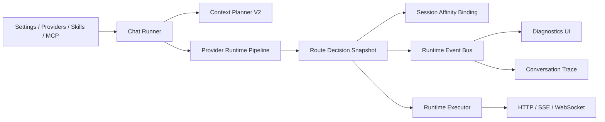

# Provider Runtime And Context Control Plane Plan

## Document Status

- Created: 2026-06-25.
- Purpose: define the follow-up work plan for provider proxy/routing, session affinity, context planning, runtime observability, and plugin/hook extensibility.
- Scope: architecture and execution plan only. This document does not approve broad behavior changes, dependency upgrades, or backend gateway replacement.
- Follow-up rule: future implementation work in this area should cite the phase and acceptance checklist from this document.

## Source Evidence

Local IsleMind source surfaces:

- `src/services/chatRunner.ts`: top-level chat orchestration, retrieval, compact policy, agent entry, provider execution, message persistence.
- `src/services/contextPlanner.ts`: context fragments, remote compact decision, local fallback, context window state.
- `src/services/ai/providerRuntimePipeline.ts`: credential selection, access policy, route assembly, conformance, payload policy, proxy policy, upstream request preparation.
- `src/services/ai/providerRuntimeExecutor.ts`: HTTP/SSE and WebSocket execution, retry, runtime fallback, circuit behavior, session lease.
- `src/services/ai/providerCredentials.ts`: credential groups, model availability merge, credential-group health.
- `src/services/runtimeLog.ts`: JSONL runtime log and current event-name union.
- `src/services/runtimeDiagnostics.ts` and `src/services/ai/providerRuntimeDiagnostics.ts`: runtime summary and provider runtime trace/log data builders.
- `docs/architecture/model-provider-compatibility.md`: provider compatibility contract and diagnostics direction.
- `docs/architecture/long-context-compression-and-provider-compatibility.md`: long-context, Responses, relay, and hosted-provider compatibility state.
- `docs/architecture/modernization-and-ai-enhancement-plan.md`: broader refactor principles and completed modernization slices.

External GitHub sources inspected directly:

- CLIProxyAPI: https://github.com/router-for-me/CLIProxyAPI
- Sub2API: https://github.com/Wei-Shaw/sub2api
- OpenAI Codex: https://github.com/openai/codex
- Claude Code: https://github.com/anthropics/claude-code

Important external ideas:

- CLIProxyAPI: multi-account routing, session affinity, quota-exceeded switching, model aliases, excluded models, management diagnostics, plugin routing.
- Sub2API: account/channel/api-key/quota/concurrency/sticky-session modeling, channel monitoring, and reverse-proxy header compatibility warnings.
- Codex: model-visible context should be incremental, cache-friendly, bounded, and represented as structured fragments.
- Claude Code: plugin, command, agent, skill, hook, MCP, model restriction, background-agent, and streaming coalescing behavior. The current public repo exposes more behavior history than runtime source, so treat it as behavior reference rather than copyable runtime code.

## Current Architecture Reading

IsleMind already has a client-side AI runtime, not just a provider settings screen:

1. UI and settings stores define provider, model, runtime, proxy, compact, skill, MCP, and agent options.
2. `chatRunner.ts` orchestrates user sends, retry/regenerate, retrieval, web/MCP context, context planning, compact usage, agent workflow entry, provider execution, and message finalization.
3. `contextPlanner.ts` turns system prompt, retrieved context, memory, tool output, attachments, recent messages, and remote compact state into fragments and packed request state.
4. `providerRuntimePipeline.ts` prepares a provider request through credential, access, route, conformance, payload, health, and proxy stages.
5. `providerRuntimeExecutor.ts` executes the prepared request over HTTP/SSE or Responses WebSocket, applies retry, fallback, circuit, compact local fallback, and session lease policy.
6. Runtime diagnostics already summarize provider compatibility, route decisions, proxy policy, conformance, compact usage, and recent runtime log tails.

This was a strong base at plan creation. The gap was not lack of features. The gap was that routing/session/context decisions were still spread across logs, traces, request objects, and diagnostics summaries instead of being represented by one first-class runtime control-plane contract.

## Baseline Gaps At Plan Creation

These gaps were captured before the implementation slices below. Use the phase progress entries and current source/tests as the authoritative current state.

1. Runtime events are log-oriented, not protocol-oriented
   - `RuntimeLogEvent` is useful, but it is optional, file-backed, and mostly diagnostic.
   - UI state, trace state, and runtime decisions still need to infer meaning from separate call sites.

2. Route decisions are not a stable snapshot contract
   - `ProviderRouteDecision` exists, and the pipeline returns `ProviderRuntimePipelineReady`.
   - There is no single persisted or inspectable `ProviderRouteDecisionSnapshot` that combines provider, credential group, session, transport, proxy, conformance, fallback, and health.

3. Credential group and channel concepts are close but not fully unified
   - `ProviderCredentialGroup` already behaves like a provider account.
   - CLIProxyAPI/Sub2API style concepts such as account, channel, quota, cooldown, concurrency, alias pool, excluded model, and session affinity are not yet normalized under one local runtime control-plane model.

4. Session affinity is currently a lease, not a routing concept
   - Current session lease limits concurrency for provider/model/conversation/session keys.
   - It does not yet bind a conversation/session to a credential group or channel with TTL and visible failover reasons.

5. Context fragments exist but are not yet a cache-aware protocol
   - `ContextFragment` has id/type/priority/tokenCap/estimatedTokens/trace.
   - It lacks stable source hash, version, hard-cap enforcement metadata, reuse decision, and cache-miss diagnostics.

6. Plugin/hook capability is fragmented
   - Skills, agent workflows, MCP, and settings exist.
   - There is not yet a manifest-driven extension contract with hook points around chat start, context planned, provider request, tool call, compact, completion, and runtime error.

7. Diagnostics are aggregate-first
   - Runtime diagnostics are already valuable.
   - Users still need a provider/session/request-level explanation: which account, which route, why fallback, why unavailable, why compacted, and which capability blocked the path.

## Target Architecture

The target is a mobile-local "AI Runtime Control Plane":

Target properties:

- Decisions are explicit: every request has a route/context/session decision snapshot.
- Events are first-class: logs, traces, and UI diagnostics consume the same event objects.
- Context is bounded: every injected fragment has a stable identity, source, size cap, and reuse/fallback decision.
- Routing is quota-aware: credential groups can cool down, fail over, and bind to a session with visible reasons.
- Extensions are manifest-driven: skills, agents, MCP, commands, and hooks share a validated package boundary.
- Mobile performance is protected: streaming text, traces, runtime events, and diagnostics are coalesced and bounded.

## Non-Goals

- Do not turn IsleMind into a server-side gateway like CLIProxyAPI/Sub2API.
- Do not add Redis, backend billing, subscription management, or remote account resale concepts.
- Do not replace the existing provider compatibility contract.
- Do not infer unsupported relay capabilities from model names alone.
- Do not broaden MCP or agent tool permissions as part of this plan.
- Do not run heavy live provider smoke tests without explicit credentials and a separate gate.

## Phase 0 - Baseline And Plan Acceptance

Goal: establish this plan as the working boundary.

Tasks:

1. Keep this document as the reference for follow-up work.
2. Record current `git status --short` before implementation because the worktree is often dirty.
3. Do not mix plan phases in one implementation pass unless the user explicitly asks.
4. Prefer focused type additions and pure helpers before touching UI.

Acceptance:

- This document exists under `docs/architecture/`.
- Future changes cite a phase from this document in their summary or commit/PR notes.
- No runtime behavior changes are introduced by Phase 0.

Progress:

- 2026-06-26: Phase 0 audit slice completed.
  - Reconfirmed this document is the local working boundary for runtime control-plane follow-up work.
  - Recorded dirty worktree state before implementation in the active Codex turn and preserved unrelated changes.
  - Added a machine-checkable provider-intelligence audit focus for cross-phase plan/source evidence.
- Checks run:
  - `git status --short`
  - `node scripts/provider-intelligence-tests.js --focus=control-plane-plan`
  - `bun run type-check -- --pretty false`
  - `node scripts/provider-intelligence-tests.js`
  - `git diff --check -- docs/architecture/provider-runtime-context-control-plane-plan.md scripts/provider-intelligence-tests.js`
  - `rg -n "[ \t]+$" docs/architecture/provider-runtime-context-control-plane-plan.md scripts/provider-intelligence-tests.js`

## Phase 1 - Runtime Event Protocol MVP

Goal: upgrade runtime log events into typed, reusable runtime events while keeping the existing JSONL log intact.

Tasks:

1. Add `src/services/runtimeEvents.ts`.
2. Define a versioned `RuntimeEventEnvelope` with:
   - `schema`
   - `id`
   - `ts`
   - `conversationId`
   - `turnId` or `messageId` when available
   - `providerId`
   - `credentialGroupId`
   - `model`
   - `event`
   - `data`
   - `redaction`
3. Define initial event names:
   - `provider.access.decided`
   - `provider.route.decided`
   - `provider.conformance.checked`
   - `provider.proxy.decided`
   - `provider.request.started`
   - `provider.response.completed`
   - `provider.error`
   - `provider.retry.scheduled`
   - `provider.fallback.decided`
   - `provider.circuit.changed`
   - `session.lease.acquired`
   - `session.lease.rejected`
   - `context.planned`
   - `context.compact.decided`
   - `context.compact.completed`
   - `token_usage.updated`
4. Implement `emitRuntimeEvent()` as a thin wrapper that can:
   - append to existing runtime log when enabled,
   - optionally notify an in-memory subscriber later,
   - reuse existing redaction behavior.
5. Migrate only a small set of existing call sites first:
   - route decision
   - proxy policy
   - fallback decision
   - compact request/usage
   - session lease

Acceptance:

- Existing `appendRuntimeLog()` behavior remains compatible.
- Provider-intelligence tests cover event envelope redaction and stable event names.
- No UI changes are required in this phase.
- Runtime logs still stay quiet when `runtimeLogEnabled` is false.

Suggested checks:

- `bun run test:provider-intelligence`
- `bun run test:architecture-boundary`
- `bun run type-check -- --pretty false`
- `git diff --check`

Progress:

- 2026-06-26: Phase 1 audit slice completed.
  - Confirmed `runtimeEventContract.ts` provides the versioned `islemind.runtime-event.v1` contract, event names, legacy runtime log mapping, and high-frequency policy, while `runtimeEvents.ts` provides envelope building, redaction reuse, runtime log compatibility, and disabled-log quiet behavior.
  - Migrated first-pass control-plane log sites for access decisions, proxy decisions, fallback decisions, session lease acquisition/rejection, and compact request/usage through `emitRuntimeEvent()` while preserving their legacy JSONL event families.
  - Added provider-intelligence assertions for runtime event to legacy log mappings and static source checks that the migrated call sites no longer bypass runtime events.
- 2026-06-26: Phase 1 event-bus slice completed.
  - Added a local runtime event subscriber boundary plus bounded in-memory event history.
  - Kept subscriber failures isolated from request execution and kept skipped-log high-frequency events visible to in-memory diagnostics.
  - Added provider-intelligence assertions for subscribe/unsubscribe behavior, subscriber failure isolation, skipped-log event delivery, and history eviction.
- Checks run:
  - `node scripts/provider-intelligence-tests.js --focus=runtime-log`
  - `node scripts/provider-intelligence-tests.js --focus=control-plane-plan`
  - `bun run type-check -- --pretty false`
  - `node scripts/provider-intelligence-tests.js`
  - `bun run test:architecture-boundary`
  - `git diff --check -- docs/architecture/provider-runtime-context-control-plane-plan.md src/services/runtimeEvents.ts src/services/ai/providerRuntimeDiagnostics.ts src/services/ai/providerRuntimeFallbackLogging.ts src/services/ai/providerRuntimeExecutor.ts src/services/ai/providerRuntimePipeline.ts src/services/chatRunner.ts scripts/provider-intelligence-tests.js`
  - `rg -n "[ \t]+$" docs/architecture/provider-runtime-context-control-plane-plan.md src/services/runtimeEvents.ts src/services/ai/providerRuntimeDiagnostics.ts src/services/ai/providerRuntimeFallbackLogging.ts src/services/ai/providerRuntimeExecutor.ts src/services/ai/providerRuntimePipeline.ts src/services/chatRunner.ts scripts/provider-intelligence-tests.js`

## Phase 2 - Provider Route Decision Snapshot

Goal: introduce one inspectable decision object for provider route behavior.

Tasks:

1. Add `ProviderRouteDecisionSnapshot`.
2. Build it in `providerRuntimePipeline.ts` after access, credential, route, conformance, transport, health, and proxy are known.
3. Include:
   - requested model and upstream model
   - provider id/type
   - credential group id
   - endpoint family
   - protocol and transport
   - proxy mode and effective host
   - conformance blockers and warnings
   - payload policy result summary
   - fallback plan summary
   - health/cooldown state
   - capability evidence id and audit state
4. Attach the snapshot to the pipeline ready result.
5. Emit `provider.route.snapshot.created`.
6. Keep raw body, headers, API keys, message text, and payload content out of the snapshot.

Acceptance:

- A failing provider path can be explained from the snapshot without reading raw request payloads.
- Existing route/conformance/proxy tests still pass.
- Snapshot tests prove secrets and prompt content are not serialized.

Suggested checks:

- `node scripts/provider-intelligence-tests.js --focus=runtime-log`
- `node scripts/provider-intelligence-tests.js --focus=provider-compatibility-contract`
- `bun run test:provider-intelligence`
- `bun run type-check -- --pretty false`

Progress:

- 2026-06-26: Phase 2 audit slice completed.
  - Confirmed `ProviderRouteDecisionSnapshot` is built in `providerRuntimePipeline.ts`, attached to the ready pipeline result, and emitted as `provider.route.snapshot.created`.
  - Confirmed provider-intelligence coverage proves schema, provider/model/credential, endpoint family, protocol/transport, proxy host, conformance, payload policy, fallback, health, session affinity, and runtime stream summaries.
  - Confirmed snapshot tests reject raw prompt text, provider API keys, body credentials, and raw endpoint query strings.
- Checks run:
  - `node scripts/provider-intelligence-tests.js --focus=runtime-log`
  - `node scripts/provider-intelligence-tests.js --focus=upstream-governance`
  - `bun run type-check -- --pretty false`
  - `node scripts/provider-intelligence-tests.js`
  - `bun run test:architecture-boundary`
  - `git diff --check -- docs/architecture/provider-runtime-context-control-plane-plan.md src/services/ai/providerRuntimeDiagnostics.ts src/services/ai/providerRuntimeFallbackLogging.ts src/services/ai/providerRuntimeExecutor.ts src/services/ai/providerRuntimePipeline.ts src/services/chatRunner.ts scripts/provider-intelligence-tests.js`
  - `rg -n "[ \t]+$" docs/architecture/provider-runtime-context-control-plane-plan.md src/services/ai/providerRuntimeDiagnostics.ts src/services/ai/providerRuntimeFallbackLogging.ts src/services/ai/providerRuntimeExecutor.ts src/services/ai/providerRuntimePipeline.ts src/services/chatRunner.ts scripts/provider-intelligence-tests.js`

- 2026-06-28: Phase 2 slice 2 completed.
  - Added a first-class `islemind.provider-reasoning-resolution.v1` artifact to provider conformance results.
  - The artifact records requested/effective reasoning effort, provider request shape/value, capability-source confidence, removed reasoning-conflict parameters, and bounded failure codes.
  - Route decisions, route decision snapshots, and provider conformance logs now carry the same bounded reasoning-resolution evidence without raw prompt or request body content.
- Checks run:
  - `node --check scripts/provider-intelligence-tests.js`
  - `bun run type-check -- --pretty false`
  - `bun run test:provider-intelligence`

## Phase 3 - Session Affinity And Quota-Aware Routing

Goal: learn the useful CLIProxyAPI/Sub2API routing ideas without building a backend gateway.

Tasks:

1. Add `SessionAffinityBinding`:
   - `sessionKey`
   - `providerId`
   - `model`
   - `credentialGroupId`
   - `boundAt`
   - `expiresAt`
   - `reason`
   - `failoverCount`
2. Derive a stable session key from:
   - conversation id
   - explicit request/session id
   - provider/model
3. Add settings defaults:
   - affinity disabled by default
   - TTL configurable later
   - fail-open to current credential selection when no binding exists
4. Bind selected credential group after successful route preparation.
5. Reuse binding on later turns when:
   - group is enabled,
   - model is available for that group,
   - group is not cooling down,
   - binding is not expired.
6. On 401/403/429/5xx or quota-like classification:
   - record cooldown/failure,
   - emit failover event,
   - optionally clear or rotate binding.
7. Add a diagnostic warning for underscore session headers when user enters a custom proxy URL and sticky routing depends on `session_id`.

Acceptance:

- Default behavior is unchanged when affinity is off.
- Affinity on: same conversation can reuse the same credential group.
- Failover path records old group, new group, reason, and TTL state.
- No API keys are serialized.
- Tests cover disabled, initial bind, reuse, expired, disabled group, unavailable model, cooldown, and failover cases.

Suggested checks:

- `bun run test:provider-intelligence`
- `bun run test:architecture-boundary`
- focused new session-affinity tests in `scripts/provider-intelligence-tests.js`

Progress:

- 2026-06-26: Phase 3 slice 1 completed.
  - Added the pure `providerSessionAffinity` helper module.
  - Added `SessionAffinityBinding`, session-key derivation, binding construction, reuse validation, TTL expiry, disabled group, unavailable model, cooldown, and failover-count handling.
  - Added default-off settings fields: `sessionAffinityEnabled` and `sessionAffinityTtlMs`.
  - Added focused provider-intelligence coverage with `--focus=session-affinity`.
  - Verified default behavior remains unchanged because no runtime credential selection call site consumes the binding yet.
- Checks run:
  - `node scripts/provider-intelligence-tests.js --focus=session-affinity`
  - `bun run type-check -- --pretty false`
  - `git diff --check -- src/services/ai/providerSessionAffinity.ts src/types/index.ts src/store/settingsStore.ts src/services/ai/base.ts scripts/provider-intelligence-tests.js`
- 2026-06-26: Phase 3 slice 2 completed.
  - Added a bounded in-memory session-affinity binding store with expiry pruning and oldest-binding eviction.
  - Threaded affinity resolution into `prepareProviderRuntimePipeline()` behind `sessionAffinityEnabled === true`.
  - Kept default behavior unchanged when affinity is disabled; disabled requests do not read or mutate the binding store.
  - Preferred reusable credential groups during credential selection and excluded bound groups that are in runtime cooldown or circuit-open state.
  - Bound the selected credential group after route preparation and emitted typed `session.affinity.resolved` / `session.affinity.bound` runtime events.
  - Added non-secret route decision snapshot affinity summary fields: enabled, reusable, reason, key availability, credential group id, expiry, failover count, and binding state.
  - Extended focused tests for disabled defaults, store expiry/capacity pruning, first bind, reuse against normal selection pressure, runtime event mapping, and no token/session-key serialization.
- Checks run:
  - `node scripts/provider-intelligence-tests.js --focus=session-affinity`
  - `node scripts/provider-intelligence-tests.js --focus=runtime-log`
  - `bun run type-check -- --pretty false`
  - `git diff --check -- docs/architecture/provider-runtime-context-control-plane-plan.md src/services/ai/providerSessionAffinity.ts src/services/ai/providerCredentials.ts src/services/ai/providerRuntimePipeline.ts src/services/runtimeEvents.ts src/services/runtimeLog.ts src/types/index.ts src/store/settingsStore.ts src/services/ai/base.ts scripts/provider-intelligence-tests.js`
  - `rg -n "[ \t]+$" docs/architecture/provider-runtime-context-control-plane-plan.md src/services/ai/providerSessionAffinity.ts src/services/ai/providerCredentials.ts src/services/ai/providerRuntimePipeline.ts src/services/runtimeEvents.ts src/services/runtimeLog.ts src/types/index.ts src/store/settingsStore.ts src/services/ai/base.ts scripts/provider-intelligence-tests.js`
- 2026-06-26: Phase 3 slice 3 completed.
  - Added session-affinity failure classification for 401, 403, 429, 5xx, and quota-like upstream text.
  - Added explicit binding invalidation and failover rotation helpers that keep raw session keys and tokens out of serialized output.
  - Wired runtime fallback outcomes into affinity state:
    - remote compact local fallback invalidates the failed binding,
    - skipped or failed runtime fallback invalidates the failed binding,
    - successful runtime fallback to another group writes a failover binding.
  - Added typed `session.affinity.invalidated` and `session.affinity.rotated` events mapped to the legacy `session.affinity` log family.
  - Extended focused tests for invalidation decisions, mismatched-group preservation, binding clear, failover rotation, and runtime event mapping.
- Checks run:
  - `node scripts/provider-intelligence-tests.js --focus=session-affinity`
  - `node scripts/provider-intelligence-tests.js --focus=runtime-log`
  - `bun run type-check -- --pretty false`
  - `git diff --check -- docs/architecture/provider-runtime-context-control-plane-plan.md src/services/ai/providerSessionAffinity.ts src/services/ai/providerCredentials.ts src/services/ai/providerRuntimePipeline.ts src/services/ai/providerRuntimeExecutor.ts src/services/runtimeEvents.ts src/services/runtimeLog.ts src/types/index.ts src/store/settingsStore.ts src/services/ai/base.ts scripts/provider-intelligence-tests.js`
  - `rg -n "[ \t]+$" docs/architecture/provider-runtime-context-control-plane-plan.md src/services/ai/providerSessionAffinity.ts src/services/ai/providerCredentials.ts src/services/ai/providerRuntimePipeline.ts src/services/ai/providerRuntimeExecutor.ts src/services/runtimeEvents.ts src/services/runtimeLog.ts src/types/index.ts src/store/settingsStore.ts src/services/ai/base.ts scripts/provider-intelligence-tests.js`
- 2026-06-26: Phase 3 slice 4 completed.
  - Added runtime diagnostics buckets that separate cooldown, circuit-open, quota/rate-limit exhaustion, and credential-unhealthy states.
  - Added bounded provider health examples sourced from `route.snapshot` and `session.affinity` runtime log entries.
  - Surfaced session-affinity resolved/bound/invalidated/rotated counts and recent summaries in runtime diagnostics without exposing derived session keys.
  - Added a custom-proxy warning for sticky routing when a custom proxy URL is configured while session affinity is enabled; the warning calls out proxies that may drop underscore `session_id` headers.
  - Updated settings diagnostics UI and `en` / `zh-CN` / `ja` locale strings for the new health, affinity, and proxy-warning summaries.
- Checks run:
  - `node scripts/provider-intelligence-tests.js --focus=runtime-health-log`
  - `node scripts/provider-intelligence-tests.js --focus=session-affinity`
  - `node scripts/provider-intelligence-tests.js --focus=runtime-log`
  - `bun run type-check -- --pretty false`
  - `git diff --check -- docs/architecture/provider-runtime-context-control-plane-plan.md src/services/runtimeDiagnostics.ts src/components/main/SettingsScreenContent.tsx src/i18n/resources/en.json src/i18n/resources/zh-CN.json src/i18n/resources/ja.json scripts/provider-intelligence-tests.js`
  - `rg -n "[ \t]+$" docs/architecture/provider-runtime-context-control-plane-plan.md src/services/runtimeDiagnostics.ts src/components/main/SettingsScreenContent.tsx src/i18n/resources/en.json src/i18n/resources/zh-CN.json src/i18n/resources/ja.json scripts/provider-intelligence-tests.js`
  - JSON parse check for `en`, `zh-CN`, and `ja` locale files.

## Phase 4 - Context Planner V2

Goal: make context planning cache-aware, bounded, and explainable.

Tasks:

1. Extend `ContextFragment` or add `ContextFragmentV2` with:
   - stable id
   - type
   - priority
   - source id
   - source hash
   - schema/version
   - token cap
   - estimated tokens
   - included/excluded state
   - exclusion reason
   - reuse/cache hint
2. Add hard caps for:
   - retrieved context
   - memory
   - tool outputs
   - attachment summaries
   - remote compact state
3. Emit:
   - `context.planned`
   - `context.fragment.included`
   - `context.fragment.excluded`
   - `context.compact.decided`
4. Keep existing `packChatMessages()` behavior stable for the first pass.
5. Add cache-miss diagnostics inspired by Codex:
   - frequent full-context rewrite detected
   - fragment id changed with same source hash
   - unbounded fragment blocked
6. Record previous response id and compact state as bounded fragments.

Acceptance:

- Every model-visible non-message injection has a cap and source identity.
- Context trace can explain why each source was included, compressed, or excluded.
- Existing compression UX and compact fallback still work.
- Tests prove oversized tool output and retrieved context are capped before request assembly.

Suggested checks:

- `node scripts/provider-intelligence-tests.js context-compression-v2`
- `bun run test:provider-intelligence`
- `bun run type-check -- --pretty false`

Progress:

- 2026-06-26: Phase 4 slice 1 completed.
  - Extended `ContextFragment` to the `islemind.context-fragment.v2` contract with source id, stable source hash, source version, original/capped token estimates, included/capped state, exclusion reason, and cache metadata.
  - Added per-source planning before request assembly so structured `contextSources` are capped before they become `contextPrompt`.
  - Preserved existing `buildContextPlannerPrompt()` behavior and small-source prompt equivalence; only oversized non-message context is clamped.
  - Added excluded fragment records for empty context sources and trace counters for included, capped, and excluded context source counts.
  - Forwarded the new fragment metadata into chat runtime trace metadata.
  - Added a focused provider-intelligence entry: `--focus=context-planner`.
  - Adjusted runtime fallback evidence assertions to read a wider test log window because route snapshots and runtime-event envelopes can push earlier fallback decisions outside the default tail.
- Checks run:
  - `node scripts/provider-intelligence-tests.js --focus=context-planner`
  - `node scripts/provider-intelligence-tests.js --focus=upstream-governance`
  - `node scripts/provider-intelligence-tests.js`
  - `bun run test:context-compression-v2`
  - `bun run type-check -- --pretty false`
  - Direct `bun -e` planner cap smoke for oversized tool context and empty retrieved context.
- 2026-06-26: Phase 4 slice 2 completed.
  - Added runtime event names for `context.fragment.included` and `context.fragment.excluded`, mapped to the existing `context.operation` log family.
  - Emitted bounded aggregate `context.planned`, included-fragment, and excluded-fragment runtime events from `planChatContext()` when runtime logging is enabled.
  - Kept context planner logging quiet when runtime logging is disabled.
  - Runtime event payloads include schema, counts, token/cap summaries, source ids, source hashes, and cap/exclusion reasons, but not raw context bodies.
  - Extended `--focus=context-planner` to verify runtime events, quiet logging, bounded cap behavior, stable source hashes, and excluded empty sources.
- Checks run:
  - `node scripts/provider-intelligence-tests.js --focus=context-planner`
  - `node scripts/provider-intelligence-tests.js --focus=runtime-log`
  - `node scripts/provider-intelligence-tests.js`
  - `bun run type-check -- --pretty false`
- 2026-06-26: Phase 4 slice 3 completed.
  - Added previous-fragment identities to `ContextPlannerInput` so the planner can compare stable source hashes across turns.
  - Added cache diagnostics for `source_hash_changed`, `fragment_id_changed_same_source_hash`, `full_context_rewrite_detected`, and `unbounded_fragment_blocked`.
  - Made structured context source hashes independent of fragment ids so id churn with unchanged source content is detectable.
  - Annotated fragment cache metadata with bounded reuse hints: stable source hash, reused source hash, changed source hash, fragment id changed, empty source, and unbounded source blocked.
  - Blocked model-visible source injection when no finite per-source cap can be computed and recorded the blocked source as an excluded fragment.
  - Included bounded cache diagnostic summaries and reuse hints in context runtime events without raw current or previous context bodies.
- Checks run:
  - `node scripts/provider-intelligence-tests.js --focus=context-planner`
  - `node scripts/provider-intelligence-tests.js --focus=runtime-log`
  - `bun run type-check -- --pretty false`
  - `node scripts/provider-intelligence-tests.js`
  - `bun run test:context-compression-v2`
- 2026-06-26: Phase 4 slice 4 completed.
  - Emitted `context.compact.decided` from the context planner when runtime logging is enabled.
  - Mapped `context.compact.decided` runtime events to the existing `compact.request` log family.
  - Kept the compact decision event bounded to mode, support/required/enabled flags, reason, pressure ratio, token window summaries, and compact failure state.
  - Extended focused tests to verify compact decision event emission and runtime-event mapping.
- Checks run:
  - `node scripts/provider-intelligence-tests.js --focus=context-planner`
  - `node scripts/provider-intelligence-tests.js --focus=runtime-log`
  - `bun run type-check -- --pretty false`
  - `node scripts/provider-intelligence-tests.js`
- 2026-06-26: Phase 4 slice 5 completed.
  - Added bounded `contextFragmentIdentitiesJson` persistence to compact state records and migrations.
  - Stored only fragment id, source id, source hash, and included state for remote compact completed/failed records; raw context bodies remain out of compact state.
  - Loaded active compact state before planning when remote compact mode is enabled and passed previous response id plus previous fragment identities into `planChatContext()`.
  - Added compact state reuse log evidence with previous fragment counts.
  - Extended tests for completed/failed compact state identity persistence and chat runner planner/state wiring.
- Checks run:
  - `node scripts/provider-intelligence-tests.js --focus=context-planner`
  - `bun run type-check -- --pretty false`
  - `node scripts/provider-intelligence-tests.js`
  - `bun run test:context-compression-v2`
- 2026-06-28: Phase 4 slice 6 completed.
  - Added a first-class `islemind.context-assembly-manifest.v1` artifact to `ContextPlan`.
  - The manifest accounts for every planned fragment with source id/hash, authority, decision, reliability, token cap, token estimate, budget share, cache reuse hint, and failure codes.
  - The manifest is explicitly non-networked and non-content-bearing: it serializes no raw context text and only emits bounded summaries through runtime events.
  - Runtime diagnostics now count context manifests, manifest issues, and manifest failure codes from `context.planned` events.
  - Settings diagnostics surface manifest and manifest-issue counts alongside fragment/cache/unbounded context counters.
- Checks run:
  - `node scripts/provider-intelligence-tests.js --focus=context-planner`
  - `bun run test:provider-intelligence`
  - `bun run type-check -- --pretty false`

## Phase 5 - Runtime Diagnostics UI

Goal: expose the new control-plane objects to users without making settings screens heavy.

Tasks:

1. Extend diagnostics summary to consume runtime event envelopes.
2. Add request-level examples:
   - last route snapshot
   - last fallback
   - last session binding
   - last compact decision
   - last conformance block
3. In provider settings, show:
   - declared vs ready vs observed protocol
   - credential group health
   - session affinity state when enabled
   - last unavailable reason
4. Keep diagnostics lazy and bounded.
5. Do not subscribe the whole app to high-frequency runtime events.

Acceptance:

- Diagnostics can answer "why is this provider unavailable?" from events/snapshots.
- Opening diagnostics does not cause streaming chat re-renders.
- Event tail parsing is bounded.
- UI copy is localized if visible to users.

Suggested checks:

- `node scripts/provider-intelligence-tests.js --focus=runtime-health-log`
- `bun run test:provider-intelligence`
- `bun run type-check -- --pretty false`

Progress:

- 2026-06-26: Phase 5 slice 1 completed.
  - Added `contextControlPlane` to runtime diagnostics summary, consuming bounded runtime event envelopes from the runtime log tail.
  - Counted context planning, fragment included/excluded, compact decision, capped fragment, cache diagnostic, full rewrite, and unbounded fragment signals.
  - Added bounded recent examples for context planning and compact decisions without raw context bodies.
  - Surfaced the context control-plane summary in settings diagnostics with `en`, `zh-CN`, and `ja` locale strings.
  - Extended provider-intelligence tests for runtime event envelope consumption, settings row wiring, and locale coverage.
- 2026-06-26: Phase 5 slice 2 completed.
  - Added bounded request-level examples to runtime diagnostics for the latest route snapshot, fallback, session binding, compact decision, and conformance block.
  - Read runtime event envelope data first, with legacy log fields as fallback, and kept examples limited to non-sensitive routing, provider, model, credential-group, protocol, status, reason, trigger, and selected-candidate fields.
  - Surfaced request examples in settings diagnostics with `en`, `zh-CN`, and `ja` locale strings.
  - Extended provider-intelligence tests for request example coverage, fallback candidate capture, conformance block reason capture, and raw prompt/context omission.
- 2026-06-26: Phase 5 slice 3 completed.
  - Added provider-level runtime details to diagnostics summary, including declared, ready, and observed protocol evidence, credential group health buckets, session affinity state, and last unavailable reason.
  - Loaded the bounded diagnostics summary lazily in provider settings and mapped details by provider id without subscribing to high-frequency runtime events.
  - Surfaced a compact runtime status on provider rows and a provider runtime diagnostics panel in the expanded API key panel.
  - Added `en`, `zh-CN`, and `ja` locale strings for provider runtime diagnostics, unavailable reasons, and session affinity states.
  - Extended provider-intelligence tests for provider details, provider settings wiring, API key panel rendering, locale coverage, and raw prompt omission.
- 2026-06-26: Phase 5 slice 4 completed.
  - Merged bounded in-memory runtime event history into runtime diagnostics after reading the bounded JSONL tail.
  - Deduped runtime events that appear in both memory history and log tail by runtime event id.
  - Added provider-intelligence coverage proving diagnostics can summarize memory-only runtime events when logs are disabled without double-counting logged events.
- 2026-06-28: Phase 5 slice 5 completed.
  - Added a unified runtime timeline and repair-plan summary over typed runtime events, with machine-readable issue codes, next actions, action targets, and repair tasks.
  - Preserved source runtime event ids and latest event ids through timeline issues, repair tasks, retry-chat deep links, chat prompts, and visible repair replay cards.
  - Added a bounded machine-readable `islemind.runtime-repair.replay.v1` payload to repair replay prompts so agents can consume stable fields instead of parsing localized prose.
  - Added bounded `repairSteps` playbooks to the structured replay payload, including preserving the user intent, inspecting runtime event provenance, applying the action-specific adjustment, and retrying with blocker reporting.
  - Surfaced runtime repair task actions in settings diagnostics, routing provider/tool/context fixes to the right settings surface and retry-chat tasks back to the originating conversation.
  - Added chat repair replay intents that preserve the previous user request, failure summary, severity, issue codes, event count, action, target, scope, and summary.
  - Added a visible repair replay card in chat with one-click send, draft restoration, structured metadata, and duplicate-submit dismissal.
  - Added typed runtime events for repair replay submit, draft-restore, and dismiss actions while keeping telemetry to bounded metadata instead of full `payloadJson` or prompt text.
  - Extended `en`, `zh-CN`, and `ja` locale coverage plus provider-intelligence and architecture-boundary assertions for the repair replay loop.
- Checks run:
  - `node scripts/provider-intelligence-tests.js --focus=runtime-log`
  - `node scripts/provider-intelligence-tests.js --focus=control-plane-plan`
  - `bun run type-check -- --pretty false`
  - `node scripts/provider-intelligence-tests.js`

- 2026-06-28: Phase 5 slice 6 completed.
  - Feeding context assembly manifest failure codes into the runtime timeline issue mapper and repair plan.
  - Manifest budget overruns and unbounded-source blockers route to context source caps, while source hash/id churn routes to context source stabilization.
  - The timeline keeps the manifest schema/id and issue counts bounded, without serializing raw context text.
- Checks run:
  - `node --check scripts/provider-intelligence-tests.js`
  - `node scripts/provider-intelligence-tests.js --focus=runtime-log`
  - `node scripts/provider-intelligence-tests.js --focus=control-plane-plan`
  - `bun run type-check -- --pretty false`
  - `bun run test:provider-intelligence`
  - `bun run test:architecture-boundary`

- 2026-06-28: Phase 5 slice 7 completed.
  - Added a bounded `islemind.mcp-compatibility-runtime-summary.v1` summary over MCP compatibility evaluations.
  - Added typed `tool.mcp.compatibility.checked` runtime telemetry so MCP protocol diagnostics can enter the same runtime timeline as provider, context, tool, plugin, and repair events.
  - Runtime timeline now maps unsupported MCP transport, malformed MCP manifests, and permission-required tool calls to machine-readable issue codes and repair actions routed to MCP/tool settings.
  - The summary keeps server ids, source evidence, counts, permissions, failure codes, and method coverage bounded while omitting server URLs, raw tool schemas, tool arguments, and tool responses.
- 2026-06-28: Phase 5 slice 8 completed.
  - Added a bounded `islemind.agent-security-runtime-summary.v1` summary over the local agent security eval gate.
  - Added typed `agent.security.evaluation.checked` runtime telemetry so prompt-injection, provider-native replay, and saved-workflow tampering blocks can enter the same runtime timeline as provider, context, MCP, plugin, and repair events.
  - Runtime timeline now maps blocked prompt injection, provider-native tool replay mismatch, saved-workflow tampering, and security-gate failures to machine-readable issue codes and repair actions routed to agent settings.
  - The summary keeps case counts, category names, blocking conditions, behavior classes, and quality-gate state bounded while omitting raw prompts, tool arguments, provider responses, and workflow payloads.
- Checks run:
  - `node --check scripts/mcp-compatibility-tests.js`
  - `node scripts/mcp-compatibility-tests.js`
  - `node --check scripts/provider-intelligence-tests.js`
  - `node scripts/provider-intelligence-tests.js --focus=runtime-log`
  - `node scripts/provider-intelligence-tests.js --focus=control-plane-plan`
  - `bun run test:architecture-boundary`
  - `bun run type-check -- --pretty false`
  - `bun run test:provider-intelligence`

## Phase 6 - Plugin And Hook Manifest

Goal: turn skills, agent workflows, MCP, and future hooks into a validated manifest model.

Tasks:

1. Define `islemind.plugin.v1`.
2. Manifest sections:
   - `commands`
   - `agents`
   - `skills`
   - `hooks`
   - `mcp`
   - `settings`
3. Initial hook points:
   - `chat.beforeSend`
   - `context.afterPlan`
   - `provider.beforeRequest`
   - `provider.afterResponse`
   - `tool.beforeCall`
   - `tool.afterResult`
   - `context.afterCompact`
   - `chat.afterComplete`
4. Add validation:
   - stable id
   - version
   - permissions
   - disabled reason
   - required capabilities
   - visible review state for imported workflows
5. Keep hooks no-op until a separate permission and performance review is complete.

Acceptance:

- Existing skills import/export remains compatible.
- Imported workflow skills can be represented as plugin manifest entries.
- Hooks are validated but not executed by default.
- MCP server references remain permission-bound.

Suggested checks:

- `bun run test:agent-workflow`
- `bun run test:provider-intelligence`
- `bun run test:architecture-boundary`
- `bun run type-check -- --pretty false`

Progress:

- 2026-06-26: Phase 6 slice 1 completed.
  - Added `islemind.plugin.v1` manifest schema and pure validator in `src/services/pluginManifest.ts`.
  - Covered commands, agents, skills, hooks, MCP, and settings manifest sections with stable ids, semver version, permissions, disabled reason, required capabilities, and review state validation.
  - Kept hooks validated but forced to `execution: "noop"` and disabled with a review reason until separate permission and performance review exists.
  - Added workflow-skill conversion so imported agent workflow skills can be represented as plugin skill entries without mutating existing skill definitions or import/export paths.
  - Required permission declarations on MCP manifest references.
- 2026-06-26: Phase 6 slice 2 completed.
  - Integrated plugin manifest review previews into the existing workflow-skill import UI without changing `importSkill()` payload compatibility or the skill save path.
  - Imported agent workflow skills now show plugin manifest review state, permission, required capabilities, validation error count, and warning count in the visible import feedback.
  - Kept workflow skills disabled until the existing local workflow review path approves them; hooks remain no-op and are not executed by import.
  - Added `en`, `zh-CN`, and `ja` locale strings for plugin manifest import review state.
  - Extended provider-intelligence tests for skill import compatibility, Skill Settings source wiring, and locale coverage.
- 2026-06-26: Phase 6 slice 3 completed.
  - Added MCP server to plugin manifest conversion so configured server references are represented as permission-bound `mcp` entries with highest requested permission, required capabilities, and review summary counts.
  - Surfaced a compact plugin manifest preview in MCP settings for each server, including review state, permission, capabilities, validation error count, and warning count.
  - Kept MCP manifest previews read-only and did not add hook execution or MCP execution behavior changes.
  - Added `en`, `zh-CN`, and `ja` locale coverage plus provider-intelligence tests for MCP manifest conversion and settings source wiring.
- 2026-06-28: Phase 6 slice 4 completed.
  - Added `islemind.plugin-catalog.v1` snapshots that aggregate skill, workflow-skill, MCP server, and manual plugin manifests into bounded control-plane entries.
  - Catalog snapshots count valid/invalid manifests, review states, permissions, required capabilities, and hook/no-op hook totals without serializing workflow prompts, MCP tool schemas, or executable hook payloads.
  - Runtime diagnostics now load the plugin catalog alongside runtime summaries and surface manifest validity, Hook no-op, review, and capability counts in the settings diagnostics foldout.
  - Extended provider-intelligence and architecture-boundary checks for plugin catalog schema, builder, loader, settings diagnostics wiring, and localized runtime diagnostic copy.
- 2026-06-28: Phase 6 slice 5 completed.
  - Added `plugin.catalog.snapshot.created` typed runtime events so plugin catalog refreshes enter the same runtime/control-plane observability stream as provider, context, tool, and repair events.
  - Kept plugin catalog event payloads bounded to schema, trigger, counts, review states, permissions, source-kind counts, and capability keys, with catalog entries and raw manifest contents omitted.
  - Settings diagnostics emits the catalog event after a successful plugin catalog refresh without enabling Hook execution.
  - Extended provider-intelligence and architecture-boundary checks for the event mapping, bounded event payload builder, settings emission point, and protocol exposure.
- 2026-06-28: Phase 6 slice 6 completed.
  - Promoted plugin catalog events to a first-class `plugin` runtime timeline stage instead of leaving them under `other`.
  - Runtime timeline summaries now extract bounded plugin catalog counts and produce `plugin_manifest_invalid` / `plugin_hook_executable` issues when catalog health requires review.
  - Runtime repair tasks route plugin catalog issues to plugin settings, with localized stage, issue, action, and target labels in settings diagnostics.
  - Extended provider-intelligence and architecture-boundary checks for plugin timeline classification, plugin repair targets, settings routing, and locale coverage.
- 2026-06-28: Phase 6 slice 7 completed.
  - Reordered settings diagnostics refresh so plugin catalog snapshots emit their typed runtime event before runtime diagnostics builds the timeline summary.
  - This keeps the same refresh cycle self-consistent: the plugin catalog card and runtime timeline can both reflect the catalog snapshot without requiring a second refresh.
  - Added provider-intelligence source assertions to keep plugin catalog event emission ahead of runtime summary construction.
- 2026-06-28: Phase 6 slice 8 completed.
  - Added a typed `plugin-manifest` focus for Skills settings so runtime repair links targeting `plugin-settings` land on a visible plugin manifest review panel.
  - Parsed bounded runtime repair route fields for action, target, issue codes, latest event id, source event ids, event count, and summary without exposing raw plugin manifest entries or workflow prompt text.
  - Rendered a concise repair focus panel in Agent workflows with localized source, issue-code, summary, and event-provenance copy.
  - Extended provider-intelligence and architecture-boundary checks for Skills route parsing, plugin focus sanitization, visible repair panel wiring, and locale coverage.
- Checks run:
  - `node scripts/provider-intelligence-tests.js --focus=plugin-manifest`
  - `bun run type-check -- --pretty false`
  - `node scripts/provider-intelligence-tests.js`
  - `bun run test:agent-workflow`
  - `bun run test:architecture-boundary`
  - `git diff --check -- docs/architecture/provider-runtime-context-control-plane-plan.md src/services/pluginManifest.ts src/components/settings/McpSettingsContent.tsx src/i18n/resources/en.json src/i18n/resources/zh-CN.json src/i18n/resources/ja.json scripts/provider-intelligence-tests.js`
  - `rg -n "[ \t]+$" docs/architecture/provider-runtime-context-control-plane-plan.md src/services/pluginManifest.ts src/components/settings/McpSettingsContent.tsx src/i18n/resources/en.json src/i18n/resources/zh-CN.json src/i18n/resources/ja.json scripts/provider-intelligence-tests.js`

## Phase 7 - Performance Guardrails

Goal: keep runtime/control-plane visibility from reintroducing mobile jank.

Tasks:

1. Coalesce streaming/runtime UI updates to a bounded cadence.
2. Keep runtime event history size-limited.
3. Avoid writing per-token events.
4. Keep diagnostics parsing lazy and tail-based.
5. Ensure event stores use selector-friendly state and do not mutate conversation arrays on every chunk.

Acceptance:

- No high-frequency provider event writes during normal token streaming.
- No new conversation-store writes per token.
- Diagnostics still works from a bounded log tail.
- Performance tests or static assertions cover event coalescing and size limits.

Suggested checks:

- `bun run test:provider-intelligence`
- relevant performance-focused assertions added to the provider-intelligence script
- manual device smoke after UI changes

Progress:

- 2026-06-26: Phase 7 slice 1 completed.
  - Added runtime event persistence guardrails so high-frequency `token_usage.updated` events still build typed envelopes but do not append runtime log lines by default.
  - Capped runtime event data arrays and object fields before embedding envelopes into logs, keeping event payloads bounded.
  - Made runtime diagnostics explicitly parse `RUNTIME_DIAGNOSTICS_LOG_TAIL_BYTES` instead of relying on an implicit full-log read.
  - Added provider-intelligence assertions for high-frequency event skipping, bounded event data, bounded diagnostics tail parsing, and existing streaming-store coalescing.
- 2026-06-26: Phase 7 slice 2 completed.
  - Added `RUNTIME_EVENT_HISTORY_LIMIT` and bounded reads for the in-memory runtime event history.
  - Ensured high-frequency events skipped from JSONL still have a bounded in-memory path for diagnostics without writing per-token logs or notifying subscribers per token by default.
  - Extended provider-intelligence coverage for runtime event history size limits, high-frequency subscriber suppression, low-frequency subscriber delivery, and subscriber isolation.
- 2026-06-26: Phase 7 slice 3 completed.
  - Kept diagnostics read-side bounded by merging only the capped runtime event history with the capped JSONL tail.
  - Added dedupe by runtime event id so logged events are not counted twice when they also remain in memory.
- 2026-06-26: Phase 7 slice 4 completed.
  - Added an explanatory-event reserve to runtime event history pruning so high-frequency token usage events do not immediately evict route/context/session events.
  - Kept the total in-memory runtime event history capped while preserving higher-value diagnostic events during token flooding.
- 2026-06-28: Phase 7 slice 5 completed.
  - Added explicit parsed-log-entry, memory-event-read, and timeline-input budgets to runtime diagnostics so the settings diagnostics refresh stays bounded even as plugin catalog and repair telemetry expand.
  - Added a `performance` diagnostics summary with tail bytes, parsed/raw log counts, limit application, merged entry count, memory event count, timeline input/output counts, and build duration.
  - Surfaced the diagnostics budget as a visible settings pill with localized `en`, `zh-CN`, and `ja` copy.
  - Extended provider-intelligence and architecture-boundary checks for the new budgets, timeline input capping, and visible performance metadata.
- Checks run:
  - `node scripts/provider-intelligence-tests.js --focus=runtime-log`
  - `node scripts/provider-intelligence-tests.js --focus=control-plane-plan`
  - `bun run type-check -- --pretty false`
  - `node scripts/provider-intelligence-tests.js`
  - `git diff --check -- docs/architecture/provider-runtime-context-control-plane-plan.md src/services/runtimeEvents.ts src/services/runtimeDiagnostics.ts scripts/provider-intelligence-tests.js src/store/chatStreamingStore.ts`
  - `rg -n "[ \t]+$" docs/architecture/provider-runtime-context-control-plane-plan.md src/services/runtimeEvents.ts src/services/runtimeDiagnostics.ts scripts/provider-intelligence-tests.js src/store/chatStreamingStore.ts`

## Implementation Order

Recommended order:

1. Phase 1: Runtime Event Protocol MVP.
2. Phase 2: Provider Route Decision Snapshot.
3. Phase 3: Session Affinity And Quota-Aware Routing.
4. Phase 4: Context Planner V2.
5. Phase 5: Runtime Diagnostics UI.
6. Phase 7: Performance Guardrails should be applied during every UI/event phase, not only at the end.
7. Phase 6: Plugin And Hook Manifest after runtime/context events are stable.

Reasoning:

- Events and snapshots are the lowest-risk foundation.
- Affinity and quota routing need snapshots to be debuggable.
- Context V2 needs events to show cache and compact behavior.
- Diagnostics should consume stable event contracts instead of re-inventing state.
- Plugin hooks should wait until the runtime event boundary is stable.

## First Implementation Slice

Start with a very small Phase 1 slice:

1. Add `runtimeEvents.ts`.
2. Define event envelope and redaction helpers by reusing `runtimeLog` behavior.
3. Add tests for:
   - envelope schema,
   - sensitive field redaction,
   - prompt/body summary,
   - runtime log compatibility.
4. Emit one event from route decision or compact decision.
5. Do not add UI yet.

This gives the project a stable seam without changing request routing.

## Device Smoke Audit Status

Use this section for completion audit only. It records whether the UI/device smoke evidence for the runtime-control-plane work is proven in the current environment.

- 2026-06-26: Provider runtime Android smoke collector contract passed with `node scripts/collect-provider-runtime-android.js --self-test`.
- 2026-06-26: Provider runtime Android smoke was attempted with `node scripts/collect-provider-runtime-android.js`.
  - Result: not proven.
  - Evidence: `test-evidence/qa/provider-runtime-android-results.json`.
  - Current blocker: no connected adb device was found, so all 8 required scenarios were recorded as not executed.
  - Sensitive evidence scan result: `fullCredentialLeak=false`.
- 2026-06-26: No-device evidence shape was tightened.
  - Required scenarios now record `status="blocked"` with a concrete `blockedReason` when adb preconditions are missing.
  - Diagnostics now separate `blockedScenarioCount` / `blockedScenarioIds` from the compatible failed-scenario summary fields.
  - The smoke still fails, but the contract issues now stay focused on missing device/install provenance and the 8 blocked scenarios instead of missing screenshot/UIA artifacts.
- 2026-06-26: Full QA audit was run with `node scripts/qa-coverage-audit.js`.
  - Result: failed, as expected while Android evidence is unavailable.
  - Recovery worklist: `test-evidence/qa/release-recovery-worklist.json`.
  - Provider Runtime Android remains a `device_required` gate and must be rerun with `$env:QA_DEVICE_SERIAL='emulator-5554'; bun run test:provider-runtime-android`.
- 2026-06-26: Release source stability and APK rebuild were refreshed.
  - `bun run release:source-stability -- --duration-ms 30000 --interval-ms 5000` passed and wrote `test-evidence/qa/release-source-stability.json`.
  - `bun run apk:local:release -- --release-arch x86_64` produced current `1.0.13` release APK artifacts in `dist-apk/`.
  - The package script now forwards `--release-arch` into the build step before running strict 16 KB validation, preventing the validator from treating forwarded flags as APK paths.
  - `node scripts/validate-android-16kb-apk.js --strict` passed for the available APK set.
  - The follow-up QA audit reports APK freshness as `current` / `snapshot_matches`; the remaining release provenance blockers are missing/stale installed-package evidence and current device smoke evidence.
- 2026-06-26: Locale and current-APK evidence were refreshed after the final i18n fixes.
  - Added the missing `chat.composerDraftExceeded`, `messageBubble.androidPendingNotificationSettingsTitle`, and `messageBubble.androidPendingNotificationSettingsSummary` locale keys for `en`, `zh-CN`, and `ja`.
  - Locale JSON parsing passed for `src/i18n/resources/en.json`, `src/i18n/resources/zh-CN.json`, and `src/i18n/resources/ja.json`.
  - `node scripts/qa-coverage-audit.js --self-test` passed.
  - `node scripts/qa-coverage-audit.js` now reports `Missing i18n keys: 0`, `Sensitive credential leaks found: 0`, `Architecture blocking issues: 0`, and release provenance `failed (1)`.
  - The refreshed x86_64 APK is `dist-apk/IsleMind-1.0.13-x86_64-no-model.apk`, modified at `2026-06-26T04:31:08.073Z`, with SHA256 `d1d86a2dcaca41dc39ca796b5a8e2d03497a4d21331ea8791ac088eda2a18238`.
  - `test-evidence/qa/current-apk-smoke-results.json` records `sourceFreshness.status="current"` and `sourceFreshness.reason="snapshot_matches"`, but the smoke remains not proven because no connected adb device was found.
  - `test-evidence/qa/provider-runtime-android-results.json` records all 8 required scenarios as `status="blocked"` with `blockedReason="No connected adb device was found."` and `fullCredentialLeak=false`.
  - `test-evidence/qa/release-recovery-worklist.json` now contains only 5 device commands: install current APK, current APK smoke, Provider Runtime Android, Android status notification evidence, and Android device task evidence.
- 2026-06-26: Source-line accessibility fix, APK rebuild, and QA audit were refreshed.
  - The app-owned unlabeled/small/invalid-bound clickable blockers trace to selectable JSON/source-code lines in old `workflow-chat-return` UIA evidence. `SourceLineRows` now renders source lines with `selectable={false}` while preserving the card-level copy action.
  - `bun run type-check -- --pretty false` and `node scripts/provider-intelligence-tests.js --focus=control-plane-plan` passed after the source change.
  - `bun run release:source-stability -- --duration-ms 30000 --interval-ms 5000` passed again and wrote `test-evidence/qa/release-source-stability.json` at `2026-06-26T04:47:05.444Z`.
  - `bun run apk:local:release -- --release-arch x86_64` rebuilt `dist-apk/IsleMind-1.0.13-x86_64-no-model.apk`, modified at `2026-06-26T04:52:31.113Z`, with SHA256 `8c28cad1248d938aabed70f7d75b4f00390b71efa7eb30043b345c9fb36d42f2`.
  - `node scripts/validate-android-16kb-apk.js --strict` passed after the rebuild.
  - `node scripts/collect-current-apk-smoke.js` refreshed no-device evidence at `2026-06-26T04:54:40.838Z`; it records `sourceFreshness.status="current"` and `sourceFreshness.reason="snapshot_matches"`, but the smoke remains not proven because no connected adb device was found.
  - `node scripts/collect-provider-runtime-android.js` refreshed no-device evidence at `2026-06-26T04:54:41.244Z`; installed package and device fields remain missing.
  - `node scripts/qa-coverage-audit.js` regenerated `test-evidence/qa/coverage-report.md` at `2026-06-26T04:54:57.120Z`.
  - Result: failed, as expected while device/manual evidence is unavailable.
  - Summary stayed clean for static/local gates: `Missing i18n keys: 0`, `Sensitive credential leaks found: 0`, `Architecture blocking issues: 0`, and APK freshness `current` / `snapshot_matches`.
  - Release provenance is now `failed (2)` because installed package provenance is missing and any cached installed-package provenance does not match the current APK SHA256.
  - The audit still reports 20 result evidence failures, 50 blocking evidence capture worklist rows, 7 UIA-only snapshots missing same-name PNG screenshots, and the old UIA clickable blockers until a connected-device recapture proves the source-line accessibility fix.
- 2026-06-26: Result evidence next-input classification was corrected for Android scripted collectors.
  - `adb devices` still reports no connected device, so `node scripts/collect-settings-state-android.js` and `node scripts/collect-mock-provider-chat-android.js` were inspected instead of executed; both require adb/UIAutomator and current Android evidence.
  - `scripts/qa-coverage-audit.js` now classifies those Node collectors as `device` result evidence instead of `direct-result`, with self-test coverage for the settings-state collector path.
  - `node scripts/qa-coverage-audit.js --self-test` passed.
  - `node scripts/qa-coverage-audit.js` regenerated `test-evidence/qa/coverage-report.md` and `test-evidence/qa/result-evidence-next-inputs.json` at `2026-06-26T05:17:00.052Z`.
  - Result: failed, as expected while device/manual evidence is unavailable.
  - `test-evidence/qa/result-evidence-next-inputs.json` now reports 20 failed evidence inputs: 4 `raw-source`, 6 `manual`, 10 `device`, and 0 `direct-result`.
  - `test-evidence/qa/blocking-evidence-capture-worklist.json` still reports 50 blocking rows, now with 11 Android-device-owned rows including installed package provenance and 10 device result rows.
  - Release provenance is now `failed (1)`, focused on missing installed package provenance from a connected Android device or valid cache.
- 2026-06-26: Connected Android evidence was refreshed on physical device `dadaa813` (`arm64-v8a`).
  - Provider Runtime Android is now covered by `test-evidence/qa/provider-runtime-android-results.json`; all 8 required scenarios pass with no contract issues and `fullCredentialLeak=false`.
  - `src/components/chat/MessageBubble.tsx` now keeps destructive delete outside the horizontal action scroller and fixes the action-bar height so Android can expose and tap the delete action above the composer.
  - `node --check scripts/collect-mock-provider-chat-android.js` and `bun run type-check -- --pretty false` passed after the UI change.
  - `node scripts/build-and-validate-local-android-apk.js --variant no-model --release --release-arch arm64-v8a` rebuilt `dist-apk/IsleMind-1.0.13-arm64-v8a-no-model.apk`, modified at `2026-06-26T16:40:29.070Z`, with SHA256 `fc16f8bd787e0a2cecdb7c6d05d0f73ac64ab5904b01a890e208d932001b4af3`; strict 16 KB validation passed.
  - `node scripts/install-current-release-apk.js` installed the rebuilt APK on `dadaa813`, and `node scripts/collect-current-apk-smoke.js` passed.
  - `node scripts/collect-mock-provider-chat-android.js` passed at `2026-06-26T16:42:33.479Z`; the refreshed result proves import, provider configuration/test, streaming in-flight and complete states, message actions, delete confirmation, source detail navigation, Android Back return, and request-log coverage.
  - `node scripts/qa-coverage-audit.js --self-test` passed.
  - `node scripts/qa-coverage-audit.js` regenerated `test-evidence/qa/coverage-report.md` and `test-evidence/qa/result-evidence-next-inputs.json` at `2026-06-26T16:47:04.313Z`.
  - Result: still failed because broader QA coverage remains incomplete, but release provenance now passes and the failed result-evidence inputs are reduced to 10: 4 `raw-source` and 6 `manual`.
  - Latest audit summary remains clean for static/local gates: `Missing i18n keys: 0`, `Sensitive credential leaks found: 0`, and `Architecture blocking issues: 0`.
  - `test-evidence/qa/blocking-evidence-capture-worklist.json` now reports 28 blocking rows: 4 raw-result inputs, 6 manual-result inputs, 13 UIA-only screenshot-pair fixes, and remaining paired visual capture gaps across app shell, knowledge/memory, local model, onboarding, MCP/settings, long-content, and route/composer overlays.

## Completion Evidence Matrix

Use this matrix as the current completion-audit entry point. It does not replace the detailed phase progress above; it identifies the authoritative evidence to inspect before claiming the control-plane plan is complete.

| Phase | Completion evidence |
| --- | --- |
| Phase 0 | `docs/architecture/provider-runtime-context-control-plane-plan.md` exists, Phase 0 progress records dirty-worktree awareness, and `--focus=control-plane-plan` checks phase markers. |
| Phase 1 | `src/services/runtimeEventContract.ts` defines `islemind.runtime-event.v1`, event names, legacy log mapping, and high-frequency persistence/subscriber suppression; `src/services/runtimeEvents.ts` adds redaction reuse, subscriber boundaries, and bounded history. `--focus=runtime-log` covers envelope behavior and event-bus guardrails. |
| Phase 2 | `src/services/ai/providerRuntimePipeline.ts` builds and emits `ProviderRouteDecisionSnapshot`; `--focus=upstream-governance` and `--focus=runtime-log` prove snapshot fields and secret omission. |
| Phase 3 | `src/services/ai/providerSessionAffinity.ts`, `providerRuntimePipeline.ts`, and `providerRuntimeExecutor.ts` cover binding, reuse, invalidation, rotation, cooldown, quota/failover, and diagnostics; `--focus=session-affinity` and `--focus=runtime-log` prove default-off behavior and no token/session-key serialization. |
| Phase 4 | `src/services/contextPlanner.ts`, compact state persistence, and `chatRunner.ts` cover fragment v2 identity, caps, cache diagnostics, compact decisions, previous response/fragment reuse, and quiet logging; `--focus=context-planner` plus `test:context-compression-v2` prove bounded context behavior. |
| Phase 5 | `src/services/runtimeDiagnostics.ts`, `src/services/runtimeTimeline.ts`, settings diagnostics UI, provider settings, API key panel, chat repair replay, and locale files cover bounded diagnostics, request examples, provider details, memory-history merge, runtime timeline issues, source event id provenance, repair tasks, machine-readable repair replay payloads, bounded repair playbooks, visible retry intents, repair replay action telemetry, and localized user copy; `--focus=runtime-log` / `--focus=runtime-health-log` prove summaries omit raw prompt/context data. |
| Phase 6 | `src/services/pluginManifest.ts`, `src/services/runtimeEvents.ts`, `src/services/runtimeTimeline.ts`, settings diagnostics, Skill Settings, MCP Settings, and locale files cover `islemind.plugin.v1`, `islemind.plugin-catalog.v1`, workflow skill import previews, MCP manifest previews, permission validation, review state, no-op hooks, bounded catalog visibility, typed catalog refresh telemetry, plugin timeline classification, plugin repair targets, and Skills plugin repair deep links; `--focus=plugin-manifest`, `test:agent-workflow`, and `test:architecture-boundary` prove compatibility. |
| Phase 7 | `src/store/chatStreamingStore.ts`, `src/services/runtimeEventContract.ts`, `src/services/runtimeEvents.ts`, `src/services/runtimeDiagnostics.ts`, and settings diagnostics cover streaming coalescing, bounded event history, high-frequency write/subscriber suppression, explanatory-event retention, bounded diagnostics tail/history/timeline reads, and visible diagnostics budget metadata; `--focus=runtime-log` and `--focus=control-plane-plan` prove the guardrails. |

## Review Checklist For Future Work

Before accepting a change under this plan:

- Does it cite the phase?
- Does it preserve default behavior unless the phase explicitly changes it?
- Does it avoid serializing API keys, tokens, prompts, file data, image data, and raw headers?
- Does it keep runtime event history bounded?
- Does it include a focused test or provider-intelligence assertion?
- Does it keep provider capability claims source-backed or user-declared?
- Does it avoid expanding MCP/agent permissions accidentally?
- Does it keep UI diagnostics lazy and selector-friendly?
