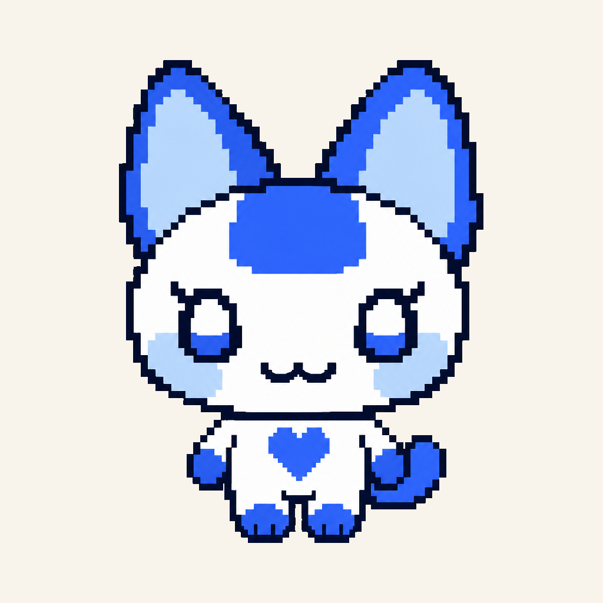

  

<h1 align="center">IsleMind</h1>

  A local-first mobile AI workspace for private provider configuration, knowledge-assisted chat, personal context, and structured work artifacts.

  <a href="../../README.md">简体中文</a> | English | <a href="README.ja.md">日本語</a>

  <a href="https://github.com/domidoremi/IsleMind/releases/latest">Latest APK</a>
  ·
  <a href="../README.md">Documentation Index</a>

## Capability Boundary

IsleMind stores conversations, settings, context indexes, Agentic RAG indexes, and provider configuration on the device by default. Data leaves the device under these user-triggered conditions:

- The user selects a configured AI provider for inference, embedding, transcription, speech, or model discovery.
- The user exports or imports JSON data.
- The user downloads, verifies, or enables a local RAG model.
- The user installs a GitHub Release APK through the Android system installer.

Provider keys stored in SecureStore are not written into JSON exports. The default APK does not bundle model weights. Local models must come from the built-in catalog or from an explicit user-selected download flow.

## User Path

| Scenario | Default Behavior | Output |
| --- | --- | --- |
| Configure provider | The user enters an API key, Base URL, model, and capability switches | Provider configuration for chat, model discovery, and runtime diagnostics |
| Start chat | The app reads the active session, personal context, knowledge retrieval results, and model settings | AI replies, citations, token usage records, and copyable content |
| Import knowledge | Agentic RAG runs chunking, indexing, hybrid search, and local rerank | Referencable knowledge indexes and retrieval evidence |
| Generate work artifact | The app converts model replies into structured delivery content | Quality gates, executable actions, copyable handoffs, and continuation prompts |
| Update Android build | The app checks GitHub Release APKs and opens the system installer | Cold update installation after user confirmation |

## Download And APK Variants

Download the Android APK from [GitHub Releases](https://github.com/domidoremi/IsleMind/releases/latest).

Local model variants:

- `no-model`: default build, no local model files bundled.
- `with-model-small`: bundles `all-MiniLM-L6-v2` for local embedding.

Android architecture variants:

- `arm64-v8a`: 64-bit ARM devices.
- `x86_64`: 64-bit x86 devices.
- `universal-64`: includes both 64-bit ARM and 64-bit x86 native libraries.
- `armeabi-v7a-legacy`: targets legacy 32-bit ARM devices.

When the installed APK is `no-model`, the in-app local model page can still download, verify, and enable RAG models.

## Risk Control

- Provider requests must be triggered by user configuration. When no provider is available, the app must remain in local configuration state.
- When a local model is missing or unavailable, retrieval falls back to hash embedding.
- Android updates must require Android system installer confirmation. The app does not silently replace the APK.
- `universal-64` includes `arm64-v8a` and `x86_64`. `armeabi-v7a-legacy` targets legacy 32-bit devices and is not part of Android 16 64-bit page-size validation.

## Failure Behavior

- When an AI provider is unreachable, has an invalid key, or does not support the requested capability, chat runtime must return diagnosable state instead of discarding user input.
- When RAG model files are missing, the local model page must keep the download and verification entry points available, and retrieval must keep its fallback path.
- When APK download fails, the installed version must remain unchanged. Installation requires system installer confirmation before it takes effect.

## Assets And Attribution

- Isle UI is a React Native adaptation of `animal-island-ui`. The upstream project is authored by `guokaigdg` and published under MIT: <https://github.com/guokaigdg/animal-island-ui>.
- The default APK does not include model weights. Optional models are recorded in `assets/models/catalog.json`; source and attribution notes are recorded in `assets/models/NOTICE.md`.
- The app icon source is stored at `assets/brand/source/isle-pet-preview-base.png`. Generated assets remove the yellow background and write outputs into `assets/` and Android launcher resource directories.

## Technology Stack

- Application runtime: [Expo SDK](https://docs.expo.dev/), [React Native](https://reactnative.dev/), [React](https://react.dev/), [Expo Router](https://docs.expo.dev/router/introduction/), [TypeScript](https://www.typescriptlang.org/).
- Mobile targets: [Android APK](https://developer.android.com/build/building-cmdline), [EAS](https://docs.expo.dev/eas/) configuration, [Expo iOS metadata](https://docs.expo.dev/versions/latest/config/app/).
- UI and motion: [NativeWind](https://www.nativewind.dev/), [Tailwind CSS](https://tailwindcss.com/), [Isle UI](../../src/components/ui/isle/README.md), [lucide-react-native](https://lucide.dev/), [moti](https://moti.fyi/), [React Native Reanimated](https://docs.swmansion.com/react-native-reanimated/), [Gesture Handler](https://docs.swmansion.com/react-native-gesture-handler/), [Safe Area Context](https://github.com/AppAndFlow/react-native-safe-area-context), [Screens](https://github.com/software-mansion/react-native-screens), [SVG](https://github.com/software-mansion/react-native-svg), [Expo Blur](https://docs.expo.dev/versions/latest/sdk/blur-view/).
- Local storage and device APIs: [AsyncStorage](https://react-native-async-storage.github.io/async-storage/), [Expo SecureStore](https://docs.expo.dev/versions/latest/sdk/securestore/), [Expo SQLite](https://docs.expo.dev/versions/latest/sdk/sqlite/), [Expo FileSystem](https://docs.expo.dev/versions/latest/sdk/filesystem/), [Expo Document Picker](https://docs.expo.dev/versions/latest/sdk/document-picker/), [Expo Image Picker](https://docs.expo.dev/versions/latest/sdk/imagepicker/), [Expo Clipboard](https://docs.expo.dev/versions/latest/sdk/clipboard/), [Expo Sharing](https://docs.expo.dev/versions/latest/sdk/sharing/), [Expo Application](https://docs.expo.dev/versions/latest/sdk/application/), [Expo Constants](https://docs.expo.dev/versions/latest/sdk/constants/), [Expo Haptics](https://docs.expo.dev/versions/latest/sdk/haptics/), [Expo Audio](https://docs.expo.dev/versions/latest/sdk/audio/), [Expo Speech](https://docs.expo.dev/versions/latest/sdk/speech/).
- AI provider runtime: [OpenAI](https://platform.openai.com/docs/), [Anthropic](https://docs.anthropic.com/), [Google Gemini](https://ai.google.dev/gemini-api/docs), [Xiaomi MiMo](https://mimo.mi.com/), [OpenAI-compatible providers](https://platform.openai.com/docs/api-reference), [custom compatible endpoints](https://platform.openai.com/docs/api-reference), plus [DeepSeek](https://api-docs.deepseek.com/), [DashScope/Qwen](https://www.alibabacloud.com/help/en/model-studio/use-qwen-by-calling-api), [Zhipu/GLM](https://docs.bigmodel.cn/), [xAI](https://docs.x.ai/), [OpenRouter](https://openrouter.ai/docs/api/reference), [NewAPI](https://docs.newapi.pro/), [OneAPI](https://github.com/songquanpeng/one-api), and [Sub2API](https://sub2api.info/) presets.
- Retrieval and local models: Agentic RAG, [ONNX Runtime React Native](https://onnxruntime.ai/docs/get-started/with-javascript/react-native.html), [local embedding model catalog](../../assets/models/catalog.json), model download verification, [Xenova](https://huggingface.co/Xenova) and [BAAI](https://huggingface.co/BAAI) model sources, hash embedding fallback.
- Localization: [i18next](https://www.i18next.com/), [React i18next](https://react.i18next.com/), [Expo Localization](https://docs.expo.dev/versions/latest/sdk/localization/), `zh-CN`, `en`, `ja` resource files.
