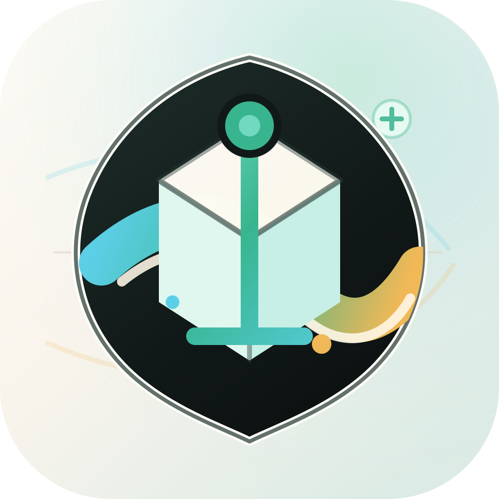

<p align="center">
  
</p>

<h1 align="center">IsleMind</h1>

<p align="center">
  A local-first, provider-controlled Android AI workspace
</p>

<p align="center">
  <a href="../../README.md">简体中文</a> · English · <a href="README.ja.md">日本語</a>
</p>

<p align="center">
  <strong>1.0.15 · Android 115</strong><br>
  <a href="https://github.com/domidoremi/IsleMind/releases">Version history</a>
</p>

## Product

IsleMind manages model providers, conversations, knowledge, personal context, and task workflows.

Primary platform: Android.

## Features

- **Provider management**: API keys, base URLs, protocols, models, capability switches, and model discovery.
- **Model compatibility**: OpenAI, Anthropic, Gemini, xAI, DeepSeek, Qwen, GLM, and OpenAI/Anthropic-compatible endpoints.
- **Conversation workspace**: Multiple conversations, streaming replies, reasoning state, citations, attachments, and copyable content.
- **Knowledge and context**: Knowledge documents, personal memory, conversation context, retrieval indexes, and local models.
- **Tasks and workflows**: Step state, cancellation, recovery, tool authorization, and execution evidence.
- **structured work artifacts**: Quality gates, executable actions, copyable handoffs, and continuation prompts.
- **Operation feedback**: Toast, Banner, status layers, Android notifications, and in-progress/success/failure states.
- **Appearance**: Light mode, dark mode, custom colors, 简体中文, English, and 日本語.

## Data and Network

Conversations, settings, knowledge indexes, personal context, and provider configuration default to local storage.

Network features:

- AI inference, model discovery, embeddings, transcription, and speech.
- Local-model resource retrieval.
- GitHub version checks.
- User-enabled network tools and integrations.

Provider credentials use secure storage. Portable JSON exports do not contain API keys.

## Development Environment

- [Bun 1.3.14](https://bun.sh/)
- Node.js
- JDK 17
- Android SDK
- Android Platform Tools / ADB
- Android emulator or USB-debuggable device

`bun.lock` is the dependency lockfile.

## Install

```powershell
git clone https://github.com/domidoremi/IsleMind.git
cd IsleMind
bun install
bun run doctor
```

## Run Android

Start Metro:

```powershell
bun run start --localhost
```

Connect a device:

```powershell
adb devices
adb reverse tcp:8081 tcp:8081
bun run android --device <device-name> --no-bundler
```

## Common Checks

```powershell
bun run type-check
bun run test:provider-intelligence
bun run test:product-mobile-layout
bun run test:theme-system
```

## Assets and Attribution

- Isle UI is a React Native adaptation of [animal-island-ui](https://github.com/guokaigdg/animal-island-ui). Upstream license: CC BY-NC 4.0.
- Local model catalog: [assets/models/catalog.json](../../assets/models/catalog.json)
- Model sources and attribution: [assets/models/NOTICE.md](../../assets/models/NOTICE.md)
- Brand sources: `assets/brand/source/`
- Runtime brand assets: `assets/brand/generated/`
